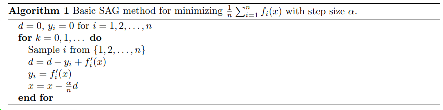

#  ASGD API 设计文档

| API 名称 | ASGD |
| - | - |
| 提交作者 | WintersMontagne10335 |
| 提交时间 | 2023-11-11 |
| 版本号 | V1.0 |
| 依赖飞桨版本 | develop |
| 文件名 | 20231111_api_design_for_ASGD.md |

# 一、概述

## 1、相关背景

[`ASGD` 论文: Minimizing Finite Sums with the Stochastic Average Gradient](https://inria.hal.science/hal-00860051v2)

随机平均梯度下降(以下简称 `ASGD`)是 `SGD` 以空间换时间的策略版本,是一种轨迹平均的随机优化方法。 `ASGD` 在 `SGD` 的基础上，增加了历史参数的平均值度量，让下降方向噪音的方差呈递减趋势下降，
从而使得算法最终会以线性速度收敛于最优值。

`ASGD` 既有 `SGD` 算法计算量小的特点，又具有像 `FGD` 一样的线性收敛速度。

论文中 `ASGD` 的实现分为两个版本：基础版本、优化版本。

其中，基本版本的伪代码如下：


`n` 为样本的数量。 $y_i$ 为第 `i` 个样本上一次的梯度信息。 $f_i^{'}(x)$ 为第 `i` 个样本本次计算得到的梯度信息。`x` 为要更新的参数。 $\alpha$ 为学习率。

核心步骤为：

    1. 初始化 d, y
    2. 随机采样
    3. 用本次计算得到的第 i 个样本的梯度信息，替换上一次的梯度信息
    4. 更新参数

## 2、功能目标

新增 `ASGD` API。

调用形式：
- `paddle.optimizer.ASGD`

## 3、意义

为 `Paddle` 增加 `ASGD` ，丰富 `Paddle` 中优化器相关的 API。

# 二、飞桨现状

`Paddle` 目前已经提供了 `SGD` 等优化器方法。

目前 `Paddle` 在 `Python` 端缺少 `ASGD` 相关接口的实现，而在底层也没有相关算子。

# 三、业内方案调研

## PyTorch

`Pytorch` 底层并未实现 `ASGD` 直接对应的 `Kernel`，而是通过在 `Python` 端，基于 `foreach` 系列，组合实现了 API。

目前 `PyTorch` 的实现存在诸多问题，在功能上相当于 `SGD` 。以下调研仅作了解，不作为 `Paddle ASGD API` 实现的参考。 

### API 文档

- [torch.optim.ASGD(params, lr, lambd, alpha, t0, weight_decay, foreach, maximize, differentiable)](https://pytorch.org/docs/stable/generated/torch.optim.ASGD.html#ASGD)

    - sketch
        - Implements Averaged Stochastic Gradient Descent

    - Parameters
        - params
        > iterable of parameters to optimize or dicts defining parameter groups
        - lr
        > learning rate
        - lambd
        > decay term
        - alpha
        > power for eta update
        - t0
        > point at which to start averaging
        - weight_decay
        > weight decay (L2 penalty)
        - foreach
        > whether foreach implementation of optimizer is used. If unspecified by the user (so foreach is None), we will try to use foreach over the for-loop implementation on CUDA, since it is usually significantly more performant. Note that the foreach implementation uses ~ sizeof(params) more peak memory than the for-loop version due to the intermediates being a tensorlist vs just one tensor. If memory is prohibitive, batch fewer parameters through the optimizer at a time or switch this flag to False
        - maximize
        > maximize the params based on the objective, instead of minimizing
        - differentiable
        > whether autograd should occur through the optimizer step in training. Otherwise, the step() function runs in a torch.no_grad() context. Setting to True can impair performance, so leave it False if you don’t intend to run autograd through this instance

### 实现逻辑 

#### `Python` 端

关键源码

- [pytorch/torch/optim/asgd.py](https://github.com/pytorch/pytorch/blob/main/torch/optim/asgd.py)

```Python
class ASGD(Optimizer):
    def __init__(
        self,
        params,
        lr=1e-2,
        lambd=1e-4,
        alpha=0.75,
        t0=1e6,
        weight_decay=0,
        foreach: Optional[bool] = None,
        maximize: bool = False,
        differentiable: bool = False,
        capturable: bool = False,
    ):
        if not 0.0 <= lr:
            raise ValueError(f"Invalid learning rate: {lr}")
        if not 0.0 <= weight_decay:
            raise ValueError(f"Invalid weight_decay value: {weight_decay}")

        if foreach is False and capturable:
            raise ValueError("Capturable not supported with single tensor ASGD")

        defaults = dict(
            lr=lr,
            lambd=lambd,
            alpha=alpha,
            t0=t0,
            weight_decay=weight_decay,
            foreach=foreach,
            maximize=maximize,
            differentiable=differentiable,
            capturable=capturable,
        )
        super().__init__(params, defaults)
```

检验lr、weight_decay、foreach、capturable的合理性。初始化。

```Python
    def _init_group(self, group, params_with_grad, grads, mus, axs, etas, state_steps):
        has_complex = False
        for p in group["params"]:
            if p.grad is not None:
                has_complex |= torch.is_complex(p)
                params_with_grad.append(p)
                if p.grad.is_sparse:
                    raise RuntimeError("ASGD does not support sparse gradients")
                grads.append(p.grad)

                state = self.state[p]
                # State initialization
                if len(state) == 0:
                    state["step"] = torch.zeros((), device=p.device)
                    state["eta"] = torch.tensor(group["lr"], device=p.device)
                    state["mu"] = torch.ones((), device=p.device)
                    state["ax"] = torch.zeros_like(
                        p, memory_format=torch.preserve_format
                    )

                mus.append(state["mu"])
                axs.append(state["ax"])
                etas.append(state["eta"])
                state_steps.append(state["step"])
        return has_complex
```

初始化 `params_with_grad`、 `grads`、 `mus`、 `axs`、 `etas`、 `state_steps`。这里的 `prevs` 为上次的梯度。

```Python
def asgd(
    params: List[Tensor],
    grads: List[Tensor],
    axs: List[Tensor],
    mus: List[Tensor],
    etas: List[Tensor],
    state_steps: List[Tensor],
    # kwonly args with defaults are not supported by functions compiled with torchscript issue #70627
    # setting this as kwarg for now as functional API is compiled by torch/distributed/optim
    foreach: Optional[bool] = None,
    maximize: bool = False,
    differentiable: bool = False,
    capturable: bool = False,
    has_complex: bool = False,
    *,
    lambd: float,
    lr: float,
    t0: float,
    alpha: float,
    weight_decay: float,
):
    r"""Functional API that performs asgd algorithm computation.

    See :class:`~torch.optim.ASGD` for details.
    """

    if foreach is None:
        _, foreach = _default_to_fused_or_foreach(params, differentiable, use_fused=False)

    if foreach and torch.jit.is_scripting():
        raise RuntimeError("torch.jit.script not supported with foreach optimizers")

    if foreach and not torch.jit.is_scripting():
        func = _multi_tensor_asgd
    else:
        if capturable and not is_compiling():
            raise RuntimeError("Capturable not supported with single tensor ASGD")
        func = _single_tensor_asgd

    func(
        params,
        grads,
        axs,
        mus,
        etas,
        state_steps,
        lambd=lambd,
        lr=lr,
        t0=t0,
        alpha=alpha,
        weight_decay=weight_decay,
        maximize=maximize,
        differentiable=differentiable,
        capturable=capturable,
        has_complex=has_complex,
    )
```

根据 `foreach` 与 `torch.jit.is_scripting()` 确定要执行的函数。 `_single_tensor_asgd` 为纯 `Python` 实现， `_multi_tensor_asgd` 使用了 `foreach` 系列的算子，有加速效果。

```Python
def _single_tensor_asgd(
    params: List[Tensor],
    grads: List[Tensor],
    axs: List[Tensor],
    mus: List[Tensor],
    etas: List[Tensor],
    state_steps: List[Tensor],
    *,
    lambd: float,
    lr: float,
    t0: float,
    alpha: float,
    weight_decay: float,
    maximize: bool,
    differentiable: bool,
    capturable: bool,
    has_complex: bool,
):
    for i, param in enumerate(params):
        grad = grads[i]
        grad = grad if not maximize else -grad
        mu = mus[i]
        ax = axs[i]
        eta = etas[i]
        step_t = state_steps[i]

        if torch.is_complex(param):
            grad = torch.view_as_real(grad)
            param = torch.view_as_real(param)
            ax = torch.view_as_real(ax)

        # update step
        step_t += 1
        step = _get_value(step_t)

        if weight_decay != 0:
            grad = grad.add(param, alpha=weight_decay)

        eta_value = _get_value(eta)
        # decay term
        param.mul_(1 - lambd * eta_value)

        # update parameter
        param.add_(grad, alpha=-eta_value)

        # averaging
        if is_compiling() or mu.item() != 1:
            ax.add_(param.sub(ax).mul(mu))
        else:
            ax.copy_(param)

        new_eta = _to_tensor(lr / ((1 + lambd * lr * step) ** alpha))
        eta.copy_(new_eta)
        new_mu = _to_tensor(1 / max(1, step - t0))
        mu.copy_(new_mu)
```

`t0` 是开始计算平均的迭代序列数；`step` 为本次迭代的迭代序列数。

对比论文中 `ASGD` 的实现，有两个关键之处不同：

    1. 论文中的实现保存了上一次计算的梯度信息，并让它参与到了权重参数的更新过程；PyTorch 的实现中，虽然上一次计算的梯度信息被保留到了 ax ，但是在权重参数的更新过程中，并没有用到 ax。
    2. 论文中的实现，是对样本数量 n 求平均；而 PyTorch 是对迭代的次数求平均。

详细实现请见上文：概述->相关背景。

#### CPU端

`PyTorch` 未实现。

#### GPU端

`PyTorch` 未实现。

### 现存问题

#### axs, ax 未使用

在 `_single_tensor_asgd` 中，对 `axs, ax` 进行了更新，但是它们却并没有参与到 `params` 中。 `axs, ax` 完全没有作用。

调研到的比较可信的原因是，目前 `ASGD` 的功能并不完善， `axs, ax` 是预留给以后的版本的。

详情可见：
- https://discuss.pytorch.org/t/asgd-optimizer-has-a-bug/95060
- https://discuss.pytorch.org/t/averaged-sgd-implementation/26960

#### weight_decay, lambd 功能重叠

weight_decay是冗余的。

详情可见：
- https://github.com/pytorch/pytorch/issues/74884

#### ASGD 功能实现得不完善

当前版本 `ASGD` 的功能，相当于 `SGD` 的。

详情可见：
- https://discuss.pytorch.org/t/asgd-optimizer-has-a-bug/95060

## TensorFlow

`TensorFlow` 未实现该算子。

## MXNet

`MXNet` 未实现该算子。

## OneFlow

`OneFlow` 未实现该算子。

# 四、对比分析

目前，主流深度学习框架仅有 `Pytorch` 实现了该算子，且实现还是存在很大问题的。所以暂不做对比分析。设计、实现均以原论文为准。

# 五、设计思路与实现方案

原论文实现分为了两个部分：基础版本；对基础版本的优化。

本设计文档仅涉及基础版本的实现，优化会另分一个 `PR` 出来。

## 命名与参数设计

### 添加 python 上层接口

- `paddle.optimizer.ASGD`

    ``` python
    paddle.optimizer.ASGD(
        batch_num,
        learning_rate=0.001,
        parameters=None,
        weight_decay=None,
        grad_clip=None,
        name=None
    )
    ```

    |参数名|类型|描述|
    |---|---|---|
    |batch_num|int|the amount of data in a batch|
    |learning_rate|float, Tensor, LearningRateDecay|the learning rate used to update ``Parameter``|
    |parameters|list, tuple|list / tuple of ``Tensor`` to update to minimize ``loss``|
    |weight_decay|float, WeightDecayRegularizer|the strategy of regularization|
    |grad_clip|GradientClipBase|gradient cliping strategy|
    |name|str|normally there is no need for user to set this property|

### 重要函数设计
- `_create_accumulators`

    ``` Python
    def _create_accumulators(self, block, parameters)
    ```

    |参数名|描述|
    |---|---|
    |block|the block in which the loss tensor is present|
    |parameters|list of parameter tensors for the optimizer|

    本函数的作用为：
  
      0. 对 multi_precision 的处理
      1. 获取保存的 y 与 d

- `_append_optimize_op`

    ```Python
    def _append_optimize_op(self, block, param_and_grad)
    ```
    
    |参数名|描述|
    |---|---|
    |block|the block in which the loss tensor is present|
    |param_and_grad|parameters and gradients|

    本函数的作用为：
  
      将 optimize_op 添加到 block 并返回所有添加的 optimize_op

- `_update_param_group`

    ```Python
    def _update_param_group(self, parameters)
    ```
    
    |参数名|描述|
    |---|---|
    |parameters|The extra group of Tensors to be optimzed with different optimization options. Only used in child class|
    
    本函数的作用为：

      当 _append_optimize_op 的参数 param_and_grad 为 dict 类型时，更新 param_and_grad 为 param_and_grad.get('params')


## 底层 OP 设计

TODO

做完底层实现后补充。

## API实现方案

- `paddle.optimizer.ASGD`

TODO

# 六、测试和验收的考量

测试考虑的case如下：

- **编程范式场景**
  常规覆盖动态图和静态图的测试场景

- **硬件场景**
  常规需覆盖 CPU、GPU 两种测试场景

- **输出正确性**
  输出数值结果的一致性和数据类型是否正确

- **计算精度**
  需要保证 `前向/后向` 计算的精度正确性

- **边界场景**
  需要保证计算在边界场景下的正确性

# 七、可行性分析及规划排期

11.27 前做出第一版提交审核。

# 八、影响面

新增 API，对其他模块无影响。

# 名词解释

无

# 附件及参考资料

- [torch.optim.ASGD](https://pytorch.org/docs/stable/generated/torch.optim.ASGD.html#ASGD)
- [paddle.optimizer.SGD](https://www.paddlepaddle.org.cn/documentation/docs/zh/api/paddle/optimizer/SGD_cn.html)
