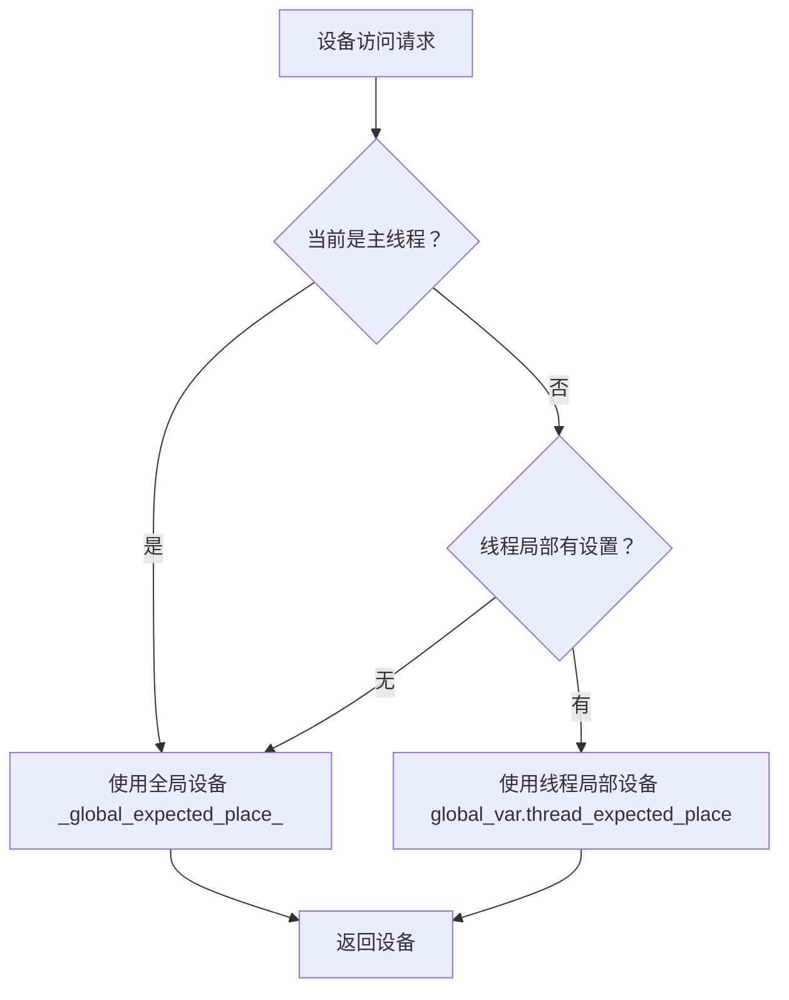
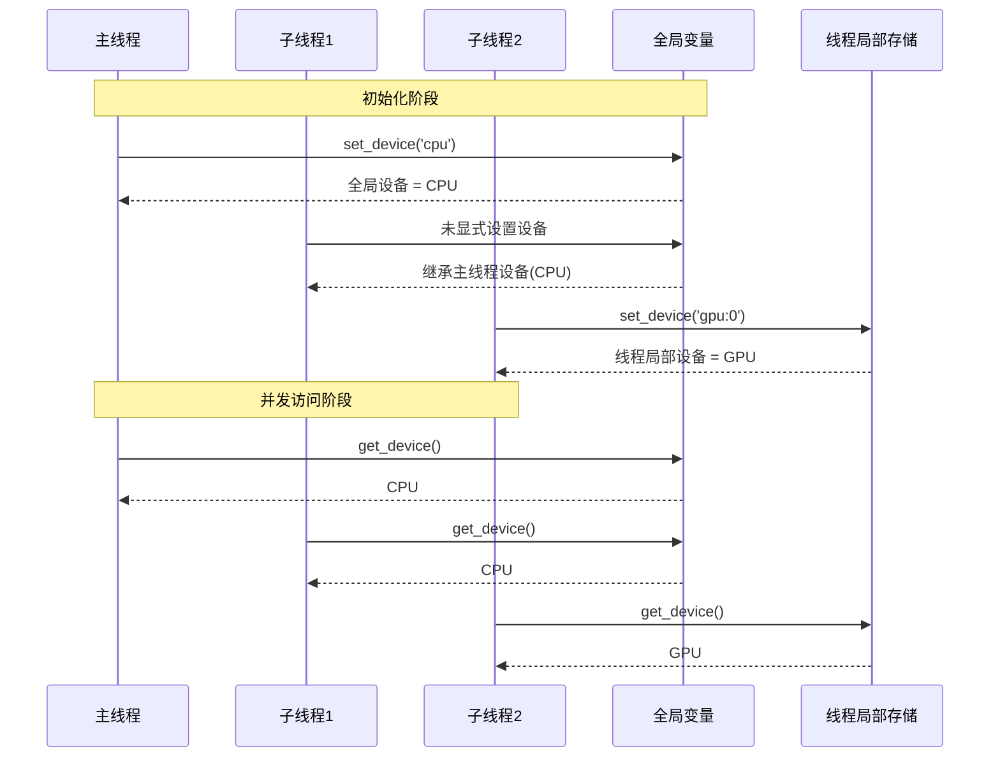

# 为 Paddle 框架添加线程安全的设备管理机制

| 任务名称 | 为 Paddle 框架添加线程安全的设备管理机制 | 
|---|---|
| **提交作者** | PlumBlossomMaid | 
| **提交时间** | 2026-02-16 | 
| **版本号** | V1.0 | 
| **依赖飞桨版本** | paddlepaddle-gpu 3.3.0 | 
| **文件名** | 20260216_device_thread_safety.md | 

# 一、概述

## 1、相关背景

目前在 Paddle 框架中，设备管理相关的函数（如 `paddle.set_device()`、`paddle.device.device()`、`paddle.cuda.device()`）存在线程安全问题。问题的根源在于 `framework.py` 中使用了全局变量 `_global_expected_place_` 来存储当前设备信息，且在多线程环境下没有线程安全保护机制。

当多个线程同时运行时，可能出现**线程 A 设置使用 CPU 设备，线程 B 随后设置使用 GPU 设备，导致线程 A 的设备意外切换为 GPU的竞态条件**，见[Issue 77927](https://github.com/PaddlePaddle/Paddle/issues/77927)。

由于**Paddle 的多卡训练采用的是多进程模式，而非多线程模式**。因此本设计主要考虑的是**用户业务代码中的多线程场景**，如：
- 多线程数据预处理
- 多线程推理服务
- 多线程模型评估
- 与第三方库的多线程交互

## 2、功能目标

本设计的目标是在不改变 Paddle 现有 API 行为的前提下，实现线程安全的设备管理机制，确保：

1. **主线程行为完全不变**：主线程的设备设置仍然影响全局，保持与现有单线程代码完全兼容
2. **子线程设备隔离**：每个子线程可以独立设置自己的设备，互不影响
3. **设备继承机制**：未显式设置设备的子线程，默认继承主线程的当前设备
4. **零性能损耗**：主线程设备访问路径无额外开销，子线程仅首次访问有微小开销

## 3、意义

- **解决并发隐患**：从根本上消除多线程环境下设备管理的竞态条件
- **提升框架健壮性**：使 Paddle 能够安全地在多线程环境中运行
- **支持更广泛的部署场景**：如多线程推理服务、并行数据处理等
- **保持向后兼容**：现有单线程代码无需任何修改即可获得线程安全保证
- **与 PyTorch 设计哲学形成差异化**：PyTorch 要求每个 API 显式指定设备，而 Paddle 采用全局设备设计，本方案在保持这一设计优势的同时解决其线程安全问题

# 二、飞桨现状

## 当前实现分析

目前 Paddle 的设备管理机制完全依赖全局变量：

```python
_global_expected_place_ = None  # 全局设备状态
_current_device = None           # 全局设备字符串

def _current_expected_place_():
    global _global_expected_place_
    # 读取和修改全局变量，无任何线程保护
    if _global_expected_place_ is None:
        # 设备检测和初始化逻辑...
    return _global_expected_place_

def _set_expected_place(place):
    global _global_expected_place_
    _global_expected_place_ = place  # 直接修改全局变量
```

## 现有线程安全机制

Paddle 框架中已经存在 `GlobalThreadLocal` 类，用于实现线程安全的变量存储：

```python
class GlobalThreadLocal(threading.local):
    def __init__(self):
        global _dygraph_tracer_
        self._in_to_static_mode_ = False
        self._functional_dygraph_context_manager = None
        self._dygraph_tracer_ = _dygraph_tracer_
        # ... 其他初始化
```

但当前设备管理**未利用**这一线程安全机制，导致多线程环境下存在风险。

# 三、业内方案调研

## 1. **PyTorch 方案**

PyTorch 采用**显式设备指定**的设计哲学：

```python
# PyTorch 需要在每个 API 调用处显式指定设备
device = torch.device("cuda:0")
x = torch.tensor([1.0, 2.0], device=device)
y = torch.tensor([3.0, 4.0]).to(device)
z = x + y  # 结果自动在相同设备上
```

**优点**：彻底避免线程安全问题
**缺点**：代码冗长，使用不便，需要用户时刻关注设备上下文

## 2. **TensorFlow 方案**

TensorFlow 通过上下文管理器实现设备管理：

```python
with tf.device('/GPU:0'):
    a = tf.constant([1.0, 2.0])
    b = tf.constant([3.0, 4.0])
    c = a + b
```

**优点**：灵活性高，支持嵌套
**缺点**：实现复杂，性能开销较大

## 3. **Paddle 现有方案（待改进）**

Paddle 采用**全局设备变量**的设计：

```python
paddle.set_device('gpu:0')  # 设置一次，全局生效
x = paddle.to_tensor([1.0, 2.0])  # 自动在 GPU 上
y = paddle.to_tensor([3.0, 4.0])  # 自动在 GPU 上
```

**优点**：使用简洁，代码清晰
**缺点**：多线程环境下存在安全隐患

# 四、对比分析

| 方案 | 线程安全 | 使用便捷性 | 实现复杂度 | 性能开销 | 兼容性 |
|------|---------|-----------|-----------|---------|--------|
| PyTorch（显式指定） | ✅ 安全 | ❌ 繁琐 | 低 | 无 | N/A |
| TensorFlow（上下文） | ✅ 安全 | ⚠️ 中等 | 高 | 中 | N/A |
| Paddle 当前（全局） | ❌ 不安全 | ✅ 便捷 | 低 | 无 | - |
| **本方案（双层设计）** | ✅ 安全 | ✅ 便捷 | 低 | 极低 | ✅ 完全兼容 |

**本方案核心优势**：

1. **保留 Paddle 的设计哲学**：继续使用全局设备变量，保持 API 简洁性
2. **零成本抽象**：主线程无性能开销，子线程仅首次访问有微小开销
3. **渐进式改造**：基于现有 `GlobalThreadLocal` 机制扩展，不改动整体架构
4. **完全兼容**：现有单线程代码无需任何修改

# 五、设计思路与实现方案

## 1、主体设计思路与折衷

### 核心设计理念

本方案的核心思想是**“主从分离，优先线程”**：

- **主线程**：继续使用全局变量 `_global_expected_place_`，保持与现有代码完全兼容
- **子线程**：使用线程局部存储 `thread_expected_place_`，实现设备隔离
- **查找优先级**：子线程优先使用自己的线程局部设备，未设置时回退到全局设备


### 整体全貌
本设计在现有设备管理机制基础上，增加一层线程局部存储的查找优先级，形成**双层设备管理架构**：



### 核心数据结构

```python
class GlobalThreadLocal(threading.local):
    def __init__(self):
        # ... 现有代码 ...
        self.thread_expected_place_ = None  # 新增：线程局部设备存储

# 全局变量保持不变
_global_expected_place_ = None
global_var = GlobalThreadLocal()  # 线程局部存储实例
```

### 核心逻辑流程示例



## 2、关键技术点/子模块设计与实现方案

### 技术点1：线程类型判断

```python
def _is_main_thread():
    """判断当前是否为主线程"""
    return threading.current_thread() is threading.main_thread()
```

**设计考量**：
- 使用 `is` 操作符直接比较线程对象，保证准确性
- 避免使用线程名称或 ID，防止被修改或复用

### 技术点2：设备获取函数改造

```python
def _current_expected_place_():
    global _global_expected_place_
    expected_place:core.Place = None

    # 第一步：根据线程类型决定设备来源
    if _is_main_thread():# 主线程使用全局变量
        expected_place = _global_expected_place_
    else: # 子线程使用线程的全局变量  
        expected_place = global_var.thread_expected_place_ or _global_expected_place_ # 子线程：优先使用线程局部存储，如果未设置则回退到全局变量

    # 第二步：如果设备为 None，执行初始化逻辑
    if expected_place is None or type(expected_place) is core.Place:
        # 保持原有的设备检测和初始化代码
        # (根据编译选项和可用设备自动选择)
        if core.is_compiled_with_cuda():
            # ... 原有 CUDA 检测逻辑 ...
        elif core.is_compiled_with_xpu():
            # ... 原有 XPU 检测逻辑 ...
        else:
            expected_place = core.CPUPlace()

    # 第三步：更新对应存储位置
    if _is_main_thread(): # 主线程设置全局变量
        _global_expected_place_ = expected_place
    elif global_var.thread_expected_place_ is not None: # 当且仅当子线程全局变量已经设置时，子线程设置线程的全局变量，不再回退到全局变量
        global_var.thread_expected_place_ = expected_place

    return expected_place
```

### 技术点3：设备设置函数改造

```python
def _set_expected_place(place): # 如果是主线程，设置全局变量；如果是子线程，设置线程的全局变量
    global _global_expected_place_
    
    if _is_main_thread(): # 是主线程，设置全局变量
        _global_expected_place_ = place
    else: # 不是主线程，才设置线程的全局变量
        global_var.thread_expected_place_ = place        

    _set_dygraph_tracer_expected_place(place)
```

### 技术点4：设备继承机制

当子线程首次调用 `_current_expected_place_()` 时，如果线程局部存储为空，将自动继承全局设备值。这是通过上述查找逻辑自然实现的：

```
子线程首次调用 → thread_expected_place_ = None → 返回 _global_expected_place_
```

## 3、主要影响的模块接口变化

### 直接接口变化

本设计**不修改任何用户可见的 API**，所有改动均在框架内部实现。对外表现：

| API | 行为变化 |
|-----|---------|
| `paddle.set_device()` | 主线程行为不变，子线程行为变为线程局部 |
| `paddle.device.get_device()` | 返回当前线程的设备 |
| `paddle.is_compiled_with_cuda()` | 无变化 |
| `paddle.CUDAPlace()` | 无变化 |

### 对框架各环节的影响排查

| 模块 | 影响程度 | 说明 |
|------|---------|------|
| 网络定义 | 无影响 | 设备信息仅用于执行，不影响图构建 |
| 底层数据结构 | 轻微 | 增加 `GlobalThreadLocal` 的一个字段 |
| OP 执行 | 无影响 | OP 执行时通过 `_current_expected_place_` 获取设备 |
| 数据 IO | 无影响 | 数据加载不直接依赖设备信息 |
| 分布式训练 | 无影响 | 多卡训练采用多进程模式，不涉及多线程 |
| 模型保存 | 无影响 | 保存时使用主线程设备 |
| 预测部署 | ✅ 正面影响 | 多线程推理服务可获得线程安全 |

# 六、测试和验收的考量

## 单元测试设计

### 测试1：主线程行为不变性

```python
def test_main_thread_behavior():
    """验证主线程设备设置行为不变"""
    paddle.set_device('cpu')
    assert paddle.device.get_device() == 'cpu'
    
    paddle.set_device('gpu:0')
    assert paddle.device.get_device() == 'gpu:0'
```

### 测试2：子线程设备隔离

```python
def test_thread_device_isolation():
    """验证子线程设备隔离"""
    main_device = 'cpu'
    thread1_device = 'gpu:0'
    thread2_device = 'gpu:1'
    
    paddle.set_device(main_device)
    
    results = {}
    
    def worker(thread_id, set_device):
        if set_device:
            paddle.set_device(set_device)
        results[thread_id] = paddle.device.get_device()
    
    t1 = threading.Thread(target=worker, args=(1, thread1_device))
    t2 = threading.Thread(target=worker, args=(2, thread2_device))
    t3 = threading.Thread(target=worker, args=(3, None))  # 不设置，应继承主线程
    
    t1.start(); t2.start(); t3.start()
    t1.join(); t2.join(); t3.join()
    
    assert results[1] == thread1_device  # 线程1用自己的设备
    assert results[2] == thread2_device  # 线程2用自己的设备
    assert results[3] == main_device     # 线程3继承主线程
    assert paddle.device.get_device() == main_device  # 主线程不受影响
```

### 测试3：并发压力测试

```python
def test_concurrent_device_access():
    """多线程并发设置/获取设备，验证无竞态条件"""
    def worker(thread_id):
        for i in range(1000):
            device = f'gpu:{i % 4}'
            paddle.set_device(device)
            current = paddle.device.get_device()
            # 验证当前线程的设备就是刚设置的
            assert current == device
    
    threads = [threading.Thread(target=worker, args=(i,)) for i in range(10)]
    for t in threads: t.start()
    for t in threads: t.join()
```

### 测试4：设备继承链测试

```python
def test_device_inheritance_chain():
    """测试设备继承链"""
    paddle.set_device('cpu')
    
    def level1():
        assert paddle.device.get_device() == 'cpu'
        
        def level2():
            paddle.set_device('gpu:0')
            assert paddle.device.get_device() == 'gpu:0'
            
            def level3():
                assert paddle.device.get_device() == 'gpu:0'
            
            level3()
        
        t = threading.Thread(target=level2)
        t.start()
        t.join()
        
        assert paddle.device.get_device() == 'cpu'
    
    level1()
```

## 验收标准

- ✅ 所有单元测试通过
- ✅ 多线程场景下无设备污染问题
- ✅ 单线程场景性能无退化（基准测试）
- ✅ 与现有模型训练/推理代码兼容
- ✅ 覆盖所有设备类型（CPU、GPU、XPU、自定义设备）

# 七、影响面

## 对用户的影响

**正面影响**：
- 多线程编程时不再需要担心设备竞争问题
- 可以安全地在子线程中使用 `paddle.set_device()`

**潜在影响**：
- 依赖设备全局状态的黑客技巧可能失效（但不属于规范用法）

## 对二次开发用户的影响

- 不暴露新的 API
- 开发者可以安全地在自定义线程中使用设备管理 API

## 对框架架构的影响

- 轻度侵入，仅修改 `framework.py` 中的几个函数
- 与现有架构完全兼容，无架构调整需求
- 基于已有的 `GlobalThreadLocal` 机制扩展，符合框架设计理念

## 对性能的影响

| 场景 | 性能开销 | 说明 |
|------|---------|------|
| 主线程设备获取 | 无 | 直接读取全局变量 |
| 主线程设备设置 | 无 | 直接修改全局变量 |
| 子线程首次设备获取 | < 50ns | 一次 TLS 查找 |
| 子线程后续设备获取 | < 50ns | 一次 TLS 查找 |
| 子线程设备设置 | < 50ns | 一次 TLS 存储 |

性能损耗可忽略不计（纳秒级）。

## 对比业内深度学习框架的差距与优势

| 对比维度 | PyTorch | TensorFlow | Paddle 当前 | Paddle 本方案 |
|---------|---------|------------|------------|--------------|
| 线程安全 | ✅ | ✅ | ❌ | ✅ |
| API 简洁性 | ❌ | ⚠️ | ✅ | ✅ |
| 性能开销 | 无 | 中 | 无 | 极低 |
| 实现复杂度 | 低 | 高 | 低 | 低 |
| 兼容性 | - | - | - | ✅ |

本方案在解决线程安全问题的同时，**完全保留了 Paddle 在 API 简洁性方面的优势**，实现了"鱼与熊掌兼得"。

## 其他风险

### C++ 层风险

需要确认 C++ 核心库是否直接读取 `_global_expected_place_`。如存在，需同步修改 C++ 层的设备获取逻辑。

### 文档更新

需在文档中明确说明：
- 本设计主要针对用户业务代码的多线程场景
- 线程安全的设备使用示例

---

# 名词解释

- **线程局部存储 (Thread Local Storage, TLS)**：每个线程独立拥有的存储空间，线程间互不干扰
- **竞态条件 (Race Condition)**：多个线程并发访问共享数据，执行结果依赖于线程执行顺序
- **Place**：Paddle 中表示设备的概念，如 CPUPlace、CUDAPlace
- **主线程 (Main Thread)**：Python 程序启动时的初始线程
- **子线程 (Child Thread)**：通过 `threading.Thread` 创建的线程

# 附件及参考资料

- [Python threading.local 文档](https://docs.python.org/3/library/threading.html#thread-local-data)
- [Paddle 现有 GlobalThreadLocal 实现](https://github.com/PaddlePaddle/Paddle/blob/6bbddb27104f39bb79cfb9bc02492e390fe997d3/python/paddle/base/framework.py#L220)
- [PyTorch 设备管理](https://pytorch.org/docs/stable/tensor_attributes.html#torch.device)