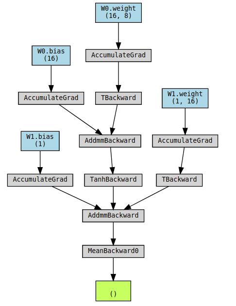
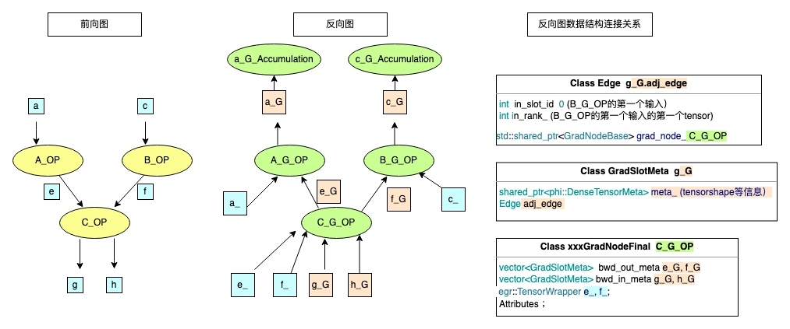
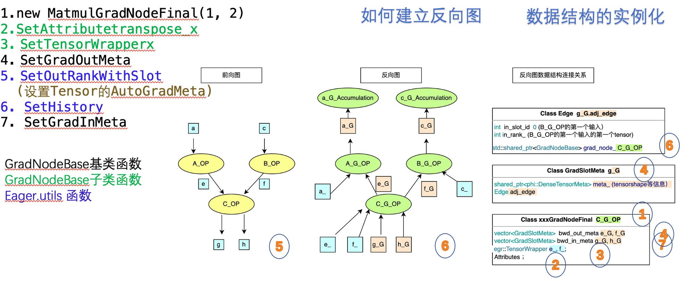

# 实现飞桨框架动态图反向图的可视化 设计文档


|API名称 | 新增API名称                                         | 
|---|-------------------------------------------------|
|提交作者<input type="checkbox" class="rowselector hidden"> | 丘文波                                             | 
|提交时间<input type="checkbox" class="rowselector hidden"> | 2022-05-10                                      | 
|版本号 | V0.1                                            | 
|依赖飞桨版本<input type="checkbox" class="rowselector hidden"> | 如无特殊情况，都应基于develop版本开发                          | 
|文件名 | api_design_for_reverse_diagram_visualization.md | 


# 一、概述
## 1、相关背景
飞桨深度学习框架提供了动态图编程的模式来开发深度学习模型（方便开发与调试），但动态图的反向图调试能力仍存在不足。
为飞桨动态图框架添加反向节点在 Python 端的访问机制。并在该机制基础上，为飞桨框架扩展反向图可视化能力。

pytorch框架下,有一个第三方库[pytorchviz](https://github.com/szagoruyko/pytorchviz)可以对基于pytorch框架实现的网络的反向图进行可视化


为了提高paddle下动态图的反向调试能力,需要对paddle下动态图的反向图进行可视化.

## 2、功能目标
- 为飞桨动态图框架扩展 Python 端访问反向节点的能力，包括不限于 grad_fn、next_functions等
- 参考 PyTorchViz 实现飞桨动态图反向图的可视化
- 丰富反向图信息：如 Tensor 名、Tensor dtype、Tensor shape、前向堆栈等

## 3、意义
为飞桨动态图框架添加反向节点在 Python 端的访问机制。并在该机制基础上，为飞桨框架扩展反向图可视化能力。方便进行调试。

# 二、飞桨现状
飞浆的前向图的可视化可以通过飞桨的可视化工具[VisualDL](https://www.paddlepaddle.org.cn/documentation/docs/zh/2.2/guides/03_VisualDL/visualdl_cn.html)实现.
但是飞浆框架目前还不支持对于反向图的可视化,也没有提供反向图的访问机制. 

飞浆构建的模型前向计算的时候会同时将[反向图的节点构建好](https://github.com/PaddlePaddle/community/blob/master/pfcc/paddle-code-reading/Dygraph/20221201_dygraph_backward.md#%E5%89%8D%E5%90%91%E6%89%A7%E8%A1%8C%E5%90%8E%E6%95%B0%E6%8D%AE%E7%BB%93%E6%9E%84%E5%9B%BE), 将这些节点信息暴露给pythonAPI 基于这些节点信息可以构建反向图.最后进行可视化


# 三、业内方案调研
pytorch 中的反向图可视化,可以通过第三方库[pytorchviz](https://github.com/szagoruyko/pytorchviz) 实现.
pytorchviz的实现原理是通过获取pytorch的反向图节点信息构建反向图,然后通过graphviz将反向图可视化.

pytorch张量中包含了一个属性grad_fn 用于表示反向图的节点信息. 通过next_functions函数来获取向下一个节点的信息


pytorchviz通过如下的[核心函数grad_fn](https://github.com/szagoruyko/pytorchviz/blob/master/torchviz/dot.py#L146)来获取到pytorch构建的网络的反向图的节点信息

```python
def add_base_tensor(var, color='darkolivegreen1'):
    if var in seen:
        return
    seen.add(var)
    dot.node(str(id(var)), get_var_name(var), fillcolor=color)
    if (var.grad_fn):
        add_nodes(var.grad_fn)  # 获取张量var的反向图节点信息
        dot.edge(str(id(var.grad_fn)), str(id(var)))
    if var._is_view():
        add_base_tensor(var._base, color='darkolivegreen3')
        dot.edge(str(id(var._base)), str(id(var)), style="dotted")
```

通过[核心函数next_functions](https://github.com/szagoruyko/pytorchviz/blob/master/torchviz/dot.py#L131)来获取向下一个节点的信息
```python
def add_nodes(fn):
    assert not torch.is_tensor(fn)
    if fn in seen:
        return
    seen.add(fn)

    if hasattr(fn, 'variable'):
        # if grad_accumulator, add the node for `.variable`
        var = fn.variable
        seen.add(var)
        dot.node(str(id(var)), get_var_name(var), fillcolor='lightblue')
        dot.edge(str(id(var)), str(id(fn)))

    # add the node for this grad_fn
    dot.node(str(id(fn)), get_fn_name(fn, show_attrs, max_attr_chars))

    # recurse
    if hasattr(fn, 'next_functions'):
        for u in fn.next_functions: # 获取fn的下一个节点信息
            if u[0] is not None:
                dot.edge(str(id(u[0])), str(id(fn)))
                add_nodes(u[0])
```

# 四、对比分析
paddle和pytorch都会创建好反向图的节点信息,但是paddle没有提供反向图的访问机制, pytorch提供了反向图的访问机制.
所以可以参考pytorch的实现,在paddle中添加反向图的访问机制,
最后将反向图的节点信息通过graphviz的实现思路进行可视化.

# 五、设计思路与实现方案
基于上述的分析,要实现paddle的反向图可视化, 需要实现以下几个功能:
1. 获取paddle的反向图的节点信息
2. 将反向图的节点信息暴露给pythonAPI
3. 将反向图的节点信息通过graphviz进行可视化

## 1、获取paddle的反向图的节点信息
[前向过程执行结束后，反向节点Grad_node创建](https://github.com/PaddlePaddle/community/blob/master/pfcc/paddle-code-reading/Dygraph/20221201_dygraph_backward.md#%E5%89%8D%E5%90%91%E6%89%A7%E8%A1%8C%E5%90%8E%E6%95%B0%E6%8D%AE%E7%BB%93%E6%9E%84%E5%9B%BE) ，其中包含反向输入tensor信息 bwd_in_meta_，反向输出信息 bwd_out_meta_
GradSlotMeta中包含 adj_edge_
Edge中包含 in_slot_id ,in_rank, grad_node_等信息


基于以上数据结构，反向图的建立过程本质上是数据结构的实例化，[其中7个调用函数对应在数据结构上的构造关系如下图所示](https://github.com/PaddlePaddle/community/blob/master/pfcc/paddle-code-reading/Dygraph/20221201_dygraph_forward.md#23-dygraph-function%E4%BB%A3%E7%A0%81%E8%A7%A3%E6%9E%90)：

图中以C_OP节点的反向图结构建立为例。在执行C_OP代码后首先1创建C_G_OP反向节点；2,3设置其中attribute,tensorwrapper变量；4设置输出的meta信息。 5对输出的tensor设置autogradMeta信息，绑定反向节点,6设置meta中edge的下一结点，7设置输入的meta信息。


前向过程后 可以创建好反向图中的节点, 然后将这些节点信息读取出来. 通过网络输出张量tensor 获取到对应的反向图节点,然后再基于该节点寻找下一个节点,以此类推获取到全部方向图节点.


基于网络输出的张量tensor获取对应的反向节点gradNode可以通过如下实现:
```c++
auto meta = egr::EagerUtils::nullable_autograd_meta(self->tensor);
meta.GradNode()
```
基于当前的gradNode获取下一个节点的信息函数next_functions可以通过如下实现:
```c++
const paddle::small_vector<std::vector, kSlotSmallVectorSize>& metas = node->OutputMeta();
for (const auto& meta_list : metas) {
    for (const GradSlotMeta& meta : meta_list) {
        const auto& edge = meta.GetEdge();
        GradNodeBase* next_node = edge.GetMutableGradNode().get();
        }
    }
```


## 2. 将反向图的节点信息暴露给pythonAPI
前面一个步骤中可以设计两个函数grad_fn()和next_functions()来获取反向图的节点信息,然后将这两个函数暴露给pythonAPI.

### 2.1 暴露grad_fn()函数
其中grad_fn()函数,可以作为tensor的一个方法, 所以需要c++中给张量新增一个方法,并暴露给python.
tensor.grad_fn 应该在paddle/fluid/pybind/eager_properties.cc中实现

可以按照以下步骤进行：
1. 定义 grad_fn 属性的 getter 函数。
2. 在 variable_properties 结构体数组中添加该属性。

首先，为 grad_fn 定义一个 getter 函数。 函数可以定义为tensor_properties_get_grad_fn()：

tensor_properties_get_grad_fn 函数的实现。这个函数返回一个 GradNode 对象，通过调用 egr::EagerUtils::nullable_autograd_meta(self->tensor) 和 meta.GradNode() 获取：
```c++
#include "paddle/fluid/imperative/utils/eager_utils.h"

static PyObject tensor_properties_get_grad_fn(TensorObject self, void* closure) {
    EAGER_TRY
    if (!self->tensor.defined()) {
        // Handle undefined tensors if necessary; otherwise, return nullptr or an appropriate PyObject.
        // In this case, I will return Py_None.
        Py_INCREF(Py_None);
        return Py_None;
    }

    // Get GradNode from the tensor
    auto meta = egr::EagerUtils::nullable_autograd_meta(self->tensor);    // If meta exists, get the GradNode
    if (meta) {
        // Get the GradNode from meta
        auto grad_node = meta.GradNode();        // Convert GradNode to a Python object
        // The conversion will depend on the structure of GradNode.
        PyObject* py_grad_node = ToPyObject(grad_node); // You need to implement ToPyObject according to the actual GradNode structure.        return py_grad_node;
    } else {
        // If meta does not exist, return an appropriate Python object (e.g., None or a special value).
        Py_INCREF(Py_None);
        return Py_None;
    }    EAGER_CATCH_AND_THROW_RETURN_NULL
}
}

PyObject* ToPyObject(const platform::Place& value) {
auto obj = ::pybind11::cast(value);
obj.inc_ref();
return obj.ptr();
}
```


然后 将新的 tensor_properties_get_grad_fn 属性添加到 variable_properties 结构体数组中：
```c++
struct PyGetSetDef variable_properties[] = {
    // ... other properties ...
    {"grad_fn",
     (getter)tensor_properties_get_grad_fn,
     nullptr, // No setter function
     nullptr, // No documentation provided
     nullptr}, // No closure
    // ... other properties ...
    {nullptr, nullptr, nullptr, nullptr, nullptr}
};
```
Python Tensor 类将包含一个名为 grad_fn 的属性，只具有 getter 方法，使用者可以通过如下方式访问 grad_fn 属性：
```python
tensor = Tensor()
grad_fn = tensor.grad_fn
```
注意，您需要实现 GradooNodeToPyObject 函数，以将 GradNode 转换为 PyObject。这个函数的实现将根据 GradNode 的实际结构而不同。

### 2.2 暴露GradNode转化成python对象
为了将GradNode类绑定到Python模块，您需要使用pybind11库创建一个C++函数，该函数对Python构造函数、方法和属性进行描述和绑定。以下是一个示例代码

```c++
#include <pybind11/pybind11.h>
#include "GradNodeBase.h"
namespace py = pybind11;

PYBIND11_MODULE(grad_node, m) {
    py::class_<GradNodeBase>(m, "GradNodeBase")
        .def(py::init<size_t, size_t>(), py::arg("bwd_in_slot_num"), py::arg("bwd_out_slot_num"))
        .def("InputMeta", &GradNodeBase::InputMeta)
        .def("OutputMeta", &GradNodeBase::OutputMeta)
        .def("MutableOutputMeta", &GradNodeBase::MutableOutputMeta)
        .def("SetGradInMeta", py::overload_cast<const paddle::Tensor&, size_t>(&GradNodeBase::SetGradInMeta),
             py::arg("fwd_out"), py::arg("slot_rank"))
        .def("SetGradInMeta", py::overload_cast<const std::vector<paddle::Tensor>&, size_t>(&GradNodeBase::SetGradInMeta),
             py::arg("fwd_out"), py::arg("slot_rank"))
        .def("SetGradOutMeta", py::overload_cast<const paddle::Tensor&, size_t>(&GradNodeBase::SetGradOutMeta),
             py::arg("fwd_in"), py::arg("slot_rank"))
        // ...其他重载SetGradInMeta以及SetGradOutMeta方法
        .def("SetDefaultGradInOutMeta", &GradNodeBase::SetDefaultGradInOutMeta)
        .def("RegisterGradientHook", &GradNodeBase::RegisterGradientHook, py::arg("slot_id"), py::arg("rank"), py::arg("hook"))
        .def("ApplyGradientHooks", &GradNodeBase::ApplyGradientHooks, py::arg("tensors"))
        .def("HandleComplexGradToRealGrad", &GradNodeBase::HandleComplexGradToRealGrad, py::arg("out_grads"));
}

```
### 2.3 暴露next_functions()
next_functions是GradNode暴露到Python端的类型的一个属性。需要参考paddle/fluid/pybind/eager_properties.cc实现。eager_properties.cc里是将Tensor的属性暴露的具体实现源码。
6.next_functions需要获取GradNode的后继节点的所有GradNode

为了将next_functions属性作为GradNode类的一部分绑定到Python模块，需要实现一个名为next_functions的C++ getter方法，并在Pybind11描述中将其映射为Python类的属性。

首先，可以在GradNodeBase类中添加一个方法，该方法实现了获取后继节点的功能：

```c++
// GradNodeBase.h
#include <vector>
class GradNodeBase {
    // ... 其他方法和字段

    std::vector<GradNodeBase*> NextFunctions(); // 新增加的方法
};

// GradNodeBase.cpp
std::vector<GradNodeBase> GradNodeBase::NextFunctions() {
    std::vector<GradNodeBase> next_nodes;
    const paddle::small_vector<std::vector, kSlotSmallVectorSize>& metas = OutputMeta();
    for (const auto& meta_list : metas) {
        for (const GradSlotMeta& meta : meta_list) {
            const auto& edge = meta.GetEdge();
            GradNodeBase* next_node = edge.GetMutableGradNode().get();
            next_nodes.push_back(next_node);
        }
    }
    return next_nodes;
}


```

然后，在Pybind11绑定中将next_functions映射为Python类的属性。
    
```c++
#include <pybind11/pybind11.h>
#include "GradNodeBase.h"
namespace py = pybind11;

PYBIND11_MODULE(grad_node, m) {
    py::class_<GradNodeBase>(m, "GradNodeBase")
        // ... 其他绑定
        .def_property_readonly("next_functions", &GradNodeBase::NextFunctions);
}
```


## 3.将反向图的节点信息通过graphviz进行可视化
基于上面的步骤获取到所有反向图节点信息后 参考pytorchvize的实现 将所有的节点信息组织成一个拓扑图进行显示.

获取到所有的节点信息之后使用 工具 [pygraphviz](https://pypi.org/project/pygraphviz/)将拓扑图进行可视化


## 命名与参数设计
参考：[飞桨API 设计及命名规范](https://www.paddlepaddle.org.cn/documentation/docs/zh/develop/dev_guides/api_contributing_guides/api_design_guidelines_standard_cn.html)
## 底层OP设计
## API实现方案

# 六、测试和验收的考量
构建一个全连接网络,RNN网络,测试反向图的可视化效果,并保证通过全部的单元测试

# 七、可行性分析和排期规划
* 5.30 实现反向图节点信息获取
* 6.30 将反向图的节点信息暴露给pythonAPI
* 7.30 将反向图的节点信息通过graphviz进行可视化

# 八、影响面
需要进一步讨论的问题，开放性问题，有争议问题；对其他模块是否有影响

# 名词解释

# 附件及参考资料
- 飞桨开源框架：[https://github.com/PaddlePaddle/Paddle](https://github.com/PaddlePaddle/Paddle)
- 飞桨动态图阅读笔记：[https://github.com/PaddlePaddle/community/tree/master/pfcc/paddle-code-reading/Dygraph](https://github.com/PaddlePaddle/community/tree/master/pfcc/paddle-code-reading/Dygraph)
- PyTorchViz： [https://github.com/szagoruyko/pytorchviz](https://github.com/szagoruyko/pytorchviz)