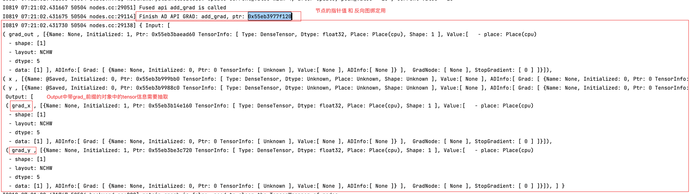
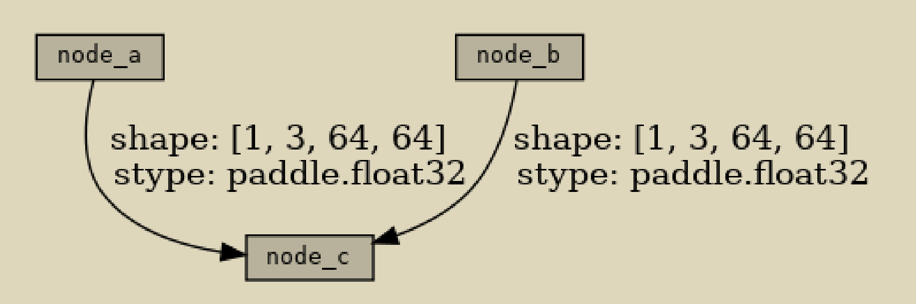

# 实现飞桨框架动态图反向图的可视化 设计文档


|API名称 | 新增API名称                                           | 
|---|---------------------------------------------------|
|提交作者<input type="checkbox" class="rowselector hidden"> | 丘文波,何健飞                                           | 
|提交时间<input type="checkbox" class="rowselector hidden"> | 2023-08-20                                        | 
|版本号 | V0.1                                              | 
|依赖飞桨版本<input type="checkbox" class="rowselector hidden"> | 如无特殊情况，都应基于develop版本开发                            | 
|文件名 | api_design_for_reverse_diagram_visualization_2.md | 


# 一、概述
## 1、相关背景
飞桨深度学习框架提供了动态图编程的模式来开发深度学习模型（方便开发与调试），但动态图的反向图调试能力仍存在不足。
社区开发者为Paddle开发了反向图可视化工具 [paddleviz](https://github.com/PFCCLab/paddleviz)，很大程度上提升了反向图的调试能力。
但我们还希望，在现有 paddleviz 基础上，扩展 paddleviz 的能力，进一步提升反向图的调试能力。

## 2、功能目标

- 探索如何在 paddleviz 基础上，扩展反向图边（Tensor）的调试信息，包括不限于Tensor name、shape、dtype、place、stop_gradient 等。
- 丰富反向图信息：如 Tensor 名、Tensor dtype、Tensor shape、前向堆栈等

## 3、意义
为飞桨动态图框架添加反向节点在 Python 端的访问机制。并在该机制基础上，为飞桨框架扩展反向图可视化能力。方便进行调试。

# 二、飞桨现状
飞浆的前向图的可视化可以通过飞桨的可视化工具[VisualDL](https://www.paddlepaddle.org.cn/documentation/docs/zh/2.2/guides/03_VisualDL/visualdl_cn.html)实现.
但是飞浆框架目前还不支持对于反向图的可视化,也没有提供反向图的访问机制. 

飞浆构建的模型前向计算的时候会同时将[反向图的节点构建好](https://github.com/PaddlePaddle/community/blob/master/pfcc/paddle-code-reading/Dygraph/20221201_dygraph_backward.md#%E5%89%8D%E5%90%91%E6%89%A7%E8%A1%8C%E5%90%8E%E6%95%B0%E6%8D%AE%E7%BB%93%E6%9E%84%E5%9B%BE), 将这些节点信息暴露给pythonAPI 基于这些节点信息可以构建反向图.最后进行可视化

目前已经开发了一个[paddleviz工具](https://github.com/PFCCLab/paddleviz) 可以实现反向图的可视化, 但是图中显示的信息还不够多


# 三、业内方案调研
pytorch 中的反向图可视化,可以通过第三方库[pytorchviz](https://github.com/szagoruyko/pytorchviz) 实现.
pytorchviz的实现原理是通过获取pytorch的反向图节点信息构建反向图,然后通过graphviz将反向图可视化.

pytorch张量中包含了一个属性grad_fn 用于表示反向图的节点信息. 通过next_functions函数来获取向下一个节点的信息


# 四、对比分析
社区开发者为Paddle开发了反向图可视化工具 [paddleviz](https://github.com/PFCCLab/paddleviz)，很大程度上提升了反向图的调试能力。
但是目前图中的不同反向节点之间的信息 还不够充分, 需要补充更多的信息, 包括不限于Tensor name、shape、dtype、place、stop_gradient 等。

# 五、设计思路与实现方案
在现有 paddleviz 基础上，扩展 paddleviz 的能力，进一步提升反向图的调试能力,主要的实现步骤有如下:
1. 将反向节点的指针值作为一个属性暴露给python端, 在python能获取到反向节点的指针值
2. 将反向传播过程中, 将每一个反向节点的计算的输出进行打印, 
3. python端实现对这些打印结果进行捕获, 从这些打印结果中进行解析, 获取到不同反向节点之间的连接的边(tensor)的信息
4. 将边(tensor)的信息集成到原有的反向图中去,以丰富图中的信息.


### 1. 将反向节点的指针值作为一个属性暴露给python端
基于pybind11 实现
```python
py::class_<egr::GradNodeBase, std::shared_ptr<egr::GradNodeBase>>(
      m, "GradNodeBase")
      .def("node_this_ptr", &egr::GradNodeBase::GetThisPtr)
 ```     

### 2. 将反向传播过程中, 将每一个反向节点的计算的输出进行打印
paddle/fluid/eager/api/generated/eager_generated/backwards/nodes.cc是反向GradNode的源码文件, 这个文件显示了每一个反向节点的计算的输出打印.

每一个反向节点的计算的输出进行打印,
但这个文件是生成出来的，而不是程序员写的。如果要修改nodes.cc需要修改生成该代码的逻辑：paddle/fluid/eager/auto_code_generator/generator/eager_gen.py

所以需要在eager_gen.py 中进行修改:
```python
GRAD_FUNCTION_TEMPLATE = """
paddle::small_vector<std::vector<paddle::Tensor>, egr::kSlotSmallVectorSize> {}::operator()(paddle::small_vector<std::vector<paddle::Tensor>, egr::kSlotSmallVectorSize>& grads, bool create_graph, bool is_new_grad) {{
  VLOG(3) << \"Running AD API GRAD: \" << \"{}\";

  std::stringstream ss;
  ss << this;
  std::string this_pointer = ss.str();

  // Fill Zero For GradIn Tensors
{}
  // Apply Gradient Hooks
  auto hooked_grads = ApplyGradientHooks(grads);

  // Collect GradIn Tensors, Attrs and Recovered TensorWrappers
{}
  // Prepare Grad function call
{}
  // Runtime check if we need next grad
{}
  // Inplace Check
{}
  // Inplace Strategy
{}

  VLOG(5) << \"Running C++ API: \" << \"{}\";
  // Before log info
{}
  // Call grad_api function
{}
  // Check NaN and Inf id needed
{}
  // Get GradOut autograd_meta
{}
  // Create Grad Node
{}
  VLOG(11) << \"Finish AD API GRAD: {}, gradnode_ptr: \"+ this_pointer;
  // LOG IF DEBUG
  
  {}
  // Return
{}
}}
"""
```
上述代码中新补充的部分是:
```python
  std::stringstream ss;
  ss << this;
  std::string this_pointer = ss.str();
```
和
```python
  VLOG(11) << \"Finish AD API GRAD: {}, gradnode_ptr: \"+ this_pointer;
```

下面是一个打印的信息举例:


### python端实现对这些打印结果进行捕获, 从这些打印结果中进行解析, 获取到不同反向节点之间的连接的边(tensor)的信息

在Python端我们使用subprocess模块执行shell命令并捕获日志，下面是一个简单
示例：
1. 首先我们在c + 端创建一个示例文件example.cpp，该示例文件利用glog进行简单的日志输出,举个例子:
```cpp
#include <iostream> 
#include <glog/logging.h> 
using namespace std; 

int main() 
    { 
    LOG(INFO) < "This is an informational message."; 
    LOG(WARNING) < "This is a warning message."; 
    LOG(ERROR) < "This is an error message."; 
    LOG(FATAL) < "This is a fatal error message."; 
    return 0; 
    }
```

2. 然后在Python端创建示例文件example.py，该示例文件首先使用os模块设置日
志相关的环境变量，然后通过subprocess.run()编译执行c + 端的
example.cpp文件，同时将日志输出到output.txt文件中。

```python
import subprocess
import os

# 设置环境变量
os.environ['GLOG_v'] = '4'

# 编译 c++
cpp_command = "g++ -o example example.cpp -lglog -L/home/shicao/hjf/code/paddleviz/glog/build/glog/"

result = subprocess.run(cpp_command, shell=True, capture_output=True, text=True)

# 执行 c++ 将输出保存到python变量
# cpp_program = "./example"
# result = subprocess.run(cpp_program, shell=True, capture_output=True, text=True)
# print(result.stdout)
# print('>>>>>')
# print(result.stderr)

# 执行 c++ 将输出保存到文件
cpp_program = "./example"
with open("output.txt", "w") as f:
    subprocess.run(cpp_program, shell=True, stdout=f, stderr=subprocess.STDOUT)
    
```
3. 最终的output.txt输出内容如下，表明已经正确捕获到c + 端的日志输出：
```python
I0805 14:00:29.942585 2040126 example.cpp:8] This is an informational message. 
W0805 14:00:29.942757 2040126 example.cpp:11] This is a warning message. 
E0805 14:00:29.942771 2040126 example.cpp:14] This is an error message. 
F0805 14:00:29.942781 2040126 example.cpp:17] This is a fatal error message.
```

### 将边(tensor)的信息集成到原有的反向图中去,以丰富图中的信息.
假设我们已经得到了log日志文件，现在根据日志文件在paddleviz边上展示Tensor
信息，下面是一个简单示例：创建3个节点a b c，并添加边信息。

```python
from graphviz import Digraph

node_attr = dict(style='filled', shape='box', align='left', fontsize='10', ranksep='0.1', height='0.2', fontname='monospace')

# 创建Graph
dot = Digraph(node_attr=node_attr, graph_attr=dict(size="12,12"))

# 创建node节点
dot.node('node_a')
dot.node('node_b')
dot.node('node_c')

# 创建边信息
edge_info_a_c = 'shape: [1, 3, 64, 64] \n stype: paddle.float32'
edge_info_b_c = 'shape: [1, 3, 64, 64] \n stype: paddle.float32'

# 创建边
dot.edge('node_a', 'node_c', label=edge_info_a_c)
dot.edge('node_b', 'node_c', label=edge_info_b_c)

# 可视化展示
dot.render('viz-edge.gv', format='png', view=True)
```
可视化结果如下：



边上补充了更多的信息.


## 命名与参数设计
参考：[飞桨API 设计及命名规范](https://www.paddlepaddle.org.cn/documentation/docs/zh/develop/dev_guides/api_contributing_guides/api_design_guidelines_standard_cn.html)
## 底层OP设计
## API实现方案

# 六、测试和验收的考量
构建一个全连接网络,RNN网络,测试反向图的可视化效果,并保证通过全部的单元测试

# 七、可行性分析和排期规划
* 8.20 实现每一个反向节点的计算的输出进行打印,
* 9.1 将打印结果使用python进行捕获并集成到反向图中
* 9.20 优化显示效果

# 八、影响面
需要进一步讨论的问题，开放性问题，有争议问题；对其他模块是否有影响

# 名词解释

# 附件及参考资料
- 飞桨开源框架：[https://github.com/PaddlePaddle/Paddle](https://github.com/PaddlePaddle/Paddle)
- 飞桨动态图阅读笔记：[https://github.com/PaddlePaddle/community/tree/master/pfcc/paddle-code-reading/Dygraph](https://github.com/PaddlePaddle/community/tree/master/pfcc/paddle-code-reading/Dygraph)
- PyTorchViz： [https://github.com/szagoruyko/pytorchviz](https://github.com/szagoruyko/pytorchviz)