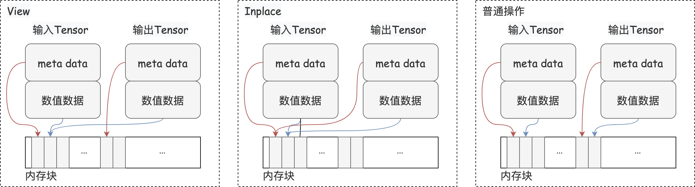

# Paddle Inplace 使用指南

## 1. 引言

在深度学习领域，框架的选择对模型的训练效率和资源消耗有着直接的影响。PaddlePaddle（飞桨）是一个由百度开发的全面、灵活和高效的深度学习平台。本文旨在介绍和分享 Paddle Inplace 机制的使用指南，帮助读者更好地利用这一机制优化内存使用和提升模型训练效率。

## 2. Inplace 相关的基本概念

为了更加深入地了解 Inplace 操作，我们先介绍一下 Paddle 中的三类数据操作：view形式的操作、inplace形式的操作和普通的操作。这些操作方式直接关系到内存管理和计算效率。

  

上图中给出了三种不同操作方式有关的内存管理示例。在 View 操作中，新的 Tensor 对象与原始 Tensor 共享相同的数值数据区域。在 Inplace 操作中，输入和输出是同一个 Tensor 对象，它们共享完全相同的数值数据区域。而在普通操作中，操作的输入和输出是完全独立的，需要为结果分配新的内存空间。


### 2.1 View 形式的操作

在深度学习框架中, 一个 Tensor 由两部分组成:元数据(meta data)和数值数据区域(numerical data)。元数据包括数据类型、形状等描述数据的信息, 而数值数据区域则实际存储了数值数据。

进行 View 形式操作时,得到的结果变量与原始变量在Python视角下是两个不同的Tensor对象。但是,新旧Tensor共享相同的数值数据区域。View 操作的一个典型例子是改变 Tensor 的形状。通过这种方式，可以在不增加额外内存负担的情况下，灵活地重组数据的维度。


### 2.2 Inplace 形式的操作

与 View 形式的操作相比,inplace形式的操作进一步深化了对内存的优化。在进行 inplace 操作时,输入和输出是同一个Tensor对象,它们共享完全相同的元数据(meta data)和数值数据区域(numerical data)。换言之,inplace操作直接在原地修改了Tensor的数值数据,避免了额外内存的分配。这种操作对于优化内存使用和加速计算过程尤为重要，因为它消除了不必要的数据复制和内存分配开销。例如，`paddle.add_(a, b)` 就是一个inplace操作，它将 a 和 b 的和直接存储回 a，而不需要为结果分配新的内存空间。


### 2.3 普通的操作

相对于 view 和 inplace 操作，普通的操作则会为操作的结果分配新的内存空间。这意味着，操作的输入和输出在物理内存上是完全独立的。虽然这种操作方式在某些场景下是必要的，但它增加了内存的占用和计算的开销。

Paddle Inplace 操作通过直接在原地更新数据，减少了显存的占用，降低了内存分配和数据拷贝的时间开销，从而提高了模型训练的效率。在实际应用中，这一机制尤其对于显存资源有限的场景至关重要，因为它允许更大或更复杂的模型在有限的硬件资源上进行训练。

需要注意的是，虽然 Inplace 操作带来了显著的性能提升，但也需谨慎使用。因为 Inplace 操作会修改原始数据，某些场景下使用可能会导致数据丢失或错误的计算结果。


## 3. Inplace 的使用

在了解了 Inplace 操作的基本概念后，我们接下来介绍如何在 PaddlePaddle 中使用 Inplace 操作。PaddlePaddle 提供了一系列支持 Inplace 操作的 API，如 `paddle.add_()`、`paddle.nn.functional.relu_` 等。这些 API 的命名规则是在操作名后加下划线，表示该操作是 Inplace 形式的。

### 3.1 基本数学运算

基本数学运算是深度学习模型中最常用的操作之一。PaddlePaddle 提供了一系列支持 Inplace 形式的数学运算 API，如 `add_()` 、`subtract_` 等。这些 API 可以直接在原地更新数据，避免了额外的内存分配。

```python
import paddle

# 创建两个张量
x = paddle.to_tensor([[1, 2], [3, 4]], dtype='float32')
y = paddle.to_tensor([[5, 6], [7, 8]], dtype='float32')

# Inplace加法
x.add_(y, alpha=1) 
print(x)
# Tensor([[6., 8.], [10., 12.]])

# Inplace减法
x.subtract_(y, alpha=2)
print(x) 
# Tensor([[-4., -4.], [-4., -4.]])
```

使用 Inplace 操作的优势是可以节省内存使用,特别是在处理大型张量时。但需要注意, Inplace 会直接修改原始数据,因此在某些场景下可能会导致数据丢失或错误的计算结果,需要谨慎使用。

### 3.2 逐元素操作

该示例中的 `relu_` 是一种逐元素的 Inplace 操作。它对张量中的每个元素应用ReLU激活函数,并直接覆盖原始元素值。

对于像 ReLU 这种简单的逐元素(element-wise)操作, 使用 Inplace 方式可以避免创建新的临时张量,从而减少内存开销。但同时也要注意, 如果原始张量在后续还需要使用,就不应该进行 Inplace 操作。

类似 ReLU 操作都是独立对每个元素进行操作, 不涉及元素之间的相互影响, 因此往往可以通过 Inplace 的方式高效计算, 避免创建临时张量。

```python
import paddle

x = paddle.rand([2, 3]) - 0.5
print(x)
# Tensor(shape=[2, 3], dtype=float32, place=Place(cpu), stop_gradient=True,
#        [[-0.11629868, -0.14393741,  0.29877216],
#         [-0.12311274, -0.42231464, -0.23500025]])

# Inplace relu操作
paddle.nn.functional.relu_(x)
print(x)  
# Tensor(shape=[2, 3], dtype=float32, place=Place(cpu), stop_gradient=True,
#        [[0.        , 0.        , 0.29877216],
#         [0.        , 0.        , 0.        ]])
```

### 3.3 线性代数计算

PaddlePaddle 提供了一系列支持 Inplace 形式的线性代数计算 API，如 `transpose_()`、`t_()` 等。这些 API 可以直接在原地更新数据，避免了额外的内存分配。

```python
import paddle

# 创建一个3x4的矩阵
X = paddle.arange(12).reshape([3, 4])
# Original X:
# Tensor(shape=[3, 4], dtype=int64, place=Place(cpu), stop_gradient=True,
#        [[0 , 1 , 2 , 3 ],
#         [4 , 5 , 6 , 7 ],
#         [8 , 9 , 10, 11]])
# Inplace转置
X.transpose_([1, 0])
print(f"X after inplace transpose:\n{X}") 
# X after inplace transpose:
# Tensor(shape=[4, 3], dtype=int64, place=Place(cpu), stop_gradient=True,
#        [[0 , 4 , 8 ],
#         [1 , 5 , 9 ],
#         [2 , 6 , 10],
#         [3 , 7 , 11]])

# 与非Inplace对比  
Y = X.transpose([1, 0])
print(f"Y after non-inplace transpose:\n{Y}")
# Y after non-inplace transpose:
# Tensor(shape=[3, 4], dtype=int64, place=Place(cpu), stop_gradient=True,
#        [[0 , 1 , 2 , 3 ],
#         [4 , 5 , 6 , 7 ],
#         [8 , 9 , 10, 11]])
```

`transpose_` 的参数是要交换的两个维度的索引。在这个例子中0表示行维度,1表示列维度,所以transpose_([1, 0])的效果是行列交换,实现矩阵转置。

通过使用 transpose_ 的 Inplace 版本,我们避免了为转置结果分配新的内存空间, 直接在原地修改了X的数据,从而节省了内存使用。

## 4. Inplace 的实际应用

在深度学习模型中,有时候需要在中间层使用 Inplace 操作 ,可以减少内存占用,提高模型训练效率。

```python
import paddle
import paddle.nn.functional as F

class InplaceBlock(paddle.nn.Layer):
    def __init__(self):
        super(InplaceBlock, self).__init__()
        
    def forward(self, x, inplace=True):
        if inplace:
            return F.relu_(x)
        else:
            return F.relu(x)

# 用于统计最大显存占用
paddle.set_device('gpu')
paddle.seed(0)

# 创建残差块
block = InplaceBlock()

# 创建输入张量
x = paddle.rand([1, 64, 512, 512], dtype='float32')

# 使用Inplace操作
y = block(x, inplace=False)

# 输出最大显存占用
print(paddle.device.cuda.max_memory_allocated())
# 134217728 (inplace=False)
# 67108864 (inplace=True)
```

当 `inplace=True` 时, 最大显存占用为 67108864, 而当 `inplace=False` 时, 最大显存占用为 134217728。可以看到, 使用 Inplace 操作可以减少一半的显存占用。

所以尽量在模型中间层使用 Inplace 操作,可以减少内存占用,提高模型训练效率，但是需要注意,如果原始张量在后续还需要使用,就不应该进行 Inplace 操作。

在深度学习领域，使用 Inplace 操作的场景还很多。比如在训练过程中,常常需要对输入数据进行一些增强操作,比如随机翻转、裁剪、颜色扭曲等。这些数据增强操作往往可以使用Inplace的方式直接修改输入数据,不需要拷贝额外内存。

在某些任务如对抗生成网络(GAN)、特征匹配等中,需要对特征数据进行归一化,使其服从某种分布。这种归一化操作通常可以使用Inplace的方式计算,避免拷贝中间结果。

任何涉及到直接修改张量数据的操作,都可以考虑使用Inplace的方式来优化内存占用。但同时也要注意可能存在的数据依赖问题,确保不会影响计算的正确性。在实际使用Inplace操作时,需要结合具体的场景进行权衡。

## 4. Inplace 使用注意事项

### 4.1 叶子节点不可使用 Inplace

在 Paddle 的动态图机制中,叶子节点(Leaf Tensor)指的是需要计算梯度的张量,它们不允许使用 Inplace 操作。如果叶子节点使用了 Inplace 操作, Paddle 会抛出错误。示例代码如下:

```python
import paddle

x = paddle.rand([3, 4])
x.stop_gradient = False  # 将 x 标记为叶子节点

# 错误做法,会导致报错
x.scale_(2.0) 

y = x.sum()
y.backward()
```

上述代码在执行 x.scale_(2.0) 时会抛出如下错误:

```
ValueError: (InvalidArgument) Leaf Var () that doesn't stop gradient can't use inplace strategy.
  [Hint: Expected !autograd_meta->StopGradient() && IsLeafTensor(target) == false, but received !autograd_meta->StopGradient() && IsLeafTensor(target):1 != false:0.] (at /Users/paddle/xly/workspace/f4429c34-48ba-44c2-9571-abaff039446b/Paddle/paddle/fluid/eager/utils.cc:200)
```

在Paddle的动态图机制下,叶子节点(Leaf Tensor)指的是整个计算图的输入张量, 通常就是模型的可训练权重或输入数据。

对于需要计算梯度并更新的权重张量来说, 在梯度计算和应用更新前, 它们必须保持数值不变,以确保计算的准确性。如果说权重在被梯度更新之前就被 inplace 操作修改了，那显然训练得到的权重是不正确的。

为了避免这种情况发生,Paddle 在执行 Inplace 操作前,会先检查当前张量是否为叶子节点。如果是,就会抛出错误,阻止 Inplace 操作的执行。这样可以确保自动微分过程的正确性。

### 4.2 不可重复使用中间结果

在使用 Inplace 操作时,需要确保被修改的中间结果不会在后续被重复使用。否则由于原始数据被修改,会导致计算结果错误。例如:

```python
x = paddle.rand([3, 4])
y = x  # y 和 x 引用同一份数据
x.zero_()  # 将 x 用 0 覆盖,同时也修改了 y 的值

# y 的值已经被修改为全 0 了
print(y)
```

### 4.3 分布式训练数据同步

在分布式训练环境下使用 Inplace 操作时,需要保证所有参与计算的节点对相同的数据执行相同的 Inplace 操作,否则会导致节点间数据不一致。尤其对于像 BatchNorm 这种需要跨节点同步的操作,使用 Inplace 时必须格外小心。

### 4.4 与 Paddle 版本相关

Paddle 的 Inplace 操作在不同版本中可能会有所不同,建议在使用时查看对应版本的文档。同时,由于 Inplace 操作涉及到内存管理和计算图构建,在不同的硬件环境和操作系统下可能会有不同的表现,需要根据具体情况进行调整。

Paddle 2.6 之前的版本中，为了确保反向微分计算的正确性，当某个 API 的反向计算依赖于其前向输入数据时，Paddle 会避免使用 Inplace 操作方式，因为这种方法可能会覆盖原始输入数据。虽然这种机制简化了实现过程，但也限制了许多 API 实现 Inplace 功能，从而影响了用户体验。 在 2.6 版本中，Paddle 对 Inplace 机制进行了全面升级。实现自动检测反向计算对前向输入的依赖关系，并在需要时保存这些输入数据，从而支持更多的 Inplace 操作。这一改进不仅提升了内存使用效率，还增强了 API 的功能性。 此外，Paddle 还新增了 109 个支持 Inplace 操作的 API，包括 paddle.abs_、paddle.sin_/cos_/tan_、比较操作如 paddle.greater_than_/less_than_/equal_、逻辑操作如 paddle.logical_and_/logical_or_/logical_not_，以及 paddle.neg_和 paddle.log_等。在丰富飞桨的功能集同时，提升了用户在数值计算和深度学习任务中的效率与便捷性。

## 5. 总结

Inplace 操作是 Paddle 中一种特殊的张量操作方式, 它可以直接修改原始张量的数据, 而不需要创建新的张量, 从而节省内存使用。合理使用 Inplace 操作可以优化内存占用,提高训练 large 模型或部署模型的效率。但与此同时,Inplace 操作也有一些使用限制和潜在风险,需要开发者特别注意。

## 参考文献

1. https://www.paddlepaddle.org.cn/documentation/docs/zh/release_note_cn.html#fenbushixunlian
2. https://www.paddlepaddle.org.cn/documentation/docs/zh/2.3/release_note_cn.html
3. https://github.com/PaddlePaddle/community/blob/master/pfcc/paddle-code-reading/Inplace/inplace_introduction.md
