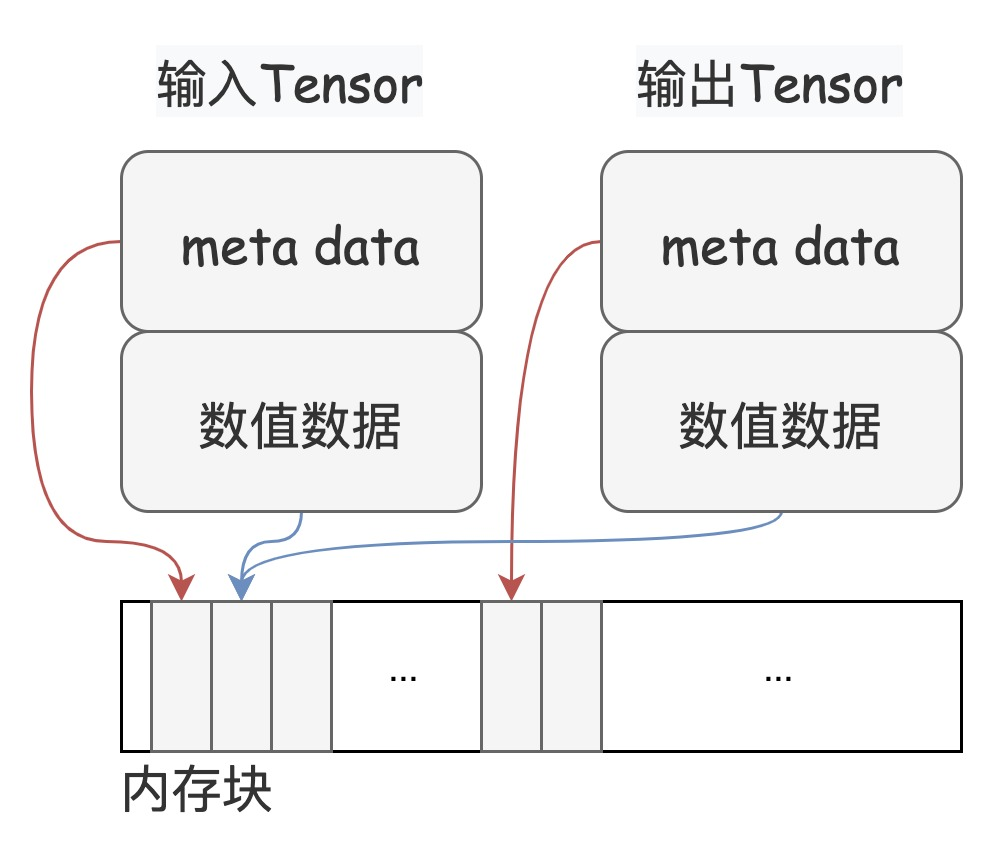

# Tensor 索引的使用指南&学习心得

## 1. 引言

在深度学习的世界中，数据是一切算法和模型的基础。有效、高效地处理数据，特别是在处理高维数组或张量（Tensor）时，成为了构建模型、处理数据等任务的重要部分。PaddlePaddle，作为一个前沿的深度学习框架，提供了丰富的Tensor索引操作，极大地简化了Tensor的操作和处理。本文基于Paddle框架，详细介绍Tensor索引的概念、功能、使用场景，并结合具体的代码示例，展示了在不同领域模型中索引的实际应用，以及个人的学习心得。

## 2. Tensor索引的基本概念

索引操作是深度学习中数据处理的基础。想象一下，当我们面对一个多维度、庞大复杂的数据集时，如何快速准确地访问到我们需要的数据片段？答案就在于Tensor索引。Tensor索引，简而言之，就是指在多维数组中访问其子集的过程。它可以是一个元素、一行、一列、一个面或者是任何跨越多个维度的复杂形状。

PaddlePaddle在这方面提供了极其丰富的操作，从基础的切片和挑选，到复杂的条件筛选和维度变换，都可以通过简洁直观的索引完成。更重要的是，PaddlePaddle中的索引操作不仅仅是数据访问那么简单，它还直接关系到框架的自动微分机制和梯度传播，这对于构建复杂的神经网络模型至关重要。

## 3. 基础索引

### 3.1 单个整形或整形的 0-D Tensor/Ndarray

在PaddlePaddle中，我们可以通过整形或整形的 0-D Tensor/Ndarray 来访问 Tensor 中的单个元素。这与 Python 原生类型的索引规则类似, 表示选择对应轴上的具体位置的元素, 从 0 开始计数, 也可以接收负数作为输入, 表示从对应轴的最后开始计数。

```python
import paddle

# 使用单个整数索引
a = paddle.arange(6).reshape((2,3))
print(a)
# Tensor Output:
# [[0, 1, 2], 
#  [3, 4, 5]]

b = a[1]  # 选取第二行
print(b)
# Tensor Output: [3, 4, 5]

c = a[-1] # 选取最后一行 
print(c)
# Tensor Output: [3, 4, 5]
```

可以看到,b 和 c 分别选取了第二行和最后一行,它们的形状从原来的 (2,3) 降为 (3,)。

从Paddle 2.5开始,使用0-D Tensor而非1-D Tensor表示Scalar语义。因此0-D Tensor可以直接用于索引:

```python
index = paddle.to_tensor(1, dtype='int32') 
print(a[index])
# Tensor Output: [3, 4, 5]
```

这里 index 是一个 0-D Tensor,等价于 Python 整数 1,用于选取第二行。

总之,使用单个整数或0-D 整数 Tensor 索引, 可以精确选取指定轴上的单个元素。对于多维数据,可以在不同轴上同时指定索引,最终返回一个降低维度后的 Tensor 或 0-D Tensor。

### 3.2 使用 Python slice 对象作为索引

slice 对象由 start/end/step 三个参数定义,用于指定在某个轴上选取的元素范围和步长。它的语义与 Python 内置的序列切片操作相同。对于 start/end/step 同样可以是整数,也可以是对应的 0-D Tensor/Ndarray,还可以是负数。当为负数时,start/end 表示从对应轴的最后开始计数,step 为负数时,表示逆序选取。在取值场景中,该轴对应的维度将被保留,大小为选取到的元素数量。

```python
import paddle

a = paddle.arange(10).reshape((2,5))
print(a)
# Tensor Output: 
# [[0, 1, 2, 3, 4],
#  [5, 6, 7, 8, 9]]

# 基本切片
b = a[0, 1:4]  # 选取第一行,第二个到第四个元素(不包括第四个)
print(b)
# Tensor Output: [1, 2, 3]

c = a[:, ::2]  # 选取所有行,步长为2
print(c)
# Tensor Output:
# [[0, 2, 4],
#  [5, 7, 9]] 

# 使用负索引
d = a[:, ::-1] # 反向选取每一行
print(d)
# Tensor Output:
# [[4, 3, 2, 1, 0], 
#  [9, 8, 7, 6, 5]]

# 使用0-D Tensor索引  
start = paddle.to_tensor(1)
end = paddle.to_tensor(4)
e = a[0, start:end]
print(e)
# Tensor Output: [1, 2, 3]

# 选取全部元素
f = a[:, :]
print(f)
# Tensor Output:
# [[0, 1, 2, 3, 4],
#  [5, 6, 7, 8, 9]]
```

可以看到,切片使用 `start:end:step` 的格式,可以很方便地选取指定轴上的一个区间内的元素。省略号:或::代表选取全部元素。负数索引从最后开始计数。0-D Tensor 也可以用于索引。

下面的示例展示了在多个维度上同时使用切片索引:

```python
g = a[:, 1:4:2]
print(g)
# Tensor Output: 
# [[1, 3],
#  [6, 8]]

h = a[0, :, ::2]  
print(h)
# Tensor Output: [0, 2, 4]
```

g 在第二个维度上选取了步长为 2 的区间 [1,4)。h 先在第一个维度选取第一行,再在第二个维度上步长为 2 选取全部元素。

slice 对象提供了一种简洁高效的方式选取指定轴上的一个区间内的元素,在数据预处理、模型微调等场景中非常实用。可以灵活组合使用不同的 start/end/step 参数满足多种需求。

### 3.3 使用Python Ellipsis对象作为索引

省略号对象 `...` 是多个连续的  `slice`对象 `:` 的简写, 可以出现在索引中任意位置, 但只能出现一次。它用于表示对所表示的单个或多个轴进行全选切片。在实际使用时, 会根据省略号前后的索引情况, 自动推断出所代表的轴。

以下是一些使用Ellipsis对象的示例:

```python
import paddle

# 创建3维张量作为示例
a = paddle.arange(24).reshape((2,3,4))
print(a)
# Tensor Output:
# [[[ 0  1  2  3]
#   [ 4  5  6  7]
#   [ 8  9 10 11]]
#  [[12 13 14 15]
#   [16 17 18 19]
#   [20 21 22 23]]]

# ...等价于全选切片
b = a[...]
print(b)
# Tensor Output: 和a完全相同
# [[[ 0  1  2  3]
#   [ 4  5  6  7]
#   [ 8  9 10 11]]
#  [[12 13 14 15]
#   [16 17 18 19] 
#   [20 21 22 23]]]

# 选取第二个2x3x4子张量的全部元素  
c = a[1,...]
print(c)
# Tensor Output:
# [[12 13 14 15]
#  [16 17 18 19]
#  [20 21 22 23]]

# 在子张量 a[1,:,:] 的基础上, 选取第一维度为 0 的所有元素。
d = a[1,...,0]  
print(d)
# Tensor Output: [12 16 20]
```

可以看到, `...` 的作用是全选对应的维度。`a[...]` 就相当于 `a[:,:,:]`。`a[1,...]` 相当于 `a[1,:,:]` 先选取第二个 `2x3x4` 子张量。`a[1,...,0]` 相当于 `a[1,:,:,0]` 在子张量内部选取第一维度为 `0` 的所有元素。

Ellipsis 对象可以放在索引的任何位置,为不同场景提供了极大的方便,例如:

```python
# 选取第三列所有行的元素  
e = a[:,:,2]
print(e)
# Tensor Output:
# [[ 2  6 10]
#  [14 18 22]]

# 等价写法
f = a[...,:,2]  
print(f)
# Tensor Output:
# [[ 2  6 10]
#  [14 18 22]]
```

使用 Ellipsis 对象可以使索引写法变得简洁且可读性更强。它为高维 Tensor 的索引操作提供了极大的灵活性和便利性。当你需要选取一个子张量内部的全部或部分元素时, Ellipsis 是一个非常有用的工具。

### 3.4 使用 None 作为索引


在 Tensor 索引中, None(或np.newaxis,两者是等价的)通常用于在指定位置增加一个大小为 1 的新维度。它的作用类似于NumPy 中的 None 或 newaxis。

下面是一些使用None进行索引的示例:

```python
import paddle
import numpy as np

a = paddle.arange(6).reshape((2,3))
print(a)
# Tensor Output: 
# [[0, 1, 2],
#  [3, 4, 5]]

# 在最外层增加一个大小为1的维度
b = a[None, :]
print(b)
# Tensor Output:
# [[[0, 1, 2],
#   [3, 4, 5]]]

# 在内部增加一个大小为1的维度  
c = a[:, None, :]
print(c)  
# Tensor Output:
# [[[0, 1, 2]], 
#  [[3, 4, 5]]]
print(c.shape)
# [2, 1, 3]

# 同时在多个位置增加大小为1的维度
d = a[None, :, None, :]
print(d)
# Tensor Output: 
# [[[[0, 1, 2]],
#   [[3, 4, 5]]]]
print(d.shape)
# [1, 2, 1, 3] 

# None和np.newaxis是等价的
e = a[np.newaxis, :, np.newaxis, :]
print(e)
# Tensor Output: 和d完全相同
```

可以看到,None 在不同位置的作用是在该位置增加一个大小为 1 的新维度。这种操作在某些情况下非常有用, 例如:

```python
# 对一个向量广播到矩阵
f = paddle.arange(3)[:, None]
print(f)
# Tensor Output:
# [[0],
#  [1], 
#  [2]]

g = paddle.arange(2)[None, :]
print(g)  
# Tensor Output:
# [[0, 1]]

# 将两个向量外积到矩阵
h = f @ g.T
print(h)
# Tensor Output:
# [[0, 0],
#  [0, 1],
#  [0, 2]]
```

这里 f 和 g 分别通过None增加一个新维度,使其形状变为 (3,1) 和 (1,2),然后就可以直接做矩阵乘法了。

None 索引操作为处理不同形状的 Tensor 数据提供了很大的方便,能够灵活地对 Tensor 的维度进行调整, 使之满足后续计算的需求, 非常实用。

> 注意：在动态图模式下，通过基础索引取值时，输出将是原 Tensor 的 view，即如果对输出 Tensor 再进行修改，会影响原 Tensor 的值。而在静态图模式下，输出是一个新的 Tensor。由于在两种模式下存在差异，请谨慎使用这个特性。
> 
> 下图给出了 View 的示意图。一个 Tensor 由元数据（meta data）和数据组成，View 操作下的输入 Tensor 和输出 Tensor 共享数值数据。




## 4. 高级索引

高级索引是指使用整数数组、布尔数组或它们的组合来对 Tensor 进行索引。与基础索引不同,高级索引会返回一个全新的 Tensor, 而不是原 Tensor 的视图。

### 4.1 使用整数数组索引

整形数组索引允许使用非0-size的Tensor/Ndarray或Python List对另一个Tensor进行索引。它支持任意选择Tensor中的元素并重新组合,非常灵活。

```python
a = paddle.arange(8).reshape((4,2))
b = a[[0,2,1]]  # 使用Python列表,选取第0、2、1行
c = a[np.array([0,1,0])]  # 使用Numpy数组,第0行被选取两次

index = paddle.to_tensor([[1], [2]]) 
d = a[index]  # 使用二维Tensor索引,先选取行,再按index的第二维度组合

e = a[[2,0,3],[1,0,0]] # 在两个维度上分别使用不同的整数索引
```

可以看出,整形数组索引可以使用Python列表、Numpy数组或Paddle Tensor作为索引。通过指定的索引值,可以任意选取Tensor中的行或列,并可以重复选择。索引还可以是高维的,在不同轴上分别使用不同的整数索引值。

当在多个轴上同时使用整形数组索引时,将根据指定的索引顺序和形状进行对应的组合选择,并遵循广播规则。如果不满足广播条件,将导致错误。

```python
f = a[[0,2,1], [0]]  # 在不同轴使用不同的整形数组索引
```

整形数组索引提供了极大的灵活性,支持任意元素的选取和组合,在 embedding 查找、数据采样等任务中非常有用。通过合理选择索引值,可以满足复杂的高维数据选取需求。

### 4.2 使用布尔数组索引

布尔索引是另一种高级索引方式,它使用布尔值 (True或False) 作为索引,选取出满足条件的元素。这类似于掩码(mask)的操作。

根据索引的类型不同,布尔索引可以分为两种情况:

1. 当索引为布尔型的Tensor/Ndarray/List时:
    - 索引的rank必须小于或等于被索引Tensor的rank
    - 索引的每一维度大小必须与被索引Tensor对应维度相同

```python 
a = paddle.arange(8).reshape((4,2))
mask = a > 4  # 创建一个布尔Tensor作为掩码
b = a[mask]   # 选取大于4的元素
print(b)
# Tensor Output: [5, 6, 7]

c = a[[True, False, True, False]] # 使用布尔列表选取第0和2行 
print(c)
# Tensor Output: 
# [[0, 1],
#  [4, 5]]
```

在这种情况下,布尔索引可通过 nonzero() 方法与整形数组索引等价。


2. 当索引为单个Python布尔值时:
    - 等价于先在最外层添加一个新维度,再根据布尔值选取

```python
d = a[True]   # 在最外层添加新维度,选取整个Tensor
print(d)
# Tensor Output:
# [[[0, 1],
#   [2, 3],
#   [4, 5], 
#   [6, 7]]]

e = a[False]  # 无元素被选取,返回0-size Tensor  
print(e)
# Tensor Output: []
```

```python
d = a[True]   # 在最外层添加新维度,选取整个Tensor
print(d)
# Tensor Output:
# [[[0, 1],
#   [2, 3],
#   [4, 5], 
#   [6, 7]]]

e = a[False]  # 无元素被选取,返回0-size Tensor  
print(e)
# Tensor Output: []
```

需要注意的是,如果在布尔索引过程中没有任何元素被选中,输出将是一个 0-size Tensor,不包含具体数据。

布尔索引为数据选取提供了方便的掩码功能,能精确选取满足条件的元素。通过合理构造掩码 Tensor/列表,可以高效完成一些数据过滤、子集采样等任务。

### 4.3 联合索引

联合索引指的是在同一个索引操作中,混合使用基础索引(如整数索引、切片索引)和高级索引(如整形数组索引、布尔索引)。这种索引方式提供了更大的灵活性,可以满足复杂的数据选取需求。

在联合索引中,计算顺序是先执行基础索引,再执行高级索引。这一点非常重要,因为基础索引可能会降低被索引 Tensor 的维度,进而影响后续高级索引的操作。

例如:

```python
import paddle

a = paddle.arange(24).reshape((2,3,4))

# 先基础索引选取子张量,再高级索引进一步选取
b = a[0,[1,2],2]
print(b)
# 等价于:
# tmp = a[0,:,2] # 基础索引先选取第一个张量的第三维
# b = tmp[[1,2]] # 高级索引在tmp上进一步选取第2和3行
# Tensor Output: [6, 10]
```

在一些情况下, 索引操作中可能包含多个高级索引, 这时索引的计算顺序将遵循广播规则。另外, 最终输出Tensor的形状,取决于高级索引在索引表达式中的相对位置。

例如:
```python
# 高级索引相邻,新维度出现在第一个高级索引的位置
c = a[:,[0,0,1],[1,2,0],:]
print(c) 
# Tensor Output: [[[4, 5, 6, 7],
#                  [8, 9,10,11], 
#                 [12,13,14,15]]]
print(c.shape)
# [2, 3, 4]

# 高级索引不相邻,新维度将在最外层
d = a[:,[1],:,[2,1,0]]
print(d)
# Tensor Output: [[[14,18,22]],
#                 [[13,17,21]],
#                 [[12,16,20]]]
print(d.shape)
# [3, 1, 3]
```

可见, 联合索引极大拓展了张量索引的能力和表现力, 能够高效完成对高维数据的复杂选取操作, 是数据处理和模型开发中一种非常强大的工具。

## 5. 使用索引赋值

### 5.1 索引赋值的概念

索引赋值是指在索引操作中,将一个值或一个数组赋值给被选取的元素。这种操作可以用于更新部分数据,填充缺失值,或者实现一些特定的数据处理需求。

前面介绍的基础索引、高级索引和联合索引都支持索引赋值操作, 只需要在索引表达式的右侧赋值即可。

```python 
a = paddle.ones((2,3,4))
a[:,:,2] = 10  # value是Python标量
a[:,:,1] = paddle.full([], 2) # value是0-size Tensor  
a[:,:,3] = paddle.full([2,1], 5) # value是形状为[2,1]的Tensor,可广播到[2,3]
print(a)
# Tensor(shape=[2, 3, 4], dtype=float32, place=Place(cpu), stop_gradient=True,
#        [[[1. , 2. , 10., 5. ],
#          [1. , 2. , 10., 5. ],
#          [1. , 2. , 10., 5. ]],

#         [[1. , 2. , 10., 5. ],
#          [1. , 2. , 10., 5. ],
#          [1. , 2. , 10., 5. ]]])
```

### 5.2 静态图模式下的索引赋值

由于赋值操作会就地修改变量值, 这在静态图模式下可能违反静态单赋值原则, 导致反向传播时梯度计算错误。因此 Paddle 在静态图模式下禁止__setitem__ 调用,提供 `paddle.static.setitem` 作为替代,返回一个新的 Tensor 结果。

动态图模式下, 仍可使用 __setitem__, 底层提供动转静策略保证正确性。

```python
import paddle

paddle.enable_static()

with paddle.static.program_guard(paddle.static.Program()):
    a = paddle.ones((2,3,4), dtype='float32')
    b = paddle.static.setitem(a, 0, 10)
    
    cpu = paddle.static.cpu_places(1)
    exe = paddle.static.Executor(cpu[0])
    exe.run(paddle.static.default_startup_program())
    outs = exe.run(fetch_list=[b])
    print(outs[0])
# [[[10. 10. 10. 10.]
#   [10. 10. 10. 10.]
#   [10. 10. 10. 10.]]

#  [[ 1.  1.  1.  1.]
#   [ 1.  1.  1.  1.]
#   [ 1.  1.  1.  1.]]]
```

对于复杂的索引赋值操作, 比如 `:` 或者多个维度的索引, 我们需要结合 `slice` 和 `paddle.static.setitem` 来实现。

```python
with paddle.static.program_guard(paddle.static.Program()):
    a = paddle.ones((2, 3, 4), dtype='float32')
    # a[:, 1, 2] = 10
    b = paddle.static.setitem(a, (slice(None), 1, 2), 10)

    cpu = paddle.static.cpu_places(1)
    exe = paddle.static.Executor(cpu[0])
    exe.run(paddle.static.default_startup_program())
    outs = exe.run(fetch_list=[b])
    print(outs[0])
# [[[ 1.  1.  1.  1.]
#   [ 1.  1. 10.  1.]
#   [ 1.  1.  1.  1.]]

#  [[ 1.  1.  1.  1.]
#   [ 1.  1. 10.  1.]
#   [ 1.  1.  1.  1.]]]

with paddle.static.program_guard(paddle.static.Program()):
    a = paddle.ones((2, 3, 4), dtype='float32')
    # a[0, 1, 1:3] = 10
    b = paddle.static.setitem(a, (0, 1, slice(1, 3)), 10)

    cpu = paddle.static.cpu_places(1)
    exe = paddle.static.Executor(cpu[0])
    exe.run(paddle.static.default_startup_program())
    outs = exe.run(fetch_list=[b])
    print(outs[0])
# [[[ 1.  1.  1.  1.]
#   [ 1. 10. 10.  1.]
#   [ 1.  1.  1.  1.]]

#  [[ 1.  1.  1.  1.]
#   [ 1.  1.  1.  1.]
#   [ 1.  1.  1.  1.]]]
```


### 5.3 不同数据类型的处理

如果赋值的 value 和 x 数据类型不同, 赋值操作将采用x的数据类型。所以当 value 类型位数较高时, 可能会导致数据截断。 实际使用中应当避免这种情况。

```python
a = paddle.ones((2,3,4), dtype='int32')
a[0] = 2.5  # 浮点数被截断为整数
print(a)
# Tensor(shape=[2, 3, 4], dtype=int32, place=Place(cpu), stop_gradient=True,
#        [[[2, 2, 2, 2],
#          [2, 2, 2, 2],
#          [2, 2, 2, 2]],

#         [[1, 1, 1, 1],
#          [1, 1, 1, 1],
#          [1, 1, 1, 1]]])

a = paddle.full([2,3], 1.25)
a[0] = 10  # 整数被提升为浮点数  
print(a)
# Tensor(shape=[2, 3], dtype=float32, place=Place(cpu), stop_gradient=True,
#        [[10.       , 10.       , 10.       ],
#         [1.25000000, 1.25000000, 1.25000000]])
```

## 6. 索引的梯度传播

在 Paddle 中, 索引操作是可以自动求导的, 系统会根据索引操作的输入输出自动计算出正确的梯度。 具体来说,对于一个形状为 (M, N) 的 Tensor a, 执行索引 b = a[index], 其中 index 的形状为 (X, Y), 则反向传播时会有以下规则:

1. 前向传播 假设 a 对应前向输出为 Out,则有: Out.shape = (X, Y, N) 其中, Out[i,j,:] 就是 a[index[i,j]] 的值。
2. 反向传播 假设 Out 对应的梯度为 dOut, 下面的代码可以表达这个过程： 

```
da = paddle.zeros_like(a) # 初始化 a 的梯度为 0 
for i in range(X): 
    for j in range(Y): 
        da[index[i,j]] += dOut[i,j,:] # 最终得到的da就是a对应的梯度值。
```

以一个简单例子说明:

```python
import paddle

a = paddle.to_tensor([[1,2],[3,4]], stop_gradient=False, dtype='float32')
b = a[0] # [[1,2]]

c = b * b # [[1,4]]
c.backward()

print(a.grad)
# Tensor(shape=[2, 2], dtype=float32, place=Place(cpu), stop_gradient=False,
#        [[2., 4.],
#         [0., 0.]])
```

可以看出, Paddle 能够精确地计算出索引操作中,梯度在反向传播时是如何准确传递回原始 Tensor 相应位置的。这对于一些复杂的模型结构(如序列到序列的 attention 模型)中的梯度计算非常重要。


## 7. 索引的实战案例

在实际应用中, 索引操作是非常常见的, 它可以用于数据预处理、模型微调、特征提取等多种场景。下面我们将结合一些具体的应用案例,展示索引在不同领域的实际应用。

### 7.1 语义分割任务中的索引应用

在语义分割中，我们经常需要对输出图像进行可视化。这时候就需要将模型输出的预测结果转换为可视化的图像。语义分割模型的输出通常是一个形状为 (H, W) 的 Tensor, 其中每个元素代表对应像素的类别。为了可视化这个结果, 我们需要将每个类别映射到对应的颜色, 并将结果转换为一个形状为 (H, W, 3) 的 RGB 图像。

```python
import paddle

# 假设模型输出的预测结果, 5 个类别
pred = paddle.randint(0, 5, shape=[512, 512], dtype='int32')

# 类别到颜色的映射
colors = paddle.to_tensor([[0, 0, 0], [255, 0, 0], [0, 255, 0], [0, 0, 255], [255, 255, 0]])

# 根据预测结果索引颜色
pred_color = colors[pred]

# 转换为 RGB 图像
pred_color = pred_color.numpy().astype('uint8')
```

这里, 我们首先定义了一个颜色映射表, 将每个类别映射到对应的颜色。然后, 我们使用预测结果作为索引, 从颜色映射表中选取对应的颜色。最后, 将结果转换为 RGB 图像, 就可以直接显示出语义分割的结果。这里的索引操作非常简单, 但却非常实用, 可以帮助我们快速实现图像可视化。不知道有没有小伙伴和我一样，曾经写过多层循环来实现这个功能。

### 7.2 目标检测任务中的索引应用

在目标检测任务中，Tensor 的索引常用于提取感兴趣区域（Region of Interest, ROI），或者在图像中定位和标识检测到的对象。PaddlePaddle 中的目标检测模型通常返回一组边界框（bounding boxes）和相应的类别信息，可以使用 Tensor 索引来处理这些信息。

以下是一个简单的示例，演示如何在PaddlePaddle中使用Tensor索引提取感兴趣区域：

```python
import paddle

# 使用模型进行推理, 模拟 Faster R-CNN 的输出

outputs = {
    'bbox': paddle.randn([100, 4]), # 100 个边界框
    'score': paddle.rand([100]), # 100 个得分
    'class': paddle.randint(0, 80, [100]) # 100 个类别
}
pred_boxes = outputs['bbox']
pred_scores = outputs['score']
pred_classes = outputs['class']

# 选择置信度较高的边界框
confidence_threshold = 0.8
selected_indices = paddle.nonzero(pred_scores > confidence_threshold)
selected_indices = paddle.squeeze(selected_indices, axis=1)
selected_boxes = pred_boxes[selected_indices]
selected_classes = pred_classes[selected_indices]

# 输出感兴趣区域的边界框和类别信息
print("Selected Boxes:", selected_boxes)
print("Selected Classes:", selected_classes)

# Selected Boxes: Tensor(shape=[22, 4], dtype=float32, place=Place(cpu), stop_gradient=True,
#        [[-0.79234219, -0.68704063, -1.21605444, -2.05194688],
#         [ 1.24249065, -0.29975235,  0.24629192, -0.31754121],
#         [ 0.26619503, -0.78678906, -1.48728061,  0.40096584],
#         [-0.41374519,  0.16157280,  1.38249183,  0.17754363],
#         [ 1.11465251, -0.47151926, -0.67502218,  3.03181624],
#         [ 0.00691149, -0.70804805,  0.34703693,  0.99146897],
#         [-1.17746651,  0.58766627,  0.32347745,  1.35208714],
#         [-0.23289940,  0.86958396,  0.33908680, -1.71941221],
#         [-0.10370602,  0.36288926, -0.02376158,  0.69864428],
#         [ 1.36964691,  0.38247025, -0.53661460, -1.58662534],
#         [ 0.74320471,  0.38753232,  0.12133107, -0.68651372],
#         [ 0.52595478,  0.78864270, -0.64166325, -0.08068753],
#         [ 1.24929786, -2.25128245,  0.86817843,  1.84834909],
#         [-0.25595900,  0.87017941, -2.23573589, -0.75245428],
#         [ 0.72230148, -0.78066516,  1.52363455, -0.40738335],
#         [ 1.29940009,  0.96897298, -0.62699026,  0.73068523],
#         [ 1.78735924,  0.25823879, -0.10659523,  0.29741058],
#         [-1.60039854, -0.37837201,  1.03668296,  0.66421866],
#         [-1.64749467, -1.10308182,  1.17963398, -0.33870465],
#         [-1.23128486,  0.49886838, -1.31310368,  0.33293939],
#         [-1.26476276, -1.26143646,  1.82751358, -0.75717008],
#         [ 0.31203568,  1.31440175,  0.51209158, -0.00312611]])
# Selected Classes: Tensor(shape=[22], dtype=int64, place=Place(cpu), stop_gradient=True,
#        [68, 79, 0 , 62, 24, 16, 10, 32, 52, 45, 67, 12, 76, 28, 45, 49, 54, 21,
#         9 , 34, 77, 78])
```

在上述示例中，我们首先模拟了一个目标检测模型的输出，包括边界框、得分和类别信息。然后，我们根据置信度阈值选择置信度较高的边界框，并提取对应的类别信息。这里使用了索引操作，非常方便地实现了感兴趣区域的提取。这是目标检测任务中索引操作的一个典型应用。

### 7.3 NLP 中的索引应用

最近大模型如 GPT、Llama 等模型的出现，使得 NLP 领域的自然语言处理任务取得了巨大的进展。在 NLP 中，索引操作也是非常常见的。

假设我们在使用 Llama 模型进行序列到序列的任务，例如机器翻译或文本摘要。 在这种情况下，输入数据的长度会有很大变化，而我们需要动态地根据每个输入的特征选择或变换 Tensor。同时，为了效率，我们可能需要在一个批次内处理多个这样的输入。

在处理不同长度的序列时，一个常见的问题是如何构造一个统一的批次来最小化填充，因为过多的填充可能会影响模型的性能。一个高级技巧是使用动态索引和masking来只处理序列的有效部分，从而避免无关数据的干扰。

考虑一个场景，我们需要从一批文本中选择那些包含特定关键词的句子，并将它们作为 LLama 模型的输入。同时，我们可能需要根据模型的输出对数据进行进一步的切片和筛选。

```python
import paddle
import paddle.nn.functional as F

# 假设data_tensor包含了一个批次的句子编码，shape为[batch_size, seq_length, feature_dim]
# lengths_tensor包含了每个句子的实际长度
batch_size, seq_length, feature_dim = 32, 100, 768
data_tensor = paddle.randn((batch_size, seq_length, feature_dim))
lengths_tensor = paddle.randint(low=10, high=100, shape=[batch_size])

# 动态创建mask，标记每个句子的有效部分
seq_range = paddle.arange(seq_length)
mask = seq_range < lengths_tensor.unsqueeze(-1)  # Broadcasting来创建mask

# 应用mask过滤无效部分，先将无效部分设置为0或者其他标记值
masked_data = paddle.where(mask.unsqueeze(-1), data_tensor, paddle.to_tensor(0.))

# 假设我们只处理长度大于某个值的数据
threshold = 50
long_seq_indices = paddle.nonzero(lengths_tensor > threshold).flatten()

# 选择长度大于threshold的序列
selected_data = masked_data[long_seq_indices]

# 对选中的数据进行处理，比如计算平均特征值
selected_data_mean = paddle.mean(selected_data, axis=1)

print(selected_data_mean.shape)  # 结果形状应该是 [满足条件的batch_size, feature_dim]
# [18, 768]
```

上面的代码很好的展示了如何使用索引操作处理 NLP 中的序列数据。我们首先根据每个句子的实际长度创建一个 mask，然后使用 mask 过滤无效部分。接着，我们根据长度阈值选择满足条件的句子，并对这些句子进行进一步的处理。这种索引操作非常灵活，可以帮助我们高效地处理不同长度的序列数据。

## 8. 学习心得

索引操作是深度学习中非常重要的一部分，它可以帮助我们高效地处理和操作数据。个人认为，索引操作对于初学者来说是一个比较难以理解的概念，因为它涉及到很多细节和技巧。特别是在处理高维度数据时，我们要清楚每个维度的含义。比如一个四纬的图像张量 [B, C, H, W]。B 代表 batch size，C 代表 channel，H 代表 height，W 代表 width。如果对第一个维度取索引 0，那就是取出第一个 batch 的数据。如果对第二个维度取索引 0，那就是取出第一个 channel 的数据。同时对第一个和第二个维度取索引 [0, 0]，那就是取出第一个 batch 的第一个 channel 的数据。这样一层一层的索引下去，我们就可以取出我们想要的数据。我们也可以结合空间来进行理解，比如一个二维的张量就是一个平面，三维的张量就是一个立方体，四维的张量就是一个立方体的堆叠。这样我们就可以更好的理解索引操作。纸上得来终觉浅，绝知此事要躬行。学习索引操作，最重要的是多动手实践，多写代码，写多了就会熟练了。

## 9. 总结

索引操作是深度学习中非常重要的一部分，它可以帮助我们高效地处理和操作数据。本文从基础索引、高级索引、索引赋值、索引的梯度传播等方面介绍了索引操作的基本概念和使用方法，并结合实际案例展示了索引在不同领域的应用。希望本文的内容能够帮助大家更好地理解和使用索引操作，提高数据处理和模型开发的效率。

## 参考文献

1. https://github.com/zoooo0820/docs/blob/6a7a9a29e2b57fee5b690a8b9010d37c9882f615/docs/guides/beginner/tensor_index_cn.md
2. https://zhuanlan.zhihu.com/p/509591863
3. https://blog.csdn.net/python_LC_nohtyp/article/details/104078810
