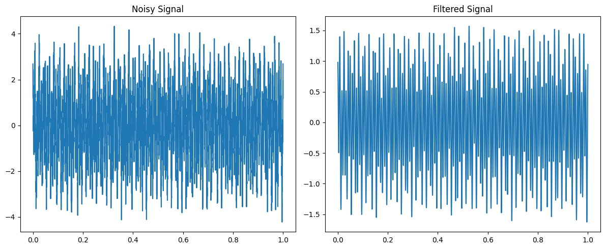
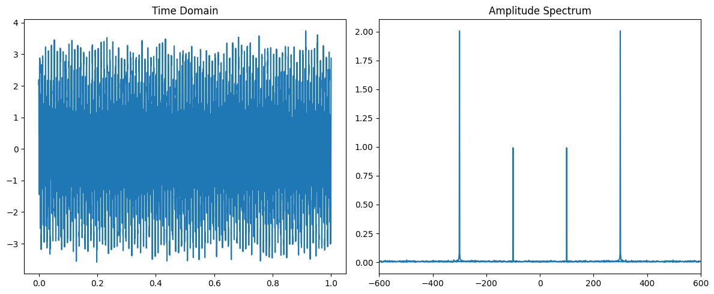
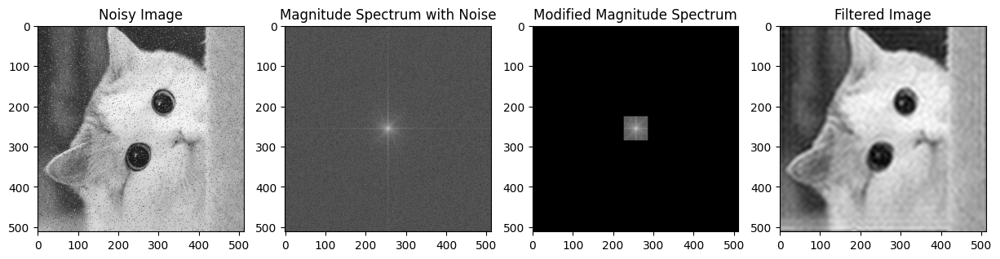

# Paddle 傅里叶变换基础及领域应用

## 1. 傅里叶变换基础

### 1.1 傅里叶变换简介

傅里叶变换是一种重要的信号处理技术，它可以将一个信号从时域转换到频域。在频域中，信号的频率特性更加明显，有利于分析和处理。傅里叶变换的基本思想是将一个信号分解为不同频率的正弦波的叠加，通过计算正弦波的振幅和相位，可以得到信号在频域中的表示。

### 1.2 傅里叶变换的数学原理

傅里叶变换的数学原理基于傅里叶级数理论,它将任意周期信号分解为不同频率的正弦/余弦函数的无穷级数之和。

对于非周期函数,我们可以将其看作是周期无穷大的周期函数。傅里叶变换就是对这种非周期函数进行周期无穷大时的分解。具体来说:

设f(t)为时域上的非周期函数,F(ω)为其对应的频域函数,傅里叶变换对将它们相互转换:

正变换:

$F(\omega) = \int_{-\infty}^{\infty} f(t)e^{-j\omega t} dt$

逆变换: 

$f(t) = \frac{1}{2\pi}\int_{-\infty}^{\infty} F(\omega)e^{j\omega t} d\omega$

其中 $j = \sqrt{-1}$

这里正变换将时域函数f(t)映射到了频域函数 F(ω), ω 表示角频率。逆变换则将频域函数 F(ω) 映射回时域 f(t)。

正弦/余弦函数 $e^{j\omega t}$ 可看作是单位复指数函数,模长为1,角速度为ω,表示无穷持续的单频振荡。

- 当ω取正值时,表示正向旋转,对应正频率分量
- 当ω取负值时,表示反向旋转,对应负频率分量

通过上式中的积分操作,原函数f(t)可以分解为无数个不同频率ω的单位复指数函数之和,其系数就是频域函数F(ω)。

因此,傅里叶变换实现了时域函数到频域的无穷级数分解,使我们能观察信号中各个频率分量的振幅。这种时域/频域观察信号的能力是傅里叶分析的关键。

### 1.3 快速傅里叶变换(FFT)算法

快速傅里叶变换(Fast Fourier Transform, FFT)是一种高效计算离散傅里叶变换(Discrete Fourier Transform, DFT)的算法。相比直接计算DFT,FFT能极大降低计算复杂度。

FFT算法的核心思想是分治法, 将一个长度为N的DFT分解为多个小规模DFT的组合计算, 从而降低计算量。具体来说:

1. 分治(decimation)
   - 将长度为N的序列拆分成若干较小的序列
   - 小序列分别计算DFT
   - 将小DFT结果组合起来,即可得到大DFT

2. 对于一个长度为N的复数序列x,可以写作: $x(n) = x_e(n) + x_o(n)W_N^n$
   其中:
    - $x_e(n)$是x中偶数项的子序列
    - $x_o(n)$是x中奇数项的子序列  
    - $W_N = e^{-\frac{2\pi j}{N}}$ 是一个长为N的主值为1的复数根

3. 将x的DFT分成两部分计算,这样就把长度为N的DFT分解为两个长度为N/2的DFT的和:

$$
X(k) = \sum_{n=0}^{N-1}x(n)W_N^{nk} \\
        = \sum_{n=0}^{N/2-1}x_e(n)W_{N/2}^{nk} + W_N^k\sum_{n=0}^{N/2-1}x_o(n)W_{N/2}^{nk}
$$

   

4. 采用递归的方式,不断将较大的DFT分解为较小的DFT,直至长度为2,可直接计算。然后自底向上合并结果。

上面的分治思路称为"蝴蝶操作",是FFT的核心步骤。不同的FFT算法主要是在蝴蝶操作的具体实现上有差异。例如最常用的是基2FFT算法(Cooley-Tukey算法)。除此之外还有分力级数FFT、Rader's FFT等变种算法。

FFT算法将DFT的计算复杂度从 $O(N^2)$ 降低到了 $O(NlogN)$ ,因此能高效计算大规模DFT。例如长度为1024的复数序列,基2FFT只需10*1024个复数乘法即可计算其DFT,而直接DFT需要约100万次乘法运算。

### 1.4 实数傅里叶变换和厄米特傅里叶变换

当输入为实数信号时，傅里叶变换显示出一种特殊的对称性，称为厄米特对称性。这意味着在频率 $f_k$ 处的频谱分量与在 $-f_k$ 处的分量是共轭对称的。基于这种对称性，可以显著减少计算所需的时间和资源。具体而言，实数傅里叶变换（简称rfft）系列函数专为处理实数输入设计，它们仅计算正频率部分，直至达到奈奎斯特频率，从而有效利用了数据的对称性。结果是，对于rfft，$n$ 个复数输入仅产生 $n // 2 + 1$ 个实数输出，这种方法通过减少必要的计算量而提高了效率。

相应地，当频谱本身为纯实数时，输入信号展现出厄米特对称性。在这种情况下，厄米特傅里叶变换（hfft）系列也采用了这一对称性原理，通过使用 $n // 2 + 1$ 个复数输入点生成 $n$ 个实数输出点，从而在计算时实现了高效率。这种对称性不仅在数学上优雅，而且在实际应用中提供了计算上的便利，使得在处理实数信号时能够更加高效地执行傅里叶变换及其逆变换。

## 2. Paddle 傅里叶变换 API

paddle.fft 模块提供了如下几大类API:

1. 标准快速傅里叶变换(FFT)API
   - 包括 1维、2维 和 N维的正向和逆向FFT API

2. 实数傅里叶变换API  
   - 用于计算实数多项式系数的离散傅里叶变换及其逆变换
   - 同样包括 1维、2维 和 N维 的变换

3. 厄米特(半正定)傅里叶变换API
   - 处理半正定厄米特矩阵的傅里叶变换

4. 辅助功能API
   - 计算FFT的频率采样值
   - 对FFT结果进行直流分量平移 (fftshift/ifftshift)
   - 等辅助操作

通过这些API,paddle.fft模块覆盖了标准复数FFT、实数FFT、半正定FFT等多种变换形式,并且每种变换都支持1维、2维、N维等多种维度,可满足各种傅里叶变换计算需求。同时这些 API 都是自动微分友好的, 支持反向传播, 因此可直接应用于神经网络中。详细的 API 列表可以参考 [API文档](https://www.paddlepaddle.org.cn/documentation/docs/zh/develop/api/paddle/fft/Overview_cn.html#standard-ffts)。下面我们结合一些领域内的应用场景, 介绍如何使用这些API。


## 3. 傅里叶变换在信号处理中的应用

### 3.1 信号滤波

在实际信号处理中,常常需要对采集的信号进行降噪处理,去除噪声干扰,以提取有用信号。传统的时域滤波器如 FIR、IIR 滤波器在性能和可设计性上都有一定局限性。基于傅里叶分析的频域滤波, 可以更直接有效地处理噪声问题。

技术原理:

1. 将时域信号通过傅里叶变换映射到频域
2. 在频域对信号进行滤波处理,如保留低频部分、阻挡高频噪声等
3. 对滤波结果进行逆傅里叶变换,得到时域上的降噪信号

下面是代码示例：

```python 
import numpy as np
import paddle
import matplotlib.pyplot as plt

# 生成含噪信号
t = np.linspace(0, 1, 4000)
sig = np.sin(2 * np.pi * 50 * t) + 2 * np.cos(
    2 * np.pi * 120 * t
)  # 50Hz正弦 + 120Hz余弦
sig += 0.6 * np.random.randn(len(t))  # 加入高斯白噪声

# 傅里叶变换
sig_fft = paddle.fft.fft(paddle.to_tensor(sig)) # 使用paddle.fft.fft计算傅里叶变换
freqs = paddle.fft.fftfreq(len(sig), 1 / len(sig)) # 使用paddle.fft.fftfreq获取频率采样值

# 理想带通滤波器
filt = paddle.zeros_like(sig_fft)
filt[(freqs > 40) & (freqs < 140)] = 1  # 通过40~140Hz频率

# 滤波并重建时域信号
# paddle.fft.ifft 计算逆傅里叶变换, 取实部得到时域信号
sig_filt = paddle.fft.ifft(sig_fft * filt).real().numpy()


# 绘制原始/滤波信号
plt.figure(figsize=(12, 5))
plt.subplot(121)
plt.plot(t, sig)
plt.title("Noisy Signal")
plt.subplot(122)
plt.plot(t, sig_filt)
plt.title("Filtered Signal")
plt.tight_layout()
plt.show()
```




上述代码首先生成了一个含50Hz/120Hz分量以及高斯白噪声的合成信号,将其做傅里叶变换,得到了频域表示,构造一个理想带通滤波器,通过40\~140Hz频率,阻挡其它频率成分,在频域对原始信号进行滤波,即保留40\~140Hz内的分量,最后对滤波结果进行逆傅里叶变换,得到时域的降噪信号,可以看到,频域滤波后的信号,高频噪声成分被大幅减弱,有效去除了噪声干扰。这种思路可广泛应用于通信信号处理、语音降噪、生物医学信号处理等领域。

### 3.2 频谱分析

接下来，我们通过一个频谱分析的例子,进一步说明傅里叶变换在信号处理中的应用。

频谱分析是信号处理的一个重要任务,目的是研究信号的频率成分及其振幅、相位等特性。它在通信系统、语音识别、故障诊断、地震勘探等领域都有广泛应用。

技术原理:

1. 采集待分析信号的时域数据
2. 对时域信号进行傅里叶变换,得到频域表示
3. 分析频域图像,查看信号在各频率分量上的振幅值
4. 可结合其他技术,提取频谱峰值、计算功率谱等


```python
import numpy as np
import paddle
import matplotlib.pyplot as plt

# 生成合成信号
t = np.linspace(0, 1, 8000)
sig = (
    np.sin(2 * np.pi * 100 * t)
    + 2 * np.cos(2 * np.pi * 300 * t)
    + 0.3 * np.random.randn(len(t))
)

# 计算傅里叶变换
sig_fft = paddle.fft.fft(paddle.to_tensor(sig))

# 使用paddle.fft.fftfreq计算傅里叶变换的频率采样值
# len(sig)是信号长度, 1/len(sig)是采样间隔
freqs = paddle.fft.fftfreq(len(sig), 1 / len(sig)).numpy()

# 计算振幅谱
# 取sig_fft的绝对值, 得到各频率分量的振幅值
amp_spec = np.abs(sig_fft.numpy()) / (len(sig) / 2)

# 绘制时域/频域图
plt.figure(figsize=(12, 5))
plt.subplot(121)
plt.plot(t, sig)
plt.title("Time Domain")
plt.subplot(122)
plt.plot(freqs, amp_spec)
plt.title("Amplitude Spectrum")
plt.xlim(-600, 600)
plt.tight_layout()
plt.show()
```



上述代码生成了一个含 100Hz 正弦波和 300Hz 余弦波的合成信号, 并添加了少量噪声, 使用 `paddle.fft.fft` 计算了信号的傅里叶变换, 得到频域表示, 计算了各频率分量的振幅谱 amp_spec, 在时域和频域图像上绘制了对应的曲线。可以明显看到在频谱图中, 100Hz 和 300Hz处有两个显著的峰值, 对应合成信号中的两个主频率分量, 其它频率分量由于噪声影响, 振幅较低。

## 4. 傅里叶变换在图像处理中的应用


在图像获取和传输过程中, 图像质量会由于各种因素而降低, 出现模糊、噪声、细节丢失等问题。 图像增强处理旨在提高图像质量, 是图像处理的一个重要环节。其中, 锐化是常用的增强手段,可以使图像的边缘和细节更加清晰。

技术原理:

1. 将含噪图像进行二维傅里叶变换,得到频域表示
2. 在频域设计并应用低通滤波器,阻挡高频噪声
3. 对滤波结果进行逆傅里叶变换,获得去噪后的图像

下面是代码示例：

```python
import paddle
import numpy as np
from PIL import Image
from skimage import util
import matplotlib.pyplot as plt

# 图像路径
image_path = "WechatIMG198.jpg"

# 读取图片并转为灰度图
gray_image = Image.open(image_path).convert("L")

# 将图片尺寸调整为 512x512
resized_image = np.array(gray_image.resize((512, 512)))

# 给图片添加椒盐噪声，噪声比例为 5%
noisy_image = util.random_noise(resized_image, mode="s&p", amount=0.05)

# 创建一个 15x5 英寸的图像窗口用于显示
plt.figure(figsize=(15, 5))

# 显示添加了噪声的图像
plt.subplot(141)
plt.imshow(noisy_image, cmap="gray")
plt.title("Noisy Image")

# 对图像进行傅里叶变换
fft_result = paddle.fft.fft2(paddle.to_tensor(noisy_image))

# 将零频分量移至频谱中心
fft_shifted = paddle.fft.fftshift(fft_result)

# 计算频谱的对数幅度以便更好的显示
log_magnitude_spectrum = paddle.log(1 + paddle.abs(fft_shifted))

# 显示噪声图像的幅度谱
plt.subplot(142)
plt.imshow(log_magnitude_spectrum.numpy(), cmap="gray")
plt.title("Magnitude Spectrum with Noise")

# 修改幅度谱
m, n = fft_shifted.shape  # 获取频谱的尺寸
fft_shifted_numpy = fft_shifted.numpy()  # 转换为 NumPy 数组进行操作
size = 30  # 设置过滤器大小

# 自适应高频过滤
fft_shifted_numpy[: m // 2 - size, :] = 0
fft_shifted_numpy[m // 2 + size :, :] = 0
fft_shifted_numpy[m // 2 - size : m // 2 + size, : n // 2 - size] = 0
fft_shifted_numpy[m // 2 - size : m // 2 + size, n // 2 + size :] = 0

# 将处理过的数据转换回 Paddle 张量
filtered_freq_spectrum = paddle.to_tensor(fft_shifted_numpy)

# 再次计算处理后频谱的对数幅度
log_magnitude_spectrum_filtered = paddle.log(1 + paddle.abs(filtered_freq_spectrum))

# 显示过滤后的幅度谱
plt.subplot(143)
plt.imshow(log_magnitude_spectrum_filtered.numpy(), cmap="gray")
plt.title("Modified Magnitude Spectrum")

# 反傅里叶变换
ifft_shifted = paddle.fft.ifftshift(filtered_freq_spectrum)
reconstructed_image = paddle.fft.ifft2(ifft_shifted)

# 取绝对值并将数据转换回 NumPy 数组
reconstructed_image_abs = paddle.abs(reconstructed_image)
reconstructed_image_numpy = reconstructed_image_abs.numpy()

# 将像素值范围调整为 0-255
final_image = (reconstructed_image_numpy * 255.0).astype(np.uint8)

# 显示最终的过滤后图像
plt.subplot(144)
plt.imshow(final_image, cmap="gray")
plt.title("Filtered Image")

# 显示所有的图像
plt.show()
```



首先加载测试图像,并人工添加高斯噪声,模拟实际情况,构造一个二维高斯低通滤波器filt,中心区域通过,边缘衰减,使用paddle.fft.fft2计算噪声图像的二维傅里叶变换,平移零频率到中心,进行滤波:fshift *= filt,使用paddle.fft.ifft2计算逆变换,得到去噪后的图像。从结果可以看出,低通滤波可以有效去除图像中的高频噪声,使图像更加平滑，但是也会导致图像细节丢失,因此在实际应用中,需要根据具体情况选择合适的滤波器。

### 5. 傅里叶变换在 NLP 中的应用

得益于自动微分的特性, 傅里叶变换在深度学习中也有广泛应用。FNet 是一个简化的自然语言处理（NLP）模型，由 Google 在 2021 年提出。FNet 的独特之处在于它用简单的傅里叶变换（Fourier transforms）替换了传统的自注意力（self-attention）机制。

在FNet中，输入的文本首先被转换为嵌入向量，然后通过傅里叶变换来处理这些嵌入。傅里叶变换是一种强大的数学工具，可以将数据从时域（或空间域）转换到频域。在FNet中，这意味着模型可以有效地捕获输入数据的频率特征，这对于理解文本的全局结构非常有用。

通过使用傅里叶变换而非自注意力机制，FNet显著简化了模型的计算复杂性。这使得FNet在训练和推理时更加高效，尤其是对于长文本或大规模数据集，同时在多数任务上保持了与更复杂模型相当的性能。

FNet可以很容易地用标准的深度学习框架实现，并且可以被应用于各种NLP任务，包括文本分类、情感分析、文本摘要等。尽管它在某些任务上的性能可能略低于使用自注意力的最先进模型，但其高效率使其成为在资源受限的情况下的有力候选者。

调用 paddle 中的多维傅里叶变换算子可以很轻松地实现傅里叶层：

```python
import paddle
from paddle.nn import Layer

# 定义一个基础的傅里叶变换层
class FNetBasicFourierTransform(Layer):
    def __init__(self):
        super().__init__()
        # 初始化傅里叶变换函数
        self.fourier_transform = paddle.fft.fftn
    
    def forward(self, hidden_states):
        # 对输入的隐藏状态进行傅里叶变换，并只取实数部分
        outputs = self.fourier_transform(hidden_states).real()
        return outputs
        
# 定义一个进行傅里叶变换的网络层
class FNetFourierTransform(Layer):
    def __init__(self, hidden_size, layer_norm_eps):
        super().__init__()
        # 使用基础的傅里叶变换
        self.fourier_transform = FNetBasicFourierTransform()
        # 初始化一个输出层，可能用于后续的标准化等操作
        self.output = FNetBasicOutput(hidden_size, layer_norm_eps)
    
    def forward(self, hidden_states):
        # 首先通过傅里叶变换层处理隐藏状态
        self_outputs = self.fourier_transform(hidden_states)
        # 将傅里叶变换后的结果以及原始隐藏状态传递给输出层，进行进一步处理
        fourier_output = self.output(self_outputs, hidden_states)
        return fourier_output
```


## 5. 总结

Paddle 提供了全面的傅里叶变换 API，包括标准的快速傅里叶变换(FFT)、实数傅里叶变换和厄米特傅里叶变换等多种功能。这些功能广泛应用于信号处理领域，例如信号滤波、频谱分析，以及图像处理领域中的去噪、锐化等任务。通过傅里叶变换，可以将信号从时域转换到频域，更好地理解信号的频率特性，并且对信号进行有效的处理和增强。这些 API 还具有自动微分的特性，可直接应用于神经网络等领域，为信号处理和图像处理任务提供了便利。


## 参考文献

1. https://aistudio.baidu.com/projectdetail/7702538?forkThirdPart=1
2. https://www.paddlepaddle.org.cn/documentation/docs/zh/develop/api/paddle/fft/Overview_cn.html
3. https://paddlescience-docs.readthedocs.io/zh/latest/zh/examples/deephpms/


