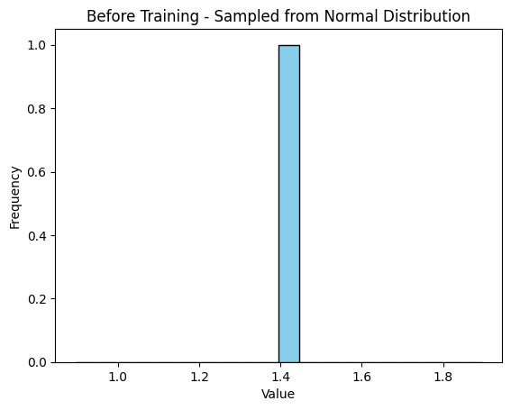
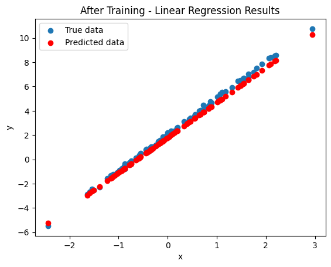
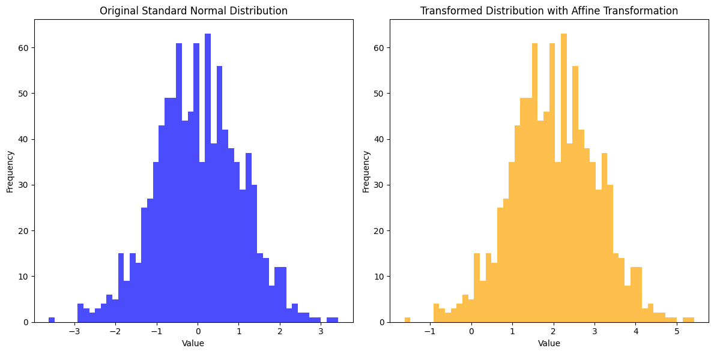
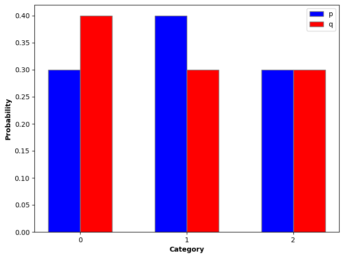
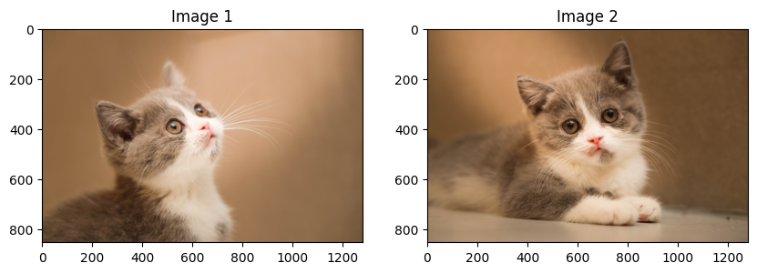

# Paddle 概率分布基础及领域应用

## 1. 概率分布基础

### 1.1 概率分布简介

概率分布是统计学中用来描述一个随机变量可能取值的概率的数学函数。它可以分为离散型概率分布和连续型概率分布两种类型。通过对数据的概率分布建模，可以更好地理解数据的分布规律，从而进行数据预测、分类、聚类等任务，例如，在机器学习中，通过建立概率模型，可以进行概率推断和预测。

### 1.2 离散型随机变量概率分布

离散型概率分布用于描述随机变量只能取有限个或可列个数值的情况。对于每一个可能的取值，分布函数会定义它对应的概率。通常来讲常见的概率分布有以下几种类：

0-1分布（伯努利分布）:

设随机变量X只可能取0与1两个值，它的分布律是 ：
$\mathrm{P}\\{X=k\\}=p^k(1-p)^{1-k}, \quad k=0,1$
则称X服从以p为参数的0-1分布或者两点分布。
它的期望为： $EX=p$
它的方差为： $DX=p(1-p)$

二项分布: 

了解到了伯努利分布后，我们来考虑n重伯努利实验，设随机变量X是事件发生的次数，那么其分布律是：
$\mathrm{P}\\{X=k\\} = \binom{n}{k} p^k (1-p)^{n-k}, \quad k=0,1,\ldots,n$
则称随机变量X服从参数n，p的二项分布，并记作： $X\sim b(n,p)$
它的期望为： $EX=np$
它的方差为： $DX=np(1-p)$

泊松分布:

设随机变量X的可能取值为0，1，2，...，且概率分布为：
$\text{P}\\{X=k\\} = \frac{e^{-\lambda} \lambda^{k}}{k!}$
,则称随机变量X服从泊松分布，并记作： $X\sim\pi(\lambda)$
它的期望为： $EX=\lambda$
它的方差为： $DX=\lambda$

几何分布:

几何分布指的是以下两种离散型概率分布中的一种：
  在伯努利试验中，得到一次成功所需要的试验次数X。X的值域是{1，2，3...}
  在得到第一次成功之前所经历的失败次数： $Y=X-1$。Y的值域是{0，1，2，...}
如果每次试验的成功概率是p，那么k次试验中，第k次才得到成功的概率是：
$\mathrm{P}(X=k) = (1-p)^{k-1} p$
它的期望为： $EX=\frac1p$
它的方差为： $DX=\frac{1-p}{p^2}$


### 1.3 连续型随机变量概率分布

连续型随机变量分布是用来描述随机变量在连续值范围内取值的概率分布，这些分布在数学和统计学中起着重要作用，常见的连续型概率分布包括以下几种：

均匀分布:

一个均匀分布在区间[a,b]上的连续型随机变量X，其对应的概率密度函数为：
$f(x) = | \frac{1}{b-a} \quad \text{if } a \leq x \leq b |
       | 0 \quad \text{otherwise} |$
它的期望为： $EX=\frac{a+b}2$
它的方差为： $DX=\frac{(b-a)^2}{12}$

指数分布:
若随机变量X有以下的概率密度函数：
$f(x) = | \lambda e^{-\lambda x} \quad \text{if } x > 0 |
       | 0 \quad \text{otherwise} |$
则称X服从指数分布。其中 $\lambda$为参数，其分布函数为：
$F(x) = | \int_{-\infty}^x f(t) \, dt = 1 - e^{-\lambda x} \quad \text{if } x > 0 |
       | 0 \quad \text{otherwise} |$
它的期望为： $EX=\frac1\lambda$
它的方差为： $DX=\frac{1}{\lambda^{2}}$

正态分布:
若随机变量X对应的概率密度函数为：
$f(x)=\frac{1}{\sqrt{2\pi}\sigma}e^{\frac{-(x-\mu)^2}{2\sigma^2}}$
则称X服从正态分布，又名高斯分布，并记作 $X\sim N(\mu,\sigma^{2})$
它的期望为： $EX=\mu$
它的方差为： $DX=\sigma^2$
当 $\mu=0$，$\sigma^2=1$， $f(x)=\frac{1}{\sqrt{2\pi}}e^{\frac{-x^{2}}{2}}$，即 $X\sim N(0,1)$，称其服从标准正态分布
通常习惯将标准正态分布函数记作 $\Phi(x)$，概率密度函数记作 $\phi(x)$


## 2. Paddle 概率分布 API

paddle.distribution 模块提供了如下几大类API:

1. 随机变量的概率分布API
   - 该模块包含了各种常见的概率分布，如正态分布、均匀分布等。你可以使用这些API来创建各种概率分布的对象，并进行概率密度函数计算、采样等操作。

2. 随机变量的变换API
   - 提供了一系列随机变量的变换函数，如 AffineTransform、Bijector 等。这些函数可以帮助进行随机变量之间的映射和变换。

3. KL 散度相关 API
   - 用于衡量两个概率分布之间的相似度。PaddlePaddle 中的 kl_divergence 函数用于计算两个分布之间的 KL 散度。

通过这些API,paddle.distribution模块覆盖了多种离散型和连续性随机变量概率分布、指数变换、Softmax变换函数、KL散度计算相关功能,不仅可以用于定义各种概率分布和进行概率计算，还可以结合在各种深度学习任务中，
如生成模型、概率编码和强化学习等领域，为深度学习提供更强大的概率建模和分析工具。详细的 API 列表可以参考 [API文档](https://www.paddlepaddle.org.cn/documentation/docs/zh/develop/api/paddle/distribution/Overview_cn.html#paddle-distribution)。
下面我们结合一些领域内的应用场景, 介绍如何使用这些API。


## 3. 随机变量的概率分布在线性回归中的应用

### 3.1 随机变量的正态分布

在实际深度学习的任务中，我们通常需要对于各种权重参数进行初始化操作，因此采用paddle.distribution中的随机变量的概率分布函数，可以帮我们有效地产生一些具有一定分布规律的参数，从而使模型训练达到较好的效果

技术原理:

1. 将设置训练参数并使用paddle.distribution.Normal创建服从正态分布的随机变量
2. 进行参数采样，并使用采样数据创建线性回归模型并训练
3. 对滤波结果进行逆傅里叶变换,得到时域上的降噪信号

下面是代码示例：

```python 
import paddle
import paddle.nn.functional as F
from paddle.distribution import Normal
from paddle.nn.initializer import Assign
import matplotlib.pyplot as plt

# 参数设置
input_size = 1
output_size = 1
num_samples = 100
learning_rate = 0.01
num_epochs = 100

# 创建服从正态分布的随机变量
mu = paddle.to_tensor([0.0])
sigma = paddle.to_tensor([1.0])
dist = Normal(mu, sigma)

# 从正态分布的随机变量中采样参数
sampled_param = dist.sample((input_size, output_size))

# 定义简单的线性回归模型
class LinearRegressionModel(paddle.nn.Layer):
    def __init__(self):
        super(LinearRegressionModel, self).__init__()
        self.linear = paddle.nn.Linear(input_size, output_size, weight_attr=paddle.ParamAttr(initializer=Assign(sampled_param)))

    def forward(self, x):
        return self.linear(x)

# 准备数据集
x = paddle.randn([num_samples, input_size])
y = 3 * x + 2 + paddle.randn([num_samples, output_size]) * 0.1

# 初始化模型
model = LinearRegressionModel()
loss_fn = paddle.nn.MSELoss()
optimizer = paddle.optimizer.SGD(parameters=model.parameters(), learning_rate=learning_rate)

# 训练模型并可视化回归结果
predicted_values = []
for epoch in range(num_epochs):
    y_pred = model(x)
    loss = loss_fn(y_pred, y)
    
    loss.backward()
    optimizer.step()
    optimizer.clear_grad()
    
    # 记录预测值
    predicted_values.append(y_pred.numpy())

    if epoch % 10 == 0:
        print('Epoch {}, Loss: {}'.format(epoch, loss.numpy()))

# 可视化回归结果
plt.figure()
plt.scatter(x.numpy(), y.numpy(), label='True data')
plt.scatter(x.numpy(), predicted_values[-1], label='Predicted data', color='red')
plt.legend()
plt.title('Linear Regression Results')
plt.xlabel('x')
plt.ylabel('y')
plt.show()


```
训练结果：
Epoch 0, Loss: 7.767370223999023
Epoch 10, Loss: 4.834458827972412
Epoch 20, Loss: 3.0138168334960938
Epoch 30, Loss: 1.8826518058776855
Epoch 40, Loss: 1.1791867017745972
Epoch 50, Loss: 0.7412469983100891
Epoch 60, Loss: 0.4682944416999817
Epoch 70, Loss: 0.2979578971862793
Epoch 80, Loss: 0.1915128529071808
Epoch 90, Loss: 0.12489435076713562

训练前正态分布数据图：

训练后的回归结果图：


上述代码演示了如何使用 paddle.distribution.Normal 创建一个服从正态分布的随机变量，并将其用于初始化线性回归模型的参数。在训练过程中，模型根据数据逐渐调整参数，在验证集上降低损失。通过这种方式，可以在深度学习中使用随机变量函数来初始化模型参数或进行其他随机化操作。

### 3.2 仿射变换

接下来，我们通过一个仿射变换的例子,进一步说明paddle.distribution中随机变量变换的应用。

技术原理:

1. 创建服从标准正态分布的随机变量
2. 创建一个 AffineTransform 对象，实现一个仿射变换
3. 在标准正态分布数据上应用 AffineTransform
4. 生成服从经过仿射变换的随机变量数据，做可视化分析


```python
import numpy as np
import matplotlib.pyplot as plt
import paddle
import paddle.distribution as pdist
from paddle.distribution import Transform, AffineTransform

# 参数设置
num_samples = 1000

# 创建服从标准正态分布的随机变量
dist = pdist.Normal(0.0, 1.0)

# 创建一个 AffineTransform 对象，实现一个仿射变换 x -> 2 * x + 1
affine = AffineTransform(paddle.to_tensor(2.0), paddle.to_tensor(1.0))

# 生成服从标准正态分布的随机变量数据
samples_original = dist.sample([num_samples])

# 应用仿射变换到原始数据
samples_transformed = affine.forward(samples_original)

# 可视化标准正态分布和变换后的分布
plt.figure(figsize=(12, 6))

# 原始标准正态分布的直方图
plt.subplot(1, 2, 1)
plt.hist(samples_original.numpy().flatten(), bins=50, color='blue', alpha=0.7)
plt.title('Original Standard Normal Distribution')
plt.xlabel('Value')
plt.ylabel('Frequency')

# 变换后的分布的直方图
plt.subplot(1, 2, 2)
plt.hist(samples_transformed.numpy().flatten(), bins=50, color='orange', alpha=0.7)
plt.title('Transformed Distribution with Affine Transformation')
plt.xlabel('Value')
plt.ylabel('Frequency')

plt.tight_layout()
plt.show()
```

仿射变换前后的数据图：


在上述代码中，我们首先创建了一个服从标准正态分布的随机变量，然后定义一个 AffineTransform，将该变换应用于随机变量，实现一个仿射变换例子，具体是将原始数据乘以 2 并加上 1。我们最终生成服从经过仿射变换的随机变量数据，并通过直方图可视化原始标准正态分布和变换后的分布。仿射变换操作在深度学习中的应用包括特征缩放、数据转换等方面。


## 4. 随机变量的概率分布在KL散度中的应用


KL散度（Kullback-Leibler divergence），也称为相对熵，是信息论中用来衡量两个概率分布之间差异的一种指标。KL散度衡量一个概率分布相对于另一个概率分布的信息增益，或者说在一个概率分布下的不确定性相对于另一个概率分布而言的信息量。
对于两个离散概率分布 P 和 Q，KL散度的计算公式为：
$KL(P||Q)=\Sigma(P(i)^*\log(P(i)/Q(i)))$
其中，$P(i)$ 和 $Q(i)$ 分别表示两个概率分布在第 i 个事件上的概率，KL散度是非对称的，即 $\mathrm{KL(P||Q)\neq KL(Q||P)}$，它不满足三角不等式，也不是一个距离度量。

技术原理:

1.定义两个概率分布 p_logits 和 q_logits，使用对数概率值作为输入。
2.计算这两个概率分布之间的KL散度值，衡量它们之间的差异。
3.可视化两个概率分布的概率值，以直观展示它们之间的区别。

下面是代码示例：

```python
import paddle
import numpy as np
import matplotlib.pyplot as plt

# 定义两个概率分布
p_logits = paddle.to_tensor(np.array([np.log(0.3), np.log(0.4), np.log(0.3)]))
q_logits = paddle.to_tensor(np.array([np.log(0.4), np.log(0.3), np.log(0.3)]))

# 使用paddle的KL散度函数计算KL散度值
p_dist = paddle.distribution.Categorical(logits=p_logits)
q_dist = paddle.distribution.Categorical(logits=q_logits)
kl_div = paddle.distribution.kl_divergence(p_dist, q_dist).numpy()

print("KL散度值为:", kl_div)

# 可视化
probs_p = paddle.exp(p_logits).numpy()
probs_q = paddle.exp(q_logits).numpy()

plt.figure(figsize=(8, 6))
barWidth = 0.3

# 设置位置
r1 = np.arange(len(probs_p))
r2 = [x + barWidth for x in r1]

# 绘制条形图
plt.bar(r1, probs_p, color='b', width=barWidth, edgecolor='grey', label='p')
plt.bar(r2, probs_q, color='r', width=barWidth, edgecolor='grey', label='q')
plt.xlabel('Category', fontweight='bold')
plt.ylabel('Probability', fontweight='bold')
plt.xticks([r + barWidth/2 for r in range(len(probs_p))], range(len(probs_p)))
plt.legend()
plt.show()
```



上述代码演示了如何使用 PaddlePaddle 中的函数来计算和可视化两个概率分布之间的 KL 散度，通过计算 KL 散度，可以更好地衡量和比较不同概率分布之间的差异性。

### 5. 使用KL散度比较两张图像的颜色分布

技术原理:

1.读取两张灰度图像，计算归一化直方图。
2.使用KL散度比较相似性，量化图像差异程度。
3.可视化图像，直观显示差异。

```python
import cv2
import numpy as np
import matplotlib.pyplot as plt

def calculate_kl_divergence(hist1, hist2):
    epsilon = 1e-10  # 微小的常数值
    hist1_smoothed = hist1 + epsilon
    hist2_smoothed = hist2 + epsilon
    kl_div = np.sum(np.where(hist1_smoothed != 0, hist1_smoothed * np.log(hist1_smoothed / hist2_smoothed), 0))
    return kl_div

# 读取两张图像
img1 = cv2.imread('./images/cat1.jpg')
img2 = cv2.imread('./images/cat2.jpg')

# 将图像转换为灰度图像
gray_img1 = cv2.cvtColor(img1, cv2.COLOR_BGR2GRAY)
gray_img2 = cv2.cvtColor(img2, cv2.COLOR_BGR2GRAY)

# 计算直方图
hist_img1 = cv2.calcHist([gray_img1], [0], None, [256], [0, 256])
hist_img2 = cv2.calcHist([gray_img2], [0], None, [256], [0, 256])

# 归一化直方图
hist_img1 /= hist_img1.sum()
hist_img2 /= hist_img2.sum()

# 计算KL散度
kl_divergence = calculate_kl_divergence(hist_img1, hist_img2)

print("KL散度值为:", kl_divergence)

# 可视化
plt.figure(figsize=(10, 5))
plt.subplot(1, 2, 1)
plt.imshow(cv2.cvtColor(img1, cv2.COLOR_BGR2RGB))
plt.title('Image 1')

plt.subplot(1, 2, 2)
plt.imshow(cv2.cvtColor(img2, cv2.COLOR_BGR2RGB))
plt.title('Image 2')

plt.show()
```

输出KL散度为：KL散度值为: 0.7396399
对比图如下图所示：


上述代码会比较两张图像的灰度直方图，并计算它们之间的KL散度值。该操作可以在图像处理中利用KL散度来度量图像之间的差异性。

## 5. 总结

Paddle 提供了全面的概率分布 API，包括伯努利分布、二项分布和狄利克雷分布等多种分布。这些API提供了丰富的分布类型和变换操作，可用于建模和处理各种随机变量，广泛应用于概率建模、优化问题等领域。这些API的应用可以帮助用户更轻松地实现复杂的概率分布模型，提高效率并扩展深度学习在概率建模领域的应用范围。


## 参考文献

1. https://www.paddlepaddle.org.cn/documentation/docs/zh/develop/api/paddle/distribution/Overview_cn.html#paddle-distribution
2. https://paddlescience-docs.readthedocs.io/zh/latest/zh/api/probability/?h=distribution#ppsci.probability.HamiltonianMonteCarlo


