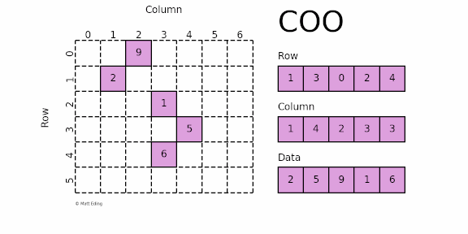
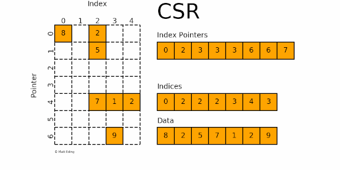
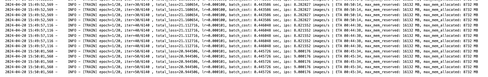

# 稀疏计算的使用指南

## 1. 稀疏格式介绍与 Paddle 支持的稀疏格式

稀疏格式是一种用于表示稀疏（大部分元素为零）数据结构的方法。在计算机科学和工程领域，有几种常见的稀疏格式，包括：

1. COO (Coordinate List)：COO格式使用三个数组来表示稀疏矩阵。第一个数组存储非零元素的值，第二个数组存储非零元素的行索引，第三个数组存储非零元素的列索引。
2. DOK (Dictionary of Keys)：DOK格式使用字典来表示稀疏矩阵，其中键是元素的坐标，值是元素的值。
3. LIL (List of Lists)：LIL格式使用嵌套列表来表示稀疏矩阵，其中外部列表代表行，内部列表代表每行的非零元素。
4. CSR (Compressed Sparse Row)：CSR格式使用三个数组来表示稀疏矩阵。第一个数组存储非零元素的值，第二个数组存储每行的起始索引，第三个数组存储非零元素的列索引。
5. CSC (Compressed Sparse Column)：CSC格式类似于CSR，但是以列为主的方式来存储数据。第一个数组存储非零元素的值，第二个数组存储每列的起始索引，第三个数组存储非零元素的行索引。
6. DIA (Diagonal)：DIA格式是一种稀疏矩阵的存储格式，主要用于存储对角线上有值的稀疏矩阵。DIA格式使用两个数组来表示稀疏矩阵。第一个数组`data`存储非零元素的值，第二个数组`offsets`存储每个对角线的偏移量。

这些格式各有优劣，选择取决于具体应用场景和算法需求。

PaddlePaddle支持的主要稀疏格式包括：

- COO格式（Coordinate Format）：此格式使用坐标来表示稀疏矩阵中的非零元素，涉及三个数组：行索引、列索引和值。
- CSR格式（Compressed Sparse Row）：此格式通过压缩稀疏矩阵的行来节省存储空间。它包含三个数组，即Index Pointers，indices和Data数组。

具体内容将在下面详细解释。

COO格式：



COO格式存储三个数组：行索引（Row）、列索引（Column）以及值（Data）数组。使用Data数组中的元素的索引分别去访问Row数组和Column数组就可以得到该元素在原来矩阵中的位置。

在`paddle.sparse`的COO实现中，使用了两个列表：

- 二维列表`indices`，包含行索引和列索引；
- 一维列表`values`，包含元素的值。

使用paddle代码保存上面的稀疏矩阵：

```python
import paddle
indices = [
    [1, 3, 0, 2, 4], # 行索引
    [1, 4, 2, 3, 3]	 # 列索引
]
values = [2, 5, 9, 1, 6] # 值
shape = [6, 7]

coo = paddle.sparse.sparse_coo_tensor(indices, values, shape)
print(coo)
```

输出如下：

```
Tensor(shape=[6, 7], dtype=paddle.int64, place=Place(cpu), stop_gradient=True, 
       indices=[[1, 3, 0, 2, 4],
                [1, 4, 2, 3, 3]], 
       values=[2, 5, 9, 1, 4])
```

我们还可以将稀疏矩阵转换为稠密矩阵：

```python
dense_coo = coo.to_dense()
print(dense_coo)
```

输出如下：

```
Tensor(shape=[6, 7], dtype=int64, place=Place(cpu), stop_gradient=True,
       [[0, 0, 9, 0, 0, 0, 0],
        [0, 2, 0, 0, 0, 0, 0],
        [0, 0, 0, 1, 0, 0, 0],
        [0, 0, 0, 0, 5, 0, 0],
        [0, 0, 0, 4, 0, 0, 0],
        [0, 0, 0, 0, 0, 0, 0]])
```

CSR格式：



CSR格式也存储三个数组，分别是Index Pointers，indices以及Data数组。

* Index Pointers数组中相邻的两个元素可以确定两个信息。

  * 首先，它们在数组中的位置（索引对中第一个元素的索引）是行号。

  * 其次，这些值表示Indices数组的 [start: stop] 切片，它们的差是每行中非零元素的个数。使用指针查找索引以确定数据中每个元素的列。

* Indices数组记录了每个元素的列索引。
* Data数组记录了元素的值

例如，第一个index pointers对是`[0,2]`，那么这是表示稀疏矩阵第0行（0在Index Pointers数组中的索引是0）中元素的信息，并且表示第0行中共有两个非零元素。而使用`Indices[0,2]`可以获得这两个元素的列索引，使用`Data[0,2]`获取这两个元素具体的值。

在`paddle.sparse`的CSR实现中，我们也使用了三个列表：

- 一维列表`crows`对应于Index Pointers数组；
- 一维列表`cols`对应于indices数组；
- 一维列表`values`对应于Data数组。

使用paddle代码存储上述的稀疏矩阵：

```python
import paddle
crows = [0, 2, 3, 3, 3, 6, 6, 7] # Index Pointers 
cols = [0, 2, 2, 2, 3, 4, 3]		 # Indices
values = [8, 2, 5, 7, 1, 2, 9]	 # Data
shape = [7, 5]
csr = paddle.sparse.sparse_csr_tensor(crows, cols, values, shape)
print(csr)
```

输出结果如下：

```
Tensor(shape=[7, 5], dtype=paddle.int64, place=Place(cpu), stop_gradient=True, 
       crows=[0, 2, 3, 3, 3, 6, 6, 7], 
       cols=[0, 2, 2, 2, 3, 4, 3], 
       values=[8, 2, 5, 7, 1, 2, 9])
```

获取对应的稠密矩阵：

```python
csr_dense = csr.to_dense()
print(csr_dense)
```

输出结果：

```
Tensor(shape=[7, 5], dtype=int64, place=Place(cpu), stop_gradient=True,
       [[8, 0, 2, 0, 0],
        [0, 0, 5, 0, 0],
        [0, 0, 0, 0, 0],
        [0, 0, 0, 0, 0],
        [0, 0, 7, 1, 2],
        [0, 0, 0, 0, 0],
        [0, 0, 0, 9, 0]])
```

## 2. Paddle 的稀疏调用体验与示例

Paddle提供了与稠密计算高度一致的稀疏计算接口，易于上手。

### 2.1 稀疏矩阵运算

首先实现一个生成随机稀疏矩阵的函数：

```python
import paddle
# 生成随机sparse tensor
def random_sparse_tensor(shape, density, sparse_type='coo'):
    dense_tensor = paddle.randn(shape)
    dropout = paddle.nn.Dropout(p=density)
    dense_tensor = dropout(dense_tensor)
    if sparse_type == 'coo':
        sparse_tensor = dense_tensor.to_sparse_coo(sparse_dim=dense_tensor.dim())
    elif sparse_type == 'csr':
        sparse_tensor = dense_tensor.to_sparse_csr()

    return sparse_tensor
```

以下是一些简单的示例，演示如何使用稀疏张量进行矩阵运算：

1. 矩阵加法

```python
import paddle
paddle.device.set_device("cpu")
sparse_x = random_sparse_tensor([3, 4], 0.5, 'csr')
sparse_y = random_sparse_tensor([3, 4], 0.4, 'csr')
print(sparse_x)
print(sparse_y)
sparse_z = paddle.sparse.add(sparse_x, sparse_y)
print(sparse_z.to_dense())
```

输出：

```
Tensor(shape=[3, 4], dtype=paddle.float32, place=Place(cpu), stop_gradient=True, 
       crows=[0, 0, 3, 6], 
       cols=[1, 2, 3, 1, 2, 3], 
       values=[0.21740164, 0.96893728, 0.79132926, 0.70950478, 0.59227538,
               0.75668865])
Tensor(shape=[3, 4], dtype=paddle.float32, place=Place(cpu), stop_gradient=True, 
       crows=[0, 1, 2, 4], 
       cols=[0, 3, 2, 3], 
       values=[0.69969773, 0.12527600, 0.99580669, 0.29706103])
Tensor(shape=[3, 4], dtype=float32, place=Place(cpu), stop_gradient=True,
       [[0.69969773, 0.        , 0.        , 0.        ],
        [0.        , 0.21740164, 0.96893728, 0.91660523],
        [0.        , 0.70950478, 1.58808208, 1.05374968]])
```

2. 矩阵乘法

```python
paddle.device.set_device("gpu")
# 矩阵乘法
sparse_x = random_sparse_tensor([3, 4], 0.5, 'csr')
dense_y = paddle.randn([3, 4])
result = paddle.sparse.matmul(sparse_x, dense_y.T)
print(f'矩阵乘：{result}')

paddle.device.set_device("cpu")
# Element-wise 乘法
sparse_x = random_sparse_tensor([3, 4], 0.5, 'csr')
sparse_y = random_sparse_tensor([3, 4], 0.5, 'csr')
result = paddle.sparse.multiply(sparse_x, sparse_y)
print(f'逐元素乘：{result}')
```

输出：

```
矩阵乘：Tensor(shape=[3, 3], dtype=float32, place=Place(gpu:0), stop_gradient=True,
       [[-0.85299683,  0.20933953,  0.17083304],
        [ 1.24665344,  0.10201306,  1.34720910],
        [ 0.        ,  0.        ,  0.        ]])
逐元素乘：Tensor(shape=[3, 4], dtype=paddle.float32, place=Place(cpu), stop_gradient=True, 
       crows=[0, 2, 5, 9], 
       cols=[0, 1, 0, 2, 3, 0, 1, 2, 3], 
       values=[0.        , 0.        , 0.        , 0.        , 0.18047522,
               0.15013061, 0.46534759, 0.        , 0.        ])
```

### 2.2 稀疏组网类

`paddle.sparse`库为我们提供了一系列精心设计的模块，包括稀疏版本的激活层、卷积层、池化层以及批量归一化层。借助这些强大且易用的组网模块，我们能够轻松构建并实现各种常见的稀疏模型。这无疑为处理稀疏数据的深度学习任务提供了极大的便利。

使用`paddle.sparse`实现稀疏 3D ResNet也是很简单的事（只演示了一部分）：

```python
import paddle
from paddle import sparse
from paddle.sparse import nn # 替换from paddle import nn

class SparseBasicBlock(paddle.nn.Layer):	# 继承的类还是原来的paddle.nn.Layer
    expansion = 1

    def __init__(
            self,
            in_channels,
            out_channels,
            stride=1,
            downsample=None,
    ):
        super(SparseBasicBlock, self).__init__()

        bias_attr = True
        self.conv1 = conv3x3(
            in_channels, out_channels, stride, bias_attr=bias_attr)
        self.bn1 = nn.BatchNorm(out_channels, epsilon=1e-3, momentum=0.01)
        self.relu = nn.ReLU()
        self.conv2 = conv3x3(out_channels, out_channels, bias_attr=bias_attr)
        self.bn2 = nn.BatchNorm(out_channels, epsilon=1e-3, momentum=0.01)
        self.downsample = downsample
        self.stride = stride

    def forward(self, x):
        identity = x

        out = self.conv1(x)
        out = self.bn1(out)
        out = self.relu(out)

        out = self.conv2(out)
        out = self.bn2(out)

        if self.downsample is not None:
            identity = self.downsample(x)

        out = sparse.add(out, identity)
        out = self.relu(out)

        return out
```

可见，ResNet 稀疏网络的代码和常规 ResNet 网络代码几乎没有差别。通过增加 import 路径替换，原网络代码基本都无需改动。通过 `from paddle.sparse import nn`，则可保持与原来的`nn.*`写法一致，更易于上手。

## 3. Paddle 稀疏计算实战案例

在本节中，我们将以3D点云CenterPoint模型为实例，进行深入探讨。

### 3.1 CenterPoint简介

CenterPoint是一个基于点云数据的3D目标检测与跟踪模型，主要应用于自动驾驶领域。

CenterPoint是Anchor-Free的三维物体检测器，以点云作为输入，将三维物体在Bird-View下的中心点作为关键点，基于关键点检测的方式回归物体的尺寸、方向和速度。相比于Anchor-Based的三维物体检测器，CenterPoint不需要人为设定Anchor尺寸，面向物体尺寸多样不一的场景时其精度表现更高，且简易的模型设计使其在性能上也表现更加高效。

CenterPoint的一些关键信息：

- **两阶段检测追踪模型**: CenterPoint首先检测三维目标的中心点，并回归其检测框大小、方向和速度。然后，通过一个refinement模块进一步优化这些参数
- **Center-based方法**: 与传统的box-based检测器不同，CenterPoint使用点表示目标，简化了三维目标检测任务，并保持了目标的旋转不变性
- **追踪计算效率**: CenterPoint的追踪任务不需要额外的运动模型，如Kalman滤波，使得追踪计算时间可以忽略不计
- **性能与速度**: 在nuScenes的3D检测和跟踪任务中，CenterPoint展现出优异的性能，但在边缘计算设备上可能无法达到实时计算的速度

这些特点使得CenterPoint在自动驾驶系统中的3D目标检测与跟踪方面非常有用。它通过简化的方法提高了检测和追踪的效率，尽管在某些硬件上可能存在速度限制。

Paddle3D实现的CenterPoint做了以下优化：

- 对模型的前后处理做了性能优化。CenterPoint-Pillars在[nuScenes](https://www.nuscenes.org/nuscenes) val set上精度有50.97mAP，速度在Tesla V100上达到了50.28FPS。
- 提供[KITTI数据集](http://www.cvlibs.net/datasets/kitti/eval_object.php?obj_benchmark=3d)上的训练配置和Baseline。CenterPoint-Pillars在KITTI val set上精度达到64.75 mAP，速度在Tesla V100上达到了43.96FPS。

跟原论文相比，Paddle3D实现的CenterPoint有以下差异：

- 未提供第二个阶段的实现。在原论文中，作者还设计了第二个阶段来进一步精炼物体的位置、尺寸和方向，并在[Waymo数据集](https://waymo.com/open/)上做了验证。Paddle3D目前还未适配Waymo数据集，所以第二个阶段暂未实现。
- 未提供在nuScenes数据集上将预测速度用于多目标跟踪的实现。

### 3.2 CenterPoint实现

使用paddle3d库实现centerpoint代码：

首先导入必要的库：

```python
import paddle
import paddle3d.models as models
import paddle3d.models.voxelizers as voxelizers
import paddle3d.models.voxel_encoders as voxel_encoders
import paddle3d.models.middle_encoders as middle_encoders
import paddle3d.models.backbones as backbones
import paddle3d.models.necks as necks
from paddle3d.datasets import NuscenesPCDataset
import paddle3d.transforms as T
```

现在进行数据预处理：

```python
train_dataset = NuscenesPCDataset(
    dataset_root='datasets/nuscenes/',
    transforms=[
        T.LoadPointCloud(dim=5,use_dim=4,use_time_lag=True,sweep_remove_radius=1),
        T.SamplingDatabase(
            min_num_points_in_box_per_class={  
                'car': 5,  
                'truck': 5,  
                'bus': 5,  
                'trailer': 5,  
                'construction_vehicle': 5,  
                'traffic_cone': 5,  
                'barrier': 5,  
                'motorcycle': 5,  
                'bicycle': 5,  
                'pedestrian': 5  
            },
            max_num_samples_per_class={  
                'car': 2,  
                'truck': 3,  
                'construction_vehicle': 7,  
                'bus': 4,  
                'trailer': 6,  
                'barrier': 2,  
                'motorcycle': 6,  
                'bicycle': 6,  
                'pedestrian': 2,  
                'traffic_cone': 2  
            },
            database_anno_path='datasets/nuscenes/gt_database_train_nsweeps10_withvelo/anno_info_train_nsweeps10_withvelo.pkl',
            database_root='datasets/nuscenes/',
            class_names=["car", "truck", "construction_vehicle", "bus", "trailer", "barrier", "motorcycle", "bicycle", "pedestrian", "traffic_cone"]
        ),
        T.RandomVerticalFlip(),
        T.RandomHorizontalFlip(),
        T.GlobalRotate(min_rot=-0.78539816, max_rot=0.78539816),
        T.GlobalScale(min_scale=0.9,max_scale=1.1),
        T.GlobalTranslate(translation_std=[0.5, 0.5, 0.5]),
        T.ShufflePoint(),
        T.FilterBBoxOutsideRange(point_cloud_range=[-54, -54, -5.0, 54, 54, 3.0]),
        T.Gt2CenterPointTarget(
            tasks=(  
                {"num_class": 1,"class_names": ["car"]  },  
                {"num_class": 2,"class_names": ["truck", "construction_vehicle"]  },  
                {"num_class": 2,"class_names": ["bus", "trailer"]  },  
                {"num_class": 1, "class_names": ["barrier"]  },  
                {"num_class": 2, "class_names": ["motorcycle", "bicycle"]  },  
                {"num_class": 2,"class_names": ["pedestrian", "traffic_cone"]  }  
            ),
            down_ratio=8,
            point_cloud_range=[-54, -54, -5.0, 54, 54, 3.0],
            voxel_size=[0.075, 0.075, 0.2],
            gaussian_overlap= 0.1,
            max_objs= 500,
            min_radius= 2
        )
    ],
    mode='train',
    max_sweeps=10,
    class_balanced_sampling=True,
    class_names=["car", "truck", "construction_vehicle", "bus", "trailer", "barrier", "motorcycle", "bicycle", "pedestrian", "traffic_cone"]
)
```

CenterPoint模型由多个部分组成，包括体素化器（voxelizer）、体素编码器（voxel_encoder）、中间编码器（middle_encoder）、主干网络（backbone）、颈部网络（neck）和检测头（bbox_head）。每个部分都有特定的参数来定义其行为和功能。

CenterPoint模型定义：

```python
model = models.CenterPoint(
    voxelizer=voxelizers.HardVoxelizer(point_cloud_range=[-54, -54, -5.0, 54, 54, 3.0], voxel_size=[0.075, 0.075, 0.2], 
                                       max_num_points_in_voxel=10, max_num_voxels=[120000, 160000]),
    voxel_encoder=voxel_encoders.VoxelMean(in_channels=5),
  	# 使用稀疏3D ResNet作为middle_encoder
    middle_encoder=middle_encoders.SparseResNet3D(in_channels=5, voxel_size=[0.075, 0.075, 0.2],
                                                  point_cloud_range=[-54, -54, -5.0, 54, 54, 3.0]),
    backbone=backbones.SecondBackbone(in_channels=256, out_channels=[128, 256],layer_nums=[5, 5], downsample_strides=[1, 2]),
    neck=necks.SecondFPN(in_channels=[128, 256],out_channels=[256, 256],upsample_strides=[1, 2],use_conv_for_no_stride=True),
    bbox_head=models.CenterHead(in_channels=512,tasks=[
            {"num_class": 1, "class_names": ["car"] },  
            {"num_class": 2,"class_names": ["truck", "construction_vehicle"]  },  
            {"num_class": 2,"class_names": ["bus", "trailer"]  },  
            {"num_class": 1, "class_names": ["barrier"] },  
            {"num_class": 2,"class_names": ["motorcycle", "bicycle"]},  
            {"num_class": 2,"class_names": ["pedestrian", "traffic_cone"] }  
        ],
        code_weights=[1.0, 1.0, 1.0, 1.0, 1.0, 1.0, 0.2, 0.2, 1.0, 1.0],
        common_heads={
            'reg': [2, 2],
            'height': [1, 2],
            'dim': [3, 2],
            'rot': [2, 2],
            'vel': [2, 2]
        }
    ),
    test_cfg={  
            'post_center_limit_range': [-61.2, -61.2, -10.0, 61.2, 61.2, 10.0],  
            'nms': {  
                'nms_pre_max_size': 1000,  
                'nms_post_max_size': 83,  
                'nms_iou_threshold': 0.2  
            },  
            'score_threshold': 0.1,  
            'point_cloud_range': [-54, -54, -5.0, 54, 54, 3.0],  
            'down_ratio': 8,  
            'voxel_size': [0.075, 0.075]  
    }
)
```

优化器使用的是OneCycleAdam，它结合了 `Adam` 优化器和 `OneCycle` 策略的优点。它的参数包括学习率、权重衰减、梯度裁剪等。

还使用了学习率调度器：`OneCycleWarmupDecayLr` 是一种学习率调度策略，它在训练的开始阶段先增加学习率，然后再逐渐降低。

定义优化器：

```python
lr_scheduler = OneCycleWarmupDecayLr(base_learning_rate=1e-4)
optimizer = optimizers.OneCycleAdam(learning_rate=lr_scheduler,beta2=0.99,parameters=model.parameters() ,weight_decay=0.01,grad_clip=paddle.nn.ClipGradByGlobalNorm(clip_norm=35.0),beta1=OneCycleDecayWarmupMomentum(momentum_peak=0.95,momentum_trough=0.85,
    step_ratio_peak=0.4))
```

准备开始训练，定义trainer：

```python
from paddle3d.apis import Trainer
trainer = Trainer(
    model=model,
    optimizer=optimizer,
    iters=6140,
    epochs=20,
    train_dataset=train_dataset,
    dataloader_fn={
        'batch_size': 4
    } 
)
```

开始训练：

```python
trainer.train()
```

开始训练后过程的一部分截图：



除了使用paddle3d的api来训练，还可以使用一行命令启动训练：

```
python tools/train.py --config configs/centerpoint/centerpoint_pillars_02voxel_nuscenes_10sweep.yml --save_dir ./output_nuscenes --num_workers 3 --save_interval 5
```

> 注意：
>
> * 在这里我们使用的数据集是NuScenes官方提供的mini数据集
> * 代码中只使用了一张4090显卡训练，python命令训练的方式也是只使用了一张显卡。

## 4. 总结

本文详细介绍了稀疏计算在Paddle中的使用,主要包括以下几个方面:

1. 稀疏格式介绍与Paddle支持的稀疏格式
   - 介绍了常见的稀疏格式包括COO、DOK、LIL、CSR、CSC和DIA格式
   - Paddle主要支持COO和CSR两种稀疏格式
   - 分别给出了COO和CSR格式在Paddle中的使用示例

2. Paddle的稀疏调用体验与示例
   - 演示了如何使用Paddle的稀疏张量进行基本的矩阵运算
   - 提供了稀疏3D ResNet网络的代码示例,说明与稠密网络代码的高度一致性

3. 3D点云CenterPoint模型
   - 介绍了CenterPoint模型在3D目标检测与跟踪任务中的应用场景
   - 阐述了Paddle3D实现的CenterPoint模型相对于原论文的优化之处
   - 给出了使用Paddle3D库实现CenterPoint的详细代码示例,包括数据预处理、模型定义、优化器设置和训练过程等

总的来说,本文介绍了Paddle对稀疏计算的支持,为开发者使用Paddle开发稀疏算法应用提供了一些例子。同时,还以3D点云处理任务中的CenterPoint模型为例,展示了Paddle在实际任务中的应用。


## 参考文献

1. https://zhuanlan.zhihu.com/p/188700729
2. https://matteding.github.io/2019/04/25/sparse-matrices/
3. https://xie.infoq.cn/article/41ebc9e8a53bf4ba5fa14acca
4. https://github.com/PaddlePaddle/Paddle3D/blob/release/1.0/paddle3d/models/middle_encoders/sparse_resnet.py
5. https://github.com/PaddlePaddle/Paddle3D/blob/develop/docs/models/centerpoint/README.md

