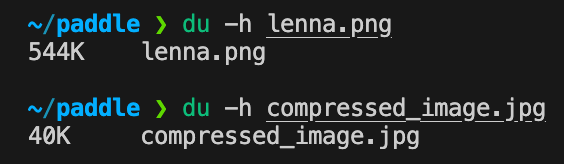
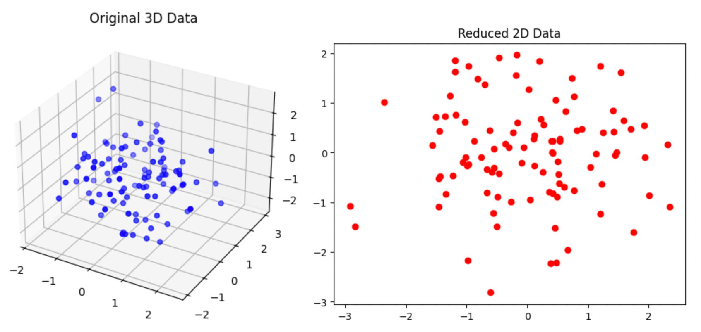

# Paddle 线性代数基础及其领域应用

## 1. 线性代数基础

线性代数是数学中的一个分支，主要研究向量空间、线性变换和线性方程组等内容。以下是线性代数的一些基础知识：

1. **向量和向量空间**：向量是有大小和方向的量，通常表示为箭头或者一组数字。向量空间是由向量组成的集合，满足一定的线性组合和封闭性质。
2. **矩阵**：矩阵是由数值排列成矩形阵列的表格，常用来表示线性变换、线性方程组等。矩阵可以进行加法、标量乘法、矩阵乘法等操作。
3. **线性方程组**：线性方程组是一组线性方程的集合，通常表示为矩阵与向量的乘积等形式。求解线性方程组的目标是找到满足所有方程的解。
4. **行列式**：行列式是一个标量值，用于衡量矩阵的某些性质，比如矩阵是否可逆、线性变换是否保持面积或体积等。
5. **特征值和特征向量**：对于一个方阵，其特征值和特征向量是一对相关联的数和向量。特征值表示变换沿特定方向的缩放因子，特征向量则表示在该方向上的变换方向。
6. **内积和外积**：内积是向量的点乘，外积是向量的叉乘。内积可以用来计算角度和长度等，而外积则用于计算面积和方向等。
7. **线性变换**：线性变换是指保持向量空间的加法和标量乘法性质的映射。常见的线性变换包括旋转、缩放、投影等。
8. **正交性**：在向量空间中，如果两个向量的内积为零，则称它们是正交的。正交向量空间具有很多重要的性质，比如可以用于构造正交基等。

以上是线性代数的一些基础知识，它们构成了线性代数的核心内容。

## 2. Paddle线性代数API

1. **矩阵属性相关 API**：用于计算和描述矩阵的基本属性，如行列式、条件数和秩等。

2. **矩阵计算相关 API**：提供了对矩阵进行基本运算和计算的工具，包括矩阵乘法、幂、逆、广义逆和协方差等。

3. **矩阵分解相关 API**：用于对矩阵进行分解，包括特征值分解、奇异值分解、Cholesky 分解以及正交三角分解等。

4. **线性方程求解相关 API**：提供了求解线性方程组的工具，包括最小二乘问题、具有唯一解的线性方程组以及通过 Cholesky 分解计算的线性方程组。

总体而言，`paddle.linalg` 包含了涵盖线性代数各个方面的 API，通过这些 API，用户可以方便地进行线性代数相关的计算和分析，从而支持各种机器学习、深度学习和科学计算任务的实现和应用。

## 3. 线性代数的一些应用

### 3.1 线性回归

使用`paddle.linalg.lstsq`可以很容易的构建线性回归模型：

```python
import paddle
import paddle.linalg as linalg

# 定义训练数据 y = 2*x+1
x_train = paddle.to_tensor([[1.0], [2.0], [3.0], [4.0], [5.0]])
y_train = paddle.to_tensor([[3.0], [5.0], [7.0], [9.0], [11.0]])

# 构建设计矩阵 X，增加一列常数项
X = paddle.concat([x_train, paddle.ones_like(x_train)], axis=1)

# 使用 paddle.linalg.lstsq 求解最小二乘线性回归问题
coeffs, residuals, _, _ = linalg.lstsq(X, y_train)

# 提取回归系数
slope, intercept = coeffs[0][0], coeffs[1][0]

print("回归系数:")
print("斜率:", slope.item()) # 2.0
print("截距:", intercept.item()) # 0.9999992847442627
```

上面的代码利用 PaddlePaddle 提供的线性代数模块 `paddle.linalg` 中的 `lstsq` 函数实现了最小二乘线性回归。通过将特征和常数项构建成设计矩阵，然后使用最小二乘法求解得到回归系数，从而完成了对线性回归模型的训练过程。

### 3.2 图片压缩

线性代数在图片压缩方面有着重要的应用，其中最典型的应用之一是奇异值分解（Singular Value Decomposition，SVD）。SVD 是一种将矩阵分解为三个矩阵乘积的方法，它在图像处理领域中被广泛应用于压缩和降维。

在图像处理中，一张图像可以表示为一个矩阵，其中每个元素代表一个像素的亮度。利用 SVD，可以将原始图像矩阵分解为三个矩阵的乘积：`A=UΣVH` 其中，`U` 是一个正交矩阵，`Σ` 是一个对角矩阵，`VH` 是另一个正交矩阵的转置。这种分解的结果是，图像可以通过保留前 *k* 个最重要的奇异值来进行压缩，从而达到减小图像大小的效果。这个过程也被称为图像降维。

在paddle中使用`paddle.linalg.svd`就可以实现上述的功能：

```python
import numpy as np
from PIL import Image
import paddle

originalImage = Image.open('lenna.png')
imageArray = np.array(originalImage)

# 将图片的RGB通道分离
R = imageArray[:, :, 0]
G = imageArray[:, :, 1]
B = imageArray[:, :, 2]

# 对每个颜色通道应用奇异值分解
U_R, S_R, V_R = paddle.linalg.svd(paddle.to_tensor(R, dtype='float32'))
U_G, S_G, V_G = paddle.linalg.svd(paddle.to_tensor(G, dtype='float32'))
U_B, S_B, V_B = paddle.linalg.svd(paddle.to_tensor(B, dtype='float32'))


# 选择前 k 个奇异值来重建每个颜色通道，并组合它们以形成压缩后的图像。
k = 200 # 选择的奇异值数量
compressed_R = (U_R[:, :k] * S_R[:k]) @ V_R[:k, :]
compressed_G = (U_G[:, :k] * S_G[:k]) @ V_G[:k, :]
compressed_B = (U_B[:, :k] * S_B[:k]) @ V_B[:k, :]

# 组合压缩后的颜色通道
compressed_imageArray = np.stack((compressed_R, compressed_G, compressed_B), axis=2)
compressed_image = Image.fromarray(compressed_imageArray.astype('uint8'))

compressed_image.save('compressed_image.jpg')
```

代码中使用的原图片：


压缩后的图片：


压缩后的图片看起来和原来的图像并没有很大的区别，但压缩后的文件的大小比原来的图片小很多：



### 3.3 数据降维

主成分分析（Principal Component Analysis，PCA）是一种常用的数据降维技术，用于发现数据中的主要方向（主成分），并将数据投影到这些方向上以实现降维。

PCA 是一种常用的数据降维技术，它通过线性变换将原始数据映射到新的坐标系中，使得在新的坐标系中数据的方差尽可能大。其核心是对数据的协方差矩阵进行特征值分解（或奇异值分解），然后选择特征值较大的特征向量对应的特征值，这些特征向量构成了数据的主成分。

主成分可以理解为原始特征的线性组合，通过保留最重要的主成分，可以实现数据的降维。

PCA的主要步骤：

1. 准备数据：
   - 收集并预处理数据，确保数据是数值型的。
2. 中心化处理：
   - 将每个特征的值减去该特征的均值，使得数据的均值向量变为零向量。
3. 计算协方差矩阵：
   - 直接计算中心化后的数据的协方差矩阵，而无需先计算均值向量。
4. 计算特征值和特征向量：
   - 对协方差矩阵进行特征值分解，得到特征值和对应的特征向量。
5. 选择主成分：
   - 根据特征值的大小，选择最重要的前 *k* 个特征向量作为主成分，其中 *k* 是降维后的维度。
6. 投影数据：
   - 将原始数据投影到选定的主成分上，得到降维后的数据。

用代码实现PCA：

```python
import numpy as np
import paddle
import matplotlib.pyplot as plt

# 生成2D数据集
X = np.random.randn(100, 2)

# 提升到3D
X_3d = np.column_stack((X, np.random.randn(100)))

# 标准化
X_std = (X_3d - X_3d.mean(axis=0)) / X_3d.std(axis=0)

# 计算协方差矩阵
cov_matrix = paddle.linalg.cov(paddle.to_tensor(X_std.T))

# 计算特征值和特征向量
eigenvalues, eigenvectors = paddle.linalg.eigh(cov_matrix)

# 按特征值大小排序，然后选择前2个主成分进行降维
idx = paddle.argsort(eigenvalues, descending=True)
eigenvalues, eigenvectors = eigenvalues[idx], eigenvectors[:, idx]
principal_components = eigenvectors[:, :2] # 选择前两个主成分
X_reduced = paddle.matmul(paddle.to_tensor(X_std), principal_components) # 投影

# 绘制原始3D数据
fig = plt.figure()
ax = fig.add_subplot(111, projection='3d')
ax.scatter(X_3d[:, 0], X_3d[:, 1], X_3d[:, 2], c='blue')
plt.title('Original 3D Data')

# 绘制降维后的2D数据
plt.figure()
plt.scatter(X_reduced[:, 0], X_reduced[:, 1], c='red')
plt.title('Reduced 2D Data')
plt.show()
```

可视化结果：



### 3.4 更多应用

线性代数在许多领域中都有广泛的应用，包括但不限于：

1. **机器学习和数据科学**：在机器学习和数据科学中，线性代数用于构建和优化模型，如线性回归、逻辑回归、支持向量机（SVM）、神经网络等。矩阵运算、矩阵分解（如奇异值分解、特征值分解）、向量空间和内积等概念在这些模型的推导、训练和优化中起着至关重要的作用。
2. **计算机图形学**：在计算机图形学中，线性代数被用来描述和处理图像、三维模型和动画。例如，使用矩阵变换来实现图像的旋转、缩放和平移，使用向量运算来表示和处理三维空间中的物体和光线等。
3. **密码学**：在线性代数中的模运算和矩阵运算被广泛应用于密码学领域，包括对称加密、公钥加密、数字签名和哈希函数等。
4. **信号处理**：在信号处理中，线性代数被用于处理和分析信号，如滤波、傅里叶变换、小波变换等。矩阵运算和线性方程组求解等技术在信号处理算法的设计和实现中发挥着重要作用。
5. **优化问题**：线性代数被广泛用于解决优化问题，如线性规划、凸优化等。通过矩阵运算和向量运算，可以高效地求解各种优化问题。
6. ......

## 4. 总结

本文概括地介绍了线性代数的基础知识,以及其在Paddle和一些应用领域中的使用:

1. 线性代数基础部分涵盖了向量、矩阵、线性方程组、行列式、特征值特征向量、内积外积以及线性变换等核心概念。这些构成了线性代数的基础内容。
2. 接下来介绍了Paddle中的线性代数API,包括矩阵属性、矩阵计算、矩阵分解和线性方程求解等不同功能模块。这些API为用户提供了便利的线性代数计算工具。
3. 文章给出了几个线性代数在实际应用中的例子,包括线性回归、图像压缩、数据降维等。这些案例展示了线性代数在机器学习、数据科学、图形学等领域的广泛应用。

总的来说,本文介绍了线性代数的基础知识,并重点阐述了它在Paddle及各类应用中的重要作用。

## 参考文献

1. https://www.paddlepaddle.org.cn/documentation/docs/zh/api/paddle/linalg/Overview_cn.html#paddle-linalg
2. https://zhuanlan.zhihu.com/p/77151308
3. https://www.cnblogs.com/pinard/p/6251584.html