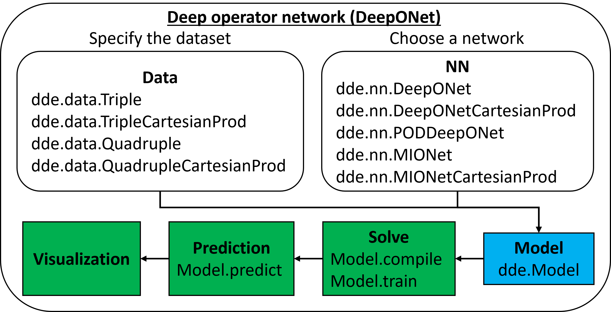
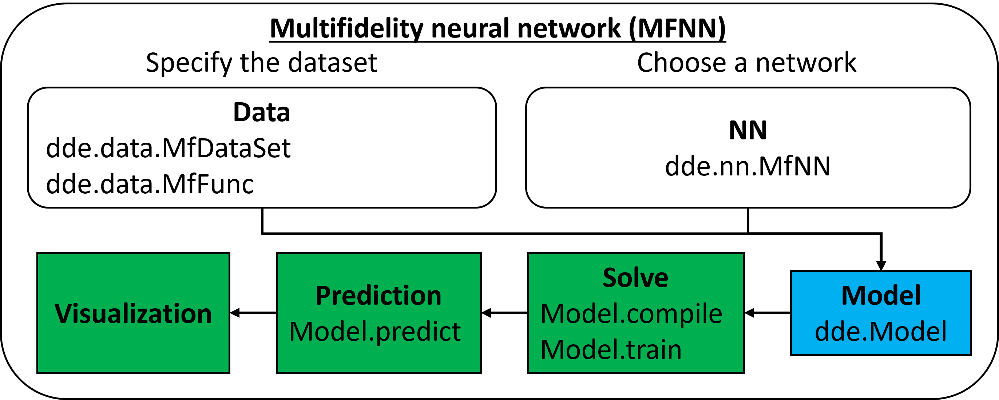

# DeepXDE

[](https://app.travis-ci.com/lululxvi/deepxde)
[](https://deepxde.readthedocs.io/en/latest/?badge=latest)
[](https://www.codacy.com/gh/lululxvi/deepxde/dashboard?utm_source=github.com&amp;utm_medium=referral&amp;utm_content=lululxvi/deepxde&amp;utm_campaign=Badge_Grade)
[](https://badge.fury.io/py/DeepXDE)
[](https://pepy.tech/project/deepxde)
[](https://anaconda.org/conda-forge/deepxde)
[](https://anaconda.org/conda-forge/deepxde)
[](https://github.com/lululxvi/deepxde/blob/master/LICENSE)

DeepXDE is a library for scientific machine learning and physics-informed learning. DeepXDE includes the following algorithms:

- physics-informed neural network (PINN)
    - solving different problems
        - solving forward/inverse ordinary/partial differential equations (ODEs/PDEs) [[SIAM Rev.](https://doi.org/10.1137/19M1274067)]
        - solving forward/inverse integro-differential equations (IDEs) [[SIAM Rev.](https://doi.org/10.1137/19M1274067)]
        - fPINN: solving forward/inverse fractional PDEs (fPDEs) [[SIAM J. Sci. Comput.](https://doi.org/10.1137/18M1229845)]
        - NN-arbitrary polynomial chaos (NN-aPC): solving forward/inverse stochastic PDEs (sPDEs) [[J. Comput. Phys.](https://doi.org/10.1016/j.jcp.2019.07.048)]
        - PINN with hard constraints (hPINN): solving inverse design/topology optimization [[SIAM J. Sci. Comput.](https://doi.org/10.1137/21M1397908)]
    - improving PINN accuracy
        - gradient-enhanced PINN (gPINN) [[arXiv](https://arxiv.org/abs/2111.02801)]
        - PINN with multi-scale Fourier features [[Comput. Methods Appl. Mech. Eng.](https://doi.org/10.1016/j.cma.2021.113938)]
    - [Slides](https://github.com/lululxvi/tutorials/blob/master/20211210_pinn/pinn.pdf), [Video](https://www.youtube.com/watch?v=Wfgr1pMA9fY&list=PL1e3Jic2_DwwJQ528agJYMEpA0oMaDSA9&index=13), [Video in Chinese](http://tianyuan.xmu.edu.cn/cn/minicourses/637.html)
- deep operator network (DeepONet)
    - learning operators [[Nat. Mach. Intell.](https://doi.org/10.1038/s42256-021-00302-5)]
    - DeepONet extensions, e.g., POD-DeepONet [[arXiv](https://arxiv.org/abs/2111.05512)]
    - MIONet: learning multiple-input operators [[arXiv](https://arxiv.org/abs/2202.06137)]
    - DeepM&Mnet: solving multiphysics and multiscale problems [[J. Comput. Phys.](https://doi.org/10.1016/j.jcp.2021.110296), [J. Comput. Phys.](https://doi.org/10.1016/j.jcp.2021.110698)]
- multifidelity neural network (MFNN)
    - learning from multifidelity data [[J. Comput. Phys.](https://doi.org/10.1016/j.jcp.2019.109020), [PNAS](https://doi.org/10.1073/pnas.1922210117)]

DeepXDE supports four tensor libraries as backends: TensorFlow 1.x (`tensorflow.compat.v1` in TensorFlow 2.x), TensorFlow 2.x, PyTorch, and JAX (in development). For how to select one, see [Working with different backends](https://deepxde.readthedocs.io/en/latest/user/installation.html#working-with-different-backends).

**Documentation**: [ReadTheDocs](https://deepxde.readthedocs.io)







## Features

DeepXDE has implemented many algorithms as shown above and supports many features:

- enables the user code to be compact, resembling closely the mathematical formulation.
- **complex domain geometries** without tyranny mesh generation. The primitive geometries are interval, triangle, rectangle, polygon, disk, cuboid, sphere, hypercube, and hypersphere. Other geometries can be constructed as constructive solid geometry (CSG) using three boolean operations: union, difference, and intersection.
- 5 types of **boundary conditions** (BCs): Dirichlet, Neumann, Robin, periodic, and a general BC, which can be defined on an arbitrary domain or on a point set.
- different **neural networks**: fully connected neural network (FNN), stacked FNN, residual neural network, (spatio-temporal) multi-scale Fourier feature networks, etc.
- 6 **sampling methods**: uniform, pseudorandom, Latin hypercube sampling, Halton sequence, Hammersley sequence, and Sobol sequence. The training points can keep the same during training or be resampled every certain iterations.
- different **optimizers**: Adam, L-BFGS, etc.
- conveniently **save** the model during training, and **load** a trained model.
- **callbacks** to monitor the internal states and statistics of the model during training: early stopping, etc.
- **uncertainty quantification** using dropout.
- **float32** and **float64**.
- many other useful features: different (weighted) losses, learning rate schedules, metrics, etc.

All the components of DeepXDE are loosely coupled, and thus DeepXDE is well-structured and highly configurable. It is easy to customize DeepXDE to meet new demands.

## Installation

DeepXDE requires one of the following backend-specific dependencies to be installed:

- TensorFlow 1.x: [TensorFlow](https://www.tensorflow.org/)>=2.2.0
- TensorFlow 2.x: [TensorFlow](https://www.tensorflow.org/)>=2.2.0, [TensorFlow Probability](https://www.tensorflow.org/probability)>=0.10.0
- PyTorch: [PyTorch](https://pytorch.org/)
- JAX: [JAX](https://jax.readthedocs.io), [Flax](https://flax.readthedocs.io), [Optax](https://optax.readthedocs.io)

Then, you can install DeepXDE itself.

- Install the stable version with `pip`:

```
$ pip install deepxde
```

- Install the stable version with `conda`:

```
$ conda install -c conda-forge deepxde
```

- For developers, you should clone the folder to your local machine and put it along with your project scripts.

```
$ git clone https://github.com/lululxvi/deepxde.git
```

- Other dependencies

  - [Matplotlib](https://matplotlib.org/)
  - [NumPy](http://www.numpy.org/)
  - [scikit-learn](https://scikit-learn.org)
  - [scikit-optimize](https://scikit-optimize.github.io)
  - [SciPy](https://www.scipy.org/)

## Explore more

- [Install and Setup](https://deepxde.readthedocs.io/en/latest/user/installation.html)
- [Demos of forward problems](https://deepxde.readthedocs.io/en/latest/demos/pinn_forward.html)
- [Demos of inverse problems](https://deepxde.readthedocs.io/en/latest/demos/pinn_inverse.html)
- [Demos of function approximation](https://deepxde.readthedocs.io/en/latest/demos/function.html)
- [FAQ](https://deepxde.readthedocs.io/en/latest/user/faq.html)
- [Research papers used DeepXDE](https://deepxde.readthedocs.io/en/latest/user/research.html)
- [API](https://deepxde.readthedocs.io/en/latest/modules/deepxde.html)

## Cite DeepXDE

If you use DeepXDE for academic research, you are encouraged to cite the following paper:

```
@article{lu2021deepxde,
  author  = {Lu, Lu and Meng, Xuhui and Mao, Zhiping and Karniadakis, George Em},
  title   = {{DeepXDE}: A deep learning library for solving differential equations},
  journal = {SIAM Review},
  volume  = {63},
  number  = {1},
  pages   = {208-228},
  year    = {2021},
  doi     = {10.1137/19M1274067}
}
```

Also, if you would like your paper to appear [here](https://deepxde.readthedocs.io/en/latest/user/research.html), open an issue in the GitHub "Issues" section.

## Contributing to DeepXDE

First off, thanks for taking the time to contribute!

- **Reporting bugs.** To report a bug, simply open an issue in the GitHub "Issues" section.
- **Suggesting enhancements.** To submit an enhancement suggestion for DeepXDE, including completely new features and minor improvements to existing functionality, let us know by opening an issue.
- **Pull requests.** If you made improvements to DeepXDE, fixed a bug, or had a new example, feel free to send us a pull-request.
- **Asking questions.** To get help on how to use DeepXDE or its functionalities, you can as well open an issue.
- **Answering questions.** If you know the answer to any question in the "Issues", you are welcomed to answer.

**Slack.** The DeepXDE Slack hosts a primary audience of moderate to experienced DeepXDE users and developers for general chat, online discussions, collaboration, etc. If you need a slack invite, please send me an email.

## The Team

DeepXDE was developed by [Lu Lu](https://lu.seas.upenn.edu) under the supervision of Prof. [George Karniadakis](https://www.brown.edu/research/projects/crunch/george-karniadakis) at [Brown University](https://www.brown.edu) from the summer of 2018 to 2020, supported by [PhILMs](https://www.pnnl.gov/computing/philms). DeepXDE was originally self-hosted in Subversion at Brown University, under the name SciCoNet (Scientific Computing Neural Networks). On Feb 7, 2019, SciCoNet was moved from Subversion to GitHub, renamed to DeepXDE.

DeepXDE is currently maintained by [Lu Lu](https://lu.seas.upenn.edu) at [University of Pennsylvania](https://www.upenn.edu) with major contributions coming from several talented individuals in various forms and means. A non-exhaustive but growing list needs to mention: [Shunyuan Mao](https://github.com/smao-astro), [Zongren Zou](https://github.com/ZongrenZou).

## License

[LGPL-2.1 License](https://github.com/lululxvi/deepxde/blob/master/LICENSE)
