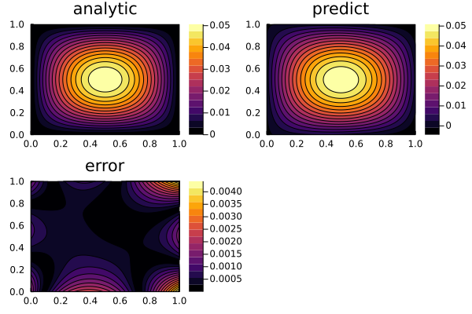

for more details, check [README.pdf](README.pdf)

solve poisson equation with PINNs algorithm using paddle in Julia: A simple case:
```julia
include("poisson2D.jl")
analytic_sol_func(x1,x2) = (sinpi(x1)*sinpi(x2))/(2pi^2)

## poisson equation in [0,1]^2
## Δu = -sin(πx1)sin(πx2)
## u = 0 at boundary

bc_func(x1, x2) = 0.0
rhs_func(x1, x2) = -sinpi(x1)*sinpi(x2)

# initial neural network
NN = paddle.nn.Sequential(
           paddle.nn.Linear(2, 16),
           paddle.nn.Sigmoid(),
           paddle.nn.Linear(16, 16),
           paddle.nn.Sigmoid(),
           paddle.nn.Linear(16, 1)
       )

# set batch size = 100
batch_size = 100
# sample 10 points from each side of Rectangle, so sample 40 point from boundary each iteration
bc_size = floor(Int, batch_size/10) 


# initial an optimizer with lr 0.1
adam = paddle.optimizer.Adam(learning_rate=0.1,
                    parameters=NN.parameters())

# tarining, 4000 iterations with lr 0.1
training(NN, adam, 4000, rhs_func, bc_func, batch_size, bc_size)

# initial an optimizer with lr 0.1
adam = paddle.optimizer.Adam(learning_rate=0.01,
                    parameters=NN.parameters())

# tarining, 2000 iterations with lr 0.01
training(NN, adam, 2000, rhs_func, bc_func, batch_size, bc_size)

```


