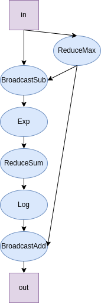

# argmin_argmax OP性能优化设计文档

| 基本信息                                                     | 内容                                      |
| ------------------------------------------------------------ | ----------------------------------------- |
| 提交作者<input type="checkbox" class="rowselector hidden">   | Asthestarsfalll                           |
| 提交时间<input type="checkbox" class="rowselector hidden">   | 2023-03-05                                |
| 版本号                                                       | V2.0                                      |
| 依赖飞桨版本<input type="checkbox" class="rowselector hidden"> | develop                                   |
| 文件名                                                       | 20220305_logsumexp_op_optimization.md  |

# 1 背景与意义

## 1.1 飞桨现状

目前 Paddle 内 logsumexp OP 的 GPU 计算调用了 eigen，性能较差，有较大的提升空间。

当前 `logsumexp` 前向性能如下所示（1000次运行取平均值）：
| Case No. | device | input_shape | input_type | origin Paddle Perf(ms) |
|---|---|---|---|---|
| 1 | Tesla V100 | [64L, 64L] | float32 | 0.05317 | 
| 2 | Tesla V100 | [1024L, 512L] | float32 | 0.72666 |
| 3 | Tesla V100 | [64L, 64L] | float16 | 0.052309 |
| 4 | Tesla V100 | [1024L, 512L] | float16 | 0.721384 |

## 1.2 业内方案调研

### 1.2.1 PyTorch

PyTorch中使用了cutlass实现，代码见[此](https://github.com/pytorch/pytorch/blob/43e71cddb0dc85b43a98238740bd5f8584d841fd/aten/src/ATen/native/transformers/cuda/mem_eff_attention/epilogue_thread_apply_logsumexp.h#L108)和[此](https://github.com/pytorch/pytorch/blob/e3df6a7c8adb8a3c596e021b48890ea9d6324020/aten/src/ATen/native/ReduceOps.cpp#L1373-L1386)

PyTorch 中 logsumexp 前向性能如下所示（1000次运行取平均值）：
| Case No. | device | input_shape | input_type | PyTorch Perf(ms) | diff with origin Paddle|
|---|---|---|---|---|---|
| 1 | Tesla V100 | [64L, 64L] | float32 | 0.030523 | faster than 74.2% |
| 2 | Tesla V100 | [1024L, 512L] | float32 | 0.038930 | faster than 1766.6% |
| 3 | Tesla V100 | [64L, 64L] | float16 | 0.031530 | faster than 65.9% |
| 4 | Tesla V100 | [1024L, 512L] | float16 | 0.037380 | faster than 1845.9% |

### 1.2.2 OneFlow

OneFlow中使用了ReduceKernel+ElementwiseKernel组合的方式，代码见[此](https://github.com/Oneflow-Inc/oneflow/blob/1979b9eb1f302f22b882f1c78ba6ce93e9cc2c91/oneflow/core/functional/impl/math_functor.cpp#L982-L1003)。

## 1.3 对比分析

二者与paddle中实现思路基本一致，值得一提的是, 上述实现方式将输入数据中含有的`Inf`替换为0，不确定是否为期望的行为。

# 2 设计方案与性能预期

## 2.1算子分析

logsumexp计算公式如下：
$$
logsumexp = \log\sum_{i=1}^N e^{x_i} \tag{1}
$$
为了解决输入数据中某些数据过大或过小计算指数造成的上溢和下溢的问题，可以将上述公式(1)等价转换为：
$$
\begin{equation} 
\begin{aligned}
logsumexp &=\log\sum_{i=1}^N e^{x_i} \\
&=\log\sum_{i=1}^N e^{x_i-m}e^m\\
&=\log e^m\sum_{i=1}^N e^{x_i-m}\\
&=\log\sum_{i=1}^N e^{x_i-m} + \log e^m\\
&=\log\sum_{i=1}^N e^{x_i-m} + m
\end{aligned}
\end{equation}
$$
其中 m 一般取输入数据中最大的数。

由于logsumexp与softmax类似，可以参考softmax，转换其输入为(num_rows, num_cols)。

## 2.1 关键模块与性能提升点

使用 Paddle 中已充分优化的 `ElementwiseKernel` 及 `ReduceKernel` 进行组合实现。

## 2.2 Host端计算流程

Host处理输入的 `axis`, `keepdim` 与 `reduce_all` 参数。

## 2.4 Device端计算流程

logsumexp的计算图如下:

按照计算图进行计算即可

# 3 测试和验收的考量

目前已完成大致完成算子开发，前向性能如下（1000次运行取平均值） ：
| Case No. | device | input_shape | input_type | New Paddle Perf(ms) | diff with origin Paddle | diff with PyTorch | 
|---|---|---|---|---|---|---|
| 1 | Tesla V100 | [64L, 64L] | float32 | 0.016674 | faster than 218.9% | faster than 83.1% |
| 2 | Tesla V100 | [1024L, 512L] | float32 | 0.027571 | faster than 2535.6% | faster than 41.2% |
| 3 | Tesla V100 | [64L, 64L] | float16 | 0.017113 | faster than 205.7% | faster than 84.2% |
| 4 | Tesla V100 | [1024L, 512L] | float16 | 0.027820 | faster than 2493.0% | faster than 34.4% |

参考：[算子性能优化验收标准](http://agroup.baidu.com/paddle-perf/md/article/4892913)

# 4 可行性分析和排期规划

时间和开发排期规划，主要milestone

| No.  | 开发内容                                       | 预期时间       |
| ---- | ---------------------------------------------- | -------------- |
| 1    | 理清Paddle中OP设计思路，同类产品中最佳设计方案 | 3-05--3-27     |
| 2    | 完成代码开发工作，通过CI                       | 3-27--3-31     |
| 3    | 提交PR进行后续迭代                             | 3-31--活动结束 |

# 5 影响面

待优化的算子独立运行，不涉及其他算子和模块的修改，API设计与之前保持一致。

# 名词解释

# 附件及参考资料

[1]. [OP Benchmark使用指南](https://github.com/PaddlePaddle/benchmark/blob/master/api/README.md)
