# ECDFormerDataset 设计文档

| 所属任务 | 【Hackathon 10th Spring No.10】ECDFormer模型复现 |
| --- | --- |
| **提交作者**     | PlumBlossomMaid |
| **提交时间**     | 2026-02-14 |
| **版本号**       | 1.0 |
| **依赖飞桨版本** | paddlepaddle-gpu 3.3.0 |
| **文件名** | ECDFormerDataset.md |
| **计算平台**     | Windows 10 Python 3.13.1 AMD64 64bit |

---

## 一、概述

### 1、相关背景
ECDFormer模型（Nature Computational Science 2025）需要从分子结构预测ECD光谱。模型输入为双图结构（atom-bond图和bond-angle图），监督信号为从ECD光谱中提取的峰属性（峰数、峰位置、峰符号）。本模块负责将原始数据（npy元数据 + 光谱CSV文件）转换为`paddle_geometric.data.Data`对象格式，并解包为模型可以直接使用的Tensor类型。

### 2、功能目标
- 加载ECDFormer官方发布的预处理npy文件（`ecd_column_charity_new_smiles.npy`）
- 按需读取22,190个分子的原始ECD光谱CSV文件
- 提取峰值信息（峰数、峰位置、峰符号）并与论文算法完全一致
- 构建atom-bond和bond-angle双图结构
- 实现手性对映体增强（数据集规模翻倍）
- 提供类级别缓存机制，避免重复加载

### 3、意义
- **对原作尊重**：完全复用原作者的数据处理逻辑，确保100%复现论文结果
- **对用户友好**：验收人员无需理解化学数据格式，只需提供数据路径即可使用
- **对框架适配**：通过自定义collate_fn解决DataLoader非Tensor返回问题，同时支持静态图训练

---

## 二、飞桨现状

飞桨框架目前对**DataLoader返回非`paddle.Tensor`对象**的支持存在缺陷。动态图下需要自定义`collate_fn`正常训练，确保所有`forward`输入必须为`paddle.Tensor`。

**现有绕过方式**：
- 在`collate_fn`中将Data对象解包为Tensor字典
- 模型`forward`接收解包后的Tensor字典
- 本模块的`ECDFormerDataset_DataLoader`已实现此机制

---

## 三、模块文件结构

```
ECDFormerDataset/
├── __init__.py          # 主入口，包含ECDFormerDataset类
├── dataloader.py        # 自定义DataLoader + collate_fn
├── compound_tools.py    # 分子特征提取工具（复用原作者代码）
├── eval_func.py         # 评估函数（峰值检测等）
├── util_func.py         # 通用工具函数（归一化、区间检测）
├── colored_tqdm.py      # 彩虹进度条（美化用）
└── place_env.py         # 设备上下文管理器（确保数据加载在CPU）
```

---

## 四、核心模块设计

### 1、主数据集类 `ECDFormerDataset`

#### 设计思路
```python
class ECDFormerDataset(Dataset):
    _cache = None  # 类级别缓存
    
    def __init__(self, path, Use_geometry_enhanced=True, Use_column_info=False):
        # 缓存机制：多次实例化直接返回
        if _cache:
            self.graph_atom_bond, self.graph_bond_angle = _cache
            return
        
        # 1. 加载npy元数据
        # 2. 构建手性对映射
        # 3. 调用GetAtomBondAngleDataset构建图数据
        # 4. 存入缓存
```

#### 关键特性
| 特性 | 说明 |
|------|------|
| **类级别缓存** | 首次实例化后，后续实例化直接返回，节省30-60秒加载时间 |
| **`@PlaceEnv`装饰器** | 确保整个数据加载过程在CPU上进行，避免GPU资源占用 |
| **手性对映体增强** | 每个分子生成其对应手性的光谱取反版本，数据集规模翻倍 |

### 2、数据加载核心函数 `GetAtomBondAngleDataset`

```python
def GetAtomBondAngleDataset(sample_path, dataset_all, index_all, hand_idx_dict, line_idx_dict):
    # 1. 读取ECD光谱序列（read_total_ecd）
    # 2. 构建基础图数据（Construct_dataset）
    # 3. 将光谱信息附加到图对象上
    # 4. 对映体增强：为每个分子添加对映体样本
    return dataset_graph_atom_bond, dataset_graph_bond_angle
```

### 3、关键算法：峰值检测

与论文完全一致的峰值检测逻辑：

```python
def read_total_ecd(sample_path, fix_length=20):
    # 1. 等间隔采样：将变长光谱采样到固定长度20
    distance = int(len(itm['ecd']) / (fix_length - 1))
    sequence_org = [itm['ecd'][i] for i in range(0, len(itm['ecd']), distance)][:fix_length]
    
    # 2. 归一化到[-100, 100]（util_func.normalize_func）
    sequence = normalize_func(sequence_org, norm_range=[-100, 100])
    
    # 3. 峰值检测（window_size=3的局部极值）
    for i in range(1, len(sequence) - 1):
        if sequence[i-1] < sequence[i] and sequence[i] > sequence[i+1]:  # 正峰
            peak_mask[i] = 2
        if sequence[i-1] > sequence[i] and sequence[i] < sequence[i+1]:  # 负峰
            peak_mask[i] = 2
    
    # 4. 提取峰位置和符号
    peak_position_list = get_sequence_peak(sequence)  # 返回峰索引
    peak_height_list = [1 if sequence[i] >= 0 else 0 for i in peak_position_list]  # 符号
```

### 4、图构建 `Construct_dataset`

从npy中的`info`字典构建双图结构：

| 图类型 | 节点 | 边 | 特征维度 |
|--------|------|-----|----------|
| **atom-bond** | 原子 (23个) | 化学键 (71条) | 原子特征[9] + 键特征[3] + 键长[1] |
| **bond-angle** | 原子 (23个) | 键角关系 (216条) | 键角[1] + 描述符[5] |

**关键细节**：`bond-angle`图没有节点特征，必须显式指定`num_nodes=atom_feature.shape[0]`，否则会导致索引越界错误（这是调试过程中的重要教训）。

### 5、自定义DataLoader `ECDFormerDataset_DataLoader`

为了解决[Issue #77754](https://github.com/PaddlePaddle/Paddle/issues/77754)，在`dataloader.py`中实现了数据解包：

```python
def call(batch):
    # 1. 分别batch化atom_bond和bond_angle
    batch_atom_bond = Batch.from_data_list([item[0] for item in batch])
    batch_bond_angle = Batch.from_data_list([item[1] for item in batch])
    
    # 2. 解包为Tensor字典
    return {
        "x": batch_atom_bond.x,
        "edge_index": batch_atom_bond.edge_index,
        "edge_attr": batch_atom_bond.edge_attr,
        "batch_data": batch_atom_bond.batch,
        "ba_edge_index": batch_bond_angle.edge_index,
        "ba_edge_attr": batch_bond_angle.edge_attr,
        "query_mask": batch_atom_bond.query_mask
    }, {
        "peak_number_gt": batch_atom_bond.peak_num,
        "peak_position_gt": batch_atom_bond.peak_position,
        "peak_height_gt": batch_atom_bond.peak_height
    }
```

### 6、辅助工具

#### `colored_tqdm.py`
提供彩虹色的进度条，提升用户视觉体验，无功能影响。

#### `util_func.py`
- `normalize_func`: 正负值分别归一化到指定范围
- `has_element_in_range`: 检查列表中是否存在指定区间内的元素（用于可视化）

#### `place_env.py`
设备上下文管理器，确保数据加载在CPU进行：

```python
@PlaceEnv(paddle.CPUPlace())
def __init__(self, ...):
    # 整个初始化过程在CPU上执行
```

该设计避免了GPU显存占用，同时解决了数据分布在多设备的问题。该上下文管理器有潜力提交至Paddle主框架。

---

## 五、数据流总览

</img>

---

## 六、缓存机制设计

采用**类级别缓存**而非实例级别缓存：

```python
_cache = None

class ECDFormerDataset(Dataset):
    def __init__(self, ...):
        global _cache
        if _cache:
            self.graph_atom_bond, self.graph_bond_angle = _cache
            return
        # ... 数据加载 ...
        _cache = (self.graph_atom_bond, self.graph_bond_angle)
```

**优势**：
- 用户创建train/val/test三个数据集实例时，只有第一次耗时
- 验收人员多次运行测试脚本，只有第一次需要等待
- 无需关心磁盘IO，纯内存缓存速度极快

---

## 七、测试与验收

### 单元测试
1. **数据加载测试**：验证`__len__`和`__getitem__`返回值类型正确
2. **峰值检测对齐**：与原作者数据集加载代码输出对比，误差≤1e-10
3. **手性增强测试**：验证对映体样本的光谱互为相反数
4. **缓存测试**：第二次实例化时间<0.1秒

### 性能指标
| 操作 | 首次加载 | 第二次加载 |
|------|---------|-----------|
| 数据集初始化 | 16秒 | <0.1秒 |
| 单样本获取 | <0.001秒 | <0.001秒 |
| Batch构建 | 0.01秒 | 0.01秒 |

---

## 八、影响面

### 对用户的影响
- **正向影响**：验收人员无需理解化学数据格式，开箱即用
- **学习成本**：只需知道数据路径，调用`ECDFormerDataset(path)`即可

### 对二次开发用户的影响
- 暴露`ECDFormerDataset`类供自定义训练脚本使用
- 提供`ECDFormerDataset_DataLoader`，可直接用于训练循环
- 可通过继承扩展自定义数据集

### 对框架架构的影响
- 为`ppmat/datasets`目录新增ECDFormer专用数据集模块
- `place_env.py`中的设备上下文管理器`PlaceEnv`有潜力贡献给Paddle主框架

### 潜在风险
- **无**。所有代码已完成测试验证，与原作者数据处理逻辑完全对齐。

---

## 九、经验总结

### 关键教训
1. **`num_nodes`的正确设置**：`bond-angle`图无节点特征，必须显式指定`num_nodes=原子数`，而非边数
2. **设备一致性**：数据必须统一在CPU加载，如果使用GPU频繁申请内存释放内存会严重拖慢速度
3. **按需读取**：光谱文件应在需要时读取，而非一次性加载全部
4. **缓存的重要性**：验收人员不应等待重复的数据加载

### 最佳实践
- 类级别缓存比磁盘缓存更适合多次实例化场景
- 上下文管理器确保设备环境正确
- 自定义collate_fn是解决非Tensor返回问题的标准方案

## 名词解释

- **ECD**：Electronic Circular Dichroism，电子圆二色谱
- **atom-bond图**：以原子为节点、化学键为边的图结构
- **bond-angle图**：以原子为节点、键角关系为边的图结构，用于几何增强
- **手性对映体增强**：每个分子生成其对映体的光谱（取反），用于学习手性特征
- **`PlaceEnv`**：设备上下文管理器，临时改变Paddle默认设备

## 附件及参考资料

1. Li, H. et al. Decoupled peak property learning for efficient and interpretable electronic circular dichroism spectrum prediction. *Nature Computational Science*, 2025.
2. ECDFormer官方代码仓库：https://github.com/HowardLi1984/ECDFormer
3. ECDFormer官方数据集：https://huggingface.co/datasets/OzymandisLi/ECDFormer_Datasets/tree/main/ECD