# IRDataset 设计文档

| 所属任务 | 【Hackathon 10th Spring No.10】ECDFormer模型复现 |
| --- | --- |
| **提交作者**     | PlumBlossomMaid |
| **提交时间**     | 2026-02-13 |
| **版本号**       | V1.0 |
| **依赖飞桨版本** | paddlepaddle-gpu 3.3.0 |
| **文件名**       | IRDataset.md |
| **计算平台**     | Windows 10 Python 3.13.1 AMD64 64bit |

---

## 一、概述

### 1、相关背景
ECDFormer模型的核心贡献是手性分子ECD光谱预测，但论文同时也展示了模型的**泛化能力**——可迁移至IR光谱预测任务。IR数据集作为ECDFormer框架的扩展演示，用于验证模型架构对**不同谱图类型**的适应性。

与ECD任务不同，IR光谱预测是**回归任务**（预测连续峰强度），且无需手性增强。本模块提供IR数据集的加载实现，与ECDFormerDataset共用相同的图构建逻辑，但针对IR任务特点进行优化。

### 2、功能目标
- 支持三种预加载模式：`'100'`（快速测试）、`'10000'`（中等规模）、`'all'`（完整数据）
- 按需读取JSON格式的IR光谱文件（只读需要的，避免扫描全部）
- 将波数（500-4000 cm⁻¹）离散化为36个位置类别
- 提供与ECDFormerDataset一致的接口和缓存机制

### 3、意义
- **泛化能力验证**：展示ECDFormer架构对IR光谱的适用性
- **快速原型支持**：默认使用100样本小数据集，便于快速调试
- **按需加载优化**：避免1小时的全量JSON读取，提升用户体验

---

## 二、模块定位

IRDataset是ECDFormer模型家族在**谱图解析**任务下的第二个数据集实现，与ECDFormerDataset形成互补：

| 维度 | ECDFormerDataset | IRDataset |
|------|------------------|-----------|
| **任务类型** | 峰属性分类（正/负） | 峰强度回归 |
| **光谱范围** | 80-450 nm | 500-4000 cm⁻¹ |
| **位置类别数** | 20 | 36 |
| **最大峰数** | 9 | 15 |
| **手性增强** | 必需 | 不需要 |
| **数据规模** | 22,190分子 | QM9子集（120000+） |
| **论文地位** | 核心贡献 | 泛化演示 |

---

## 三、模块文件结构

```
IRDataset/
├── __init__.py          # 主入口，包含IRDataset类
├── compound_tools.py    # 分子特征提取工具（复用）
├── colored_tqdm.py      # 彩虹进度条（美化）
└── place_env.py         # 设备上下文管理器（复用）
```

### 辅助模块说明
| 文件 | 作用 | 说明 |
|------|------|------|
| `compound_tools.py` | 分子特征提取 | 完全复用ECD模块的工具函数 |
| `colored_tqdm.py` | 彩色进度条 | 提升视觉体验，无功能影响 |
| `place_env.py` | 设备上下文管理器 | 确保数据加载在CPU进行，与ECD模块完全一致 |

---

## 四、核心模块设计

### 1、主数据集类 `IRDataset`

#### 设计思路
```python
class IRDataset(Dataset):
    _cache = {}  # 类级别缓存（支持不同mode分别缓存）
    
    @PlaceEnv(paddle.CPUPlace())
    def __init__(self, path, mode='100', use_geometry_enhanced=True, 
                 force_reload=False, cache=True):
        
        cache_key = f"{path}_{mode}_{use_geometry_enhanced}"
        if cache and cache_key in self._cache:
            return  # 直接从缓存返回
        
        # 1. 加载元数据文件（获取index_all）
        data = np.load(f'ir_column_charity_{mode}.npy').item()
        
        # 2. 按需读取IR光谱（只读index_all中的文件）
        self.ir_sequences = read_ir_spectra_by_ids(spectra_path, index_all)
        
        # 3. 构建图数据
        total_graph_atom_bond, total_graph_bond_angle = Construct_IR_Dataset(...)
        
        # 4. 附加光谱信息到图数据
        # 5. 存入缓存
```

#### 关键特性
| 特性 | 说明 |
|------|------|
| **三种模式** | `'100'`/`'10000'`/`'all'`，默认100用于快速测试 |
| **按需读取** | 只读取`index_all`中指定的JSON文件，而非扫描目录 |
| **独立缓存** | 不同mode使用不同缓存键，互不干扰 |
| **设备控制** | `@PlaceEnv`确保数据加载在CPU进行 |

### 2、数据加载核心函数

#### `read_ir_spectra_by_ids` - 按需读取（性能关键）
```python
def read_ir_spectra_by_ids(sample_path, index_all, max_peak=15):
    ir_final_list = []
    for fileid in tqdm(index_all, desc="Reading IR spectra"):
        filepath = os.path.join(sample_path, f"{fileid}.json")
        raw_ir_info = json.load(open(filepath, "r"))
        # ... 峰值处理 ...
```

**性能优化**：与原作逻辑完全一致，只读取`index_all`中指定的文件，避免扫描全部120,000+个JSON文件（可节省约1小时）。

#### `Construct_IR_Dataset` - 图构建
与ECD的`Construct_dataset`高度相似，主要差异：
- **特征缺失处理**：IR数据某些特征可能缺失，用0填充并给出警告
- **描述符可选**：IR任务可能不需要描述符，提供`descriptor_path=None`选项

### 3、峰值检测算法

使用`scipy.signal.find_peaks`，与原作完全一致：
```python
from scipy.signal import find_peaks
peaks_raw, _ = find_peaks(x=ir_y, height=0.1, distance=100)
```

**参数说明**：
- `height=0.1`：只检测强度大于0.1的峰
- `distance=100`：峰之间的最小距离（避免重复检测）

### 4、波数离散化

```python
IR_WAVELENGTH_MIN = 500
IR_WAVELENGTH_MAX = 4000
IR_STEP = 100
IR_NUM_POSITION_CLASSES = 36  # (4000-500)/100

def x_bin_position(real_x):
    return int((real_x - 500) / 100)
```

将连续波数映射为36个离散类别，用于位置预测头的分类任务。

### 5、自定义DataLoader `IRDataLoader`

与ECDFormerDataset的DataLoader完全一致，实现数据解包：

```python
class IRDataLoader(DataLoader):
    def _collate_fn(self, batch):
        # 分别batch化atom_bond和bond_angle
        batch_atom_bond = Batch.from_data_list([item[0] for item in batch])
        batch_bond_angle = Batch.from_data_list([item[1] for item in batch])
        
        # 解包为Tensor字典
        return {
            "x": batch_atom_bond.x,
            "edge_index": batch_atom_bond.edge_index,
            "edge_attr": batch_atom_bond.edge_attr,
            "batch_data": batch_atom_bond.batch,
            "ba_edge_index": batch_bond_angle.edge_index,
            "ba_edge_attr": batch_bond_angle.edge_attr,
            "query_mask": batch_atom_bond.query_mask
        }, {
            "peak_number_gt": batch_atom_bond.peak_num,
            "peak_position_gt": batch_atom_bond.peak_position,
            "peak_height_gt": batch_atom_bond.peak_height
        }
```

---

## 五、数据流总览

</img>

---

## 六、三种模式说明

| 模式 | 文件 | 样本数 | 适用场景 |
|------|------|--------|----------|
| **`'100'`** | `ir_column_charity_100.npy` | 94 | 快速测试、调试、验收 |
| **`'10000'`** | `ir_column_charity_10000.npy` | 10,000 | 中等规模训练、验证 |
| **`'all'`** | `ir_column_charity_all.npy` | ~120,000 | 完整训练、论文复现 |

**默认使用`'100'`** 快速加载数据集进行测试。

---

## 七、与ECDFormerDataset的异同

### 相同点
- ✅ 共用`compound_tools.py`中的特征提取函数
- ✅ 共用`place_env.py`设备上下文管理器
- ✅ 共用`colored_tqdm.py`进度条美化
- ✅ 相同的图结构（atom-bond + bond-angle）
- ✅ 相同的缓存机制（类级别缓存）
- ✅ 相同的DataLoader解包逻辑

### 不同点
| 维度 | ECDFormerDataset | IRDataset |
|------|------------------|-----------|
| **峰值检测** | 自定义滑动窗口 | scipy.signal.find_peaks |
| **位置离散化** | 20类（波长） | 36类（波数） |
| **最大峰数** | 9 | 15 |
| **手性增强** | 必需 | 不需要 |
| **数据规模** | 22,190 | 可配置（100/10000/all） |
| **论文定位** | 核心贡献 | 泛化演示 |

---

## 八、测试与验收

### 单元测试
1. **模式测试**：验证三种模式均能正确加载
2. **按需读取测试**：只读取index_all中的文件，不扫描全部
3. **峰值检测对齐**：与原作输出对比，误差≤1e-10
4. **缓存测试**：第二次实例化时间<0.1秒
5. **静态图测试**：通过`to_static`转换后前向传播正常

### 性能指标（以`'10000'`模式为例）
| 操作 | 首次加载 | 第二次加载 |
|------|---------|-----------|
| 数据集初始化 | 数分钟 | <0.1秒 |
| 单样本获取 | <0.001秒 | <0.001秒 |
| Batch构建 | 0.01秒 | 0.01秒 |

---

## 九、影响面

### 对用户的影响
- **正向影响**：默认使用100样本，快速运行模型体验全流程
- **学习成本**：只需指定`mode`参数，无需关心数据格式

### 对二次开发用户的影响
- 提供与ECDFormerDataset一致的接口，便于集成
- 可通过继承扩展自定义IR数据集

### 对框架架构的影响
- 与ECDFormerDataset并列，完善谱图解析任务的数据支持
- 验证了ECDFormer架构的泛化能力

---

## 十、经验总结

### 关键教训
1. **按需读取的重要性**：全量扫描120,000个JSON文件需要约1小时，必须避免
2. **模式配置**：提供小数据集选项对验收和调试至关重要
3. **特征缺失处理**：IR数据某些特征可能缺失，需优雅降级

### 最佳实践
- 默认使用小数据集，兼顾速度和功能性
- 按需读取JSON文件，避免性能陷阱
- 与ECDFormerDataset保持接口一致，降低学习成本

---

## 名词解释

- **IR**：Infrared Spectroscopy，红外光谱
- **波数**：IR光谱的横坐标单位，范围500-4000 cm⁻¹
- **`find_peaks`**：scipy提供的峰值检测函数
- **模式**：`'100'`/`'10000'`/`'all'`，控制加载的数据量

---

## 附件及参考资料

1. Li, H. et al. Decoupled peak property learning for efficient and interpretable electronic circular dichroism spectrum prediction. *Nature Computational Science*, 2025.
2. QM9数据集：https://huggingface.co/datasets/OzymandisLi/ECDFormer_Datasets/tree/main/IR
3. ECDFormer官方代码仓库：https://github.com/HowardLi1984/ECDFormer