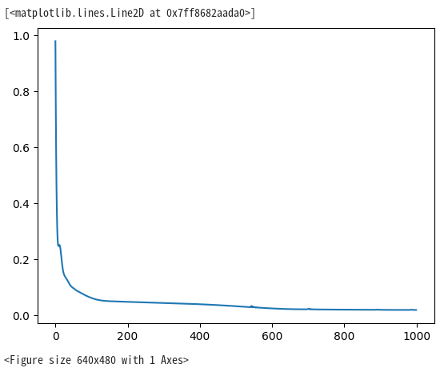
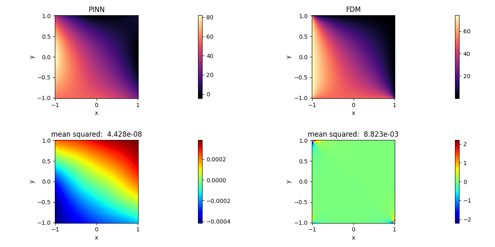
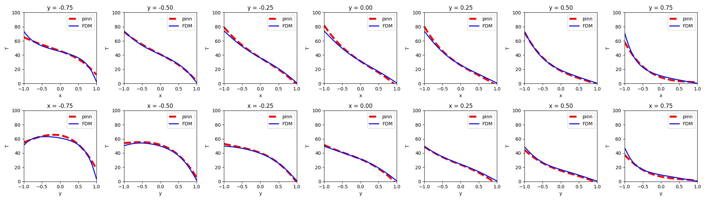

# Science 56 设计文档

| API名称                                                      | 新增API名称                                |
| ---------------------------------------------------------- | -------------------------------------- |
| 提交作者<input type="checkbox" class="rowselector hidden">     | moosewoler, buaa35050111                                  |
| 提交时间<input type="checkbox" class="rowselector hidden">     | 2023-10-05                            |
| 版本号                                                        | V2.0                                   |
| 依赖CINN版本<input type="checkbox" class="rowselector hidden"> | PaddlePaddle 2.5.0                              |
| 文件名                                                        | 20230927_science_hackthon5th_56_2D_steady-state_heat_equation.md<br> |

# 1. 概述

## 1.1 相关背景

**基于物理信息的神经网络**（Physics-Informed Neural Networks，PINN）是一种机器学习方法，它利用神经网络和物理信息来建立数学模型。

这种方法在许多领域都有广泛的应用，包括求解偏微分方程、优化控制问题等。在**2D稳态热传导方程**方面，PINN也可以发挥其优势。

PINN方法通过神经网络学习系统中的隐式解，从而可以更加高效准确地解决这类问题。
为了训练神经网络，需要构造一个损失函数，它包括两部分：数据项和物理项。数据项用于描述神经网络输出与训练数据之间的差异（边界条件、初始条件等），物理项则用于确保神经网络输出满足某些已知的物理约束或先验知识（系统的常微分方程或偏微分方程），详见[Physics-informed Neural Networks (PINN)](https://i-systems.github.io/tutorial/KSME/CAE/220520/01_PINN.html)。这两项的平衡使得神经网络在学习过程中既能适应训练数据，又能保持解的物理性质。


## 1.2 功能目标

本任务中，作者在[参考项目：Heat-PINN](https://github.com/314arhaam/heat-pinn/tree/main) 及 [PaddleScience案例：2D-Laplace](https://github.com/PaddlePaddle/PaddleScience/blob/develop/examples/laplace/laplace2d.py) 的基础上，完成以下任务：

- 根据**参考项目：Heat-PINN**，基于Paddle API实现在给定边界条件下使用PINN求解2D稳态热传导方程，并与参考项目相比较；
- 根据paddle API实现及**PaddleScience案例：2D-Laplace**，基于PaddleScience API实现求解2D稳态热传导方程，并与参考项目相比较。

## 1.3 意义

基于PaddleScience实现2D稳态热传导问题的求解，为求解其它热传导问题奠定基础。

# 2. 飞桨现状

PaddleScience目前已经支持对[2D-Laplace方程](https://github.com/PaddlePaddle/PaddleScience/blob/develop/examples/laplace/laplace2d.py)的求解。

**参考项目：Heat-PINN**基于`Tensorflow`实现，可参考[XPINN_2D_PoissonsEqn](https://github.com/PaddlePaddle/PaddleScience/blob/develop/jointContribution/XPINNs/XPINN_2D_PoissonsEqn.py)的实现方法，将其转换为`Paddle API`实现。

# 3. 业内方案调研

## 3.1 解决的问题

参考项目使用PINN求解了2D稳态热传导方程，主要参考了[Physics Informed Deep Learning (Part I): Data-driven Solutions of Nonlinear Partial Differential Equations, p3-p5](https://arxiv.org/abs/1711.10561)。

基本方程为：

$$
\frac{\partial^2T}{\partial x^2} + \frac{\partial^2T}{\partial y^2}=0
$$

计算域为：

$$
D = \\{(x, y)|-1\leq{x}\leq{+1},-1\leq{y}\leq{+1}\\}
$$

边界条件为：

$$
\begin{cases}
T(-1, y) = 75.0 ^\circ{C} \\
T(+1, y) = 0.0 ^\circ{C} \\
T(x, -1) = 50.0 ^\circ{C} \\
T(x, +1) = 0.0 ^\circ{C} \\
\end{cases}
$$

## 3.2 解决的方法

数据驱动法求解2维偏微分方程的解的一般形式为：

$$
u(x,y) + \mathcal{N}[u] = 0 \tag{1}
$$

由式（1）定义$f(x,y)$为：

$$
f := u(x,y) + \mathcal{N}[u] \tag{2}
$$

$ u(x,y) $可通过深度神经网络进行近似求解。这个假设与方程（2）一起得出了基于物理信息的神经网络$ f(x,y) $。这个网络可以通过对组成函数应用链式规则进行自动微分而导出。

对于2D稳态热传导方程，可以定义$ f(x,y) $为：

$$
f := u_{xx} + u_{yy}  \tag{3}
$$

然后通过深度神经网络对$ u(x,y) $进行近似。采用Paddle API的$ u(x,y) $定义如下：

```python
def u(self, x, y):
  u = self.layers(paddle.concat([x, y], axis=1))
  return u
```

其中`self.layers`即对$ u(x,y) $的神经网络近似，网络结构为MLP。

相应地，基于物理信息的神经网络$ f(x,y) $定义如下：

```python
def f(self, x, y):
  # Gradients need to be calculated
  x.stop_gradient = False
  y.stop_gradient = False

  u0 = self.u(x, y)
  u_x = paddle.grad(u0, x, retain_graph=True, create_graph=True)[0]
  u_y = paddle.grad(u0, y, retain_graph=True, create_graph=True)[0]
  u_xx = paddle.grad(u_x, x, retain_graph=True, create_graph=True)[0]
  u_yy = paddle.grad(u_y, y, retain_graph=True, create_graph=True)[0]
  
  F = u_xx + u_yy
  return F
```
神经网络$ u(x,y) $和$ f(x,y) $之间的共享参数可以通过最小化均方差损失来学习：

$$
MSE=MSE_u+MSE_f \tag{4}
$$

其中：

$$
MSE_u = \frac{1}{N_u}\sum_{i=1}^{N_u}{|u(x^i,y^i) - u^i|^2}
$$

$$
MSE_f = \frac{1}{N_f}\sum_{i=1}^{N_f}{|f(x^i,y^i)|^2}
$$

## 3.3 复现目标







## 3.4 可能存在的难点

- 2D稳态热传导方程求解是《传热学》中的经典问题，相关理论成熟；
- PaddleScience中已实现了求解2维拉普拉斯方程的框架；
- 参考项目及相关样例实现较为详细。

综上，预计在实现过程中不存在难点。

# 4. 设计思路与实现方案

参考[PaddleScience复现指南](https://paddlescience-docs.readthedocs.io/zh/latest/zh/reproduction/#2)，复现步骤如图所示：


## 4.1 基于Paddle API的复现

根据**参考项目：Heat-PINN**，基于Paddle API实现在给定边界条件下使用PINN求解2D稳态热传导方程的设计思路与实现步骤如下：

1. 导入依赖
2. 生成数据
3. 构造网络模型
4. 定义$ u(x,y) $的神经网络近似
5. 定义基于物理信息的神经网络$ f(x,y) $
6. 定义模型的前向传播方法forward
7. 定义其他方法
8. 模型训练及推理
9. 实现FDM，以便对比分析
10. 绘制结果


完整复现代码见：

[PINN测试](https://aistudio.baidu.com/projectdetail/6813263)

## 4.2 基于PaddleScience的复现

根据paddle API实现及**PaddleScience案例：2D-Laplace**，基于PaddleScience API实现求解2D稳态热传导方程的设计思路与实现步骤如下：

1. 模型构建
2. 方程构建
3. 计算域构建
4. 约束构建
5. 超参数设定
6. 优化器构建
7. 评估器构建
8. 可视化器构建
9. 模型训练、评估与可视化

# 5. 测试和验收的考量

测试与验收参考[PaddleScience模型复现流程及验收标准](https://paddlescience-docs.readthedocs.io/zh/latest/zh/reproduction/)。

1. 提供完整的基于Paddle API的复现方法
2. 提供完整的基于PaddleScience的复现方法

# 6. 可行性分析和排期规划

## 6.1 可行性分析

- 2D稳态热传导方程求解是《传热学》中的经典问题，相关理论成熟；
- PaddleScience中已实现了求解2维拉普拉斯方程的框架；
- 参考项目及相关样例实现较为详细。

可行

## 6.2 排期规划

- 202309   : 调研
- 20231020 ：基于Paddle API的复现
- 20231115 ：基于PaddleScience的复现
- 20231130 ：整理项目产出，撰写案例文档

# 7. 影响面

对其他模块无影响。

# 附件及参考资料

- [参考项目：Heat-PINN](https://github.com/314arhaam/heat-pinn/tree/main) 
- [PaddleScience案例：2D-Laplace](https://github.com/PaddlePaddle/PaddleScience/blob/develop/examples/laplace/laplace2d.py) 
- [XPINN_2D_PoissonsEqn](https://github.com/PaddlePaddle/PaddleScience/blob/develop/jointContribution/XPINNs/XPINN_2D_PoissonsEqn.py)
- [PaddleScience复现指南](https://paddlescience-docs.readthedocs.io/zh/latest/zh/reproduction/#2)
- [Physics Informed Deep Learning (Part I): Data-driven Solutions of Nonlinear Partial Differential Equations, p3-p5](https://arxiv.org/abs/1711.10561)
- [Tensorflow和PyTorch 对应API速查表](https://zhuanlan.zhihu.com/p/471543752)
- [4.3. 多层感知机的简洁实现](http://zh.d2l.ai/chapter_multilayer-perceptrons/mlp-concise.html)
- [Whats the equivalent of tf.keras.Input() in pytorch?](https://stackoverflow.com/questions/64780641/whats-the-equivalent-of-tf-keras-input-in-pytorch)
- [What is tape-based autograd in Pytorch?](https://stackoverflow.com/questions/64856195/what-is-tape-based-autograd-in-pytorch)