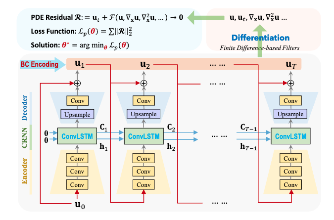

# PhyCRNet 设计文档

|              |                            |
|--------------|----------------------------|
| 提交作者     | co63oc                     |
| 提交时间     | 2023-09-29                 |
| RFC 版本号   | v1.0                       |
| 依赖飞桨版本 | develop/release 2.5.0 版本 |
| 文件名       | 20230929_phycrnet.md       |

## 1. 概述

### 1.1 相关背景

[No.63：PhyCRNet: Physics-informed Convolutional-Recurrent Network for Solving Spatiotemporal PDEs](https://github.com/PaddlePaddle/community/blob/master/hackathon/hackathon_5th/%E3%80%90PaddlePaddle%20Hackathon%205th%E3%80%91%E5%BC%80%E6%BA%90%E8%B4%A1%E7%8C%AE%E4%B8%AA%E4%BA%BA%E6%8C%91%E6%88%98%E8%B5%9B%E7%A7%91%E5%AD%A6%E8%AE%A1%E7%AE%97%E4%BB%BB%E5%8A%A1%E5%90%88%E9%9B%86.md#no63phycrnet-physics-informed-convolutional-recurrent-network-for-solving-spatiotemporal-pdes)

用偏微分方程建模的复杂时空系统在许多学科中是普遍存在的，这些学科包括应用数学、物理学、生物学、化学和工程学。解决偏微分方程系统的问题一直是科学计算界的一个关键组成部分。由于大多数物理系统无法获得解析解，近几十年来已经广泛研究和开发了各种数值方法，例如有限差分/元素/体积法和 isogeometric 分析（IGA）法。

本文提出了 PhyCRNet，一种解决空间时间 PDEs 的物理信息卷积循环网络。文章中提出了一种新颖的编码器解码器卷积长短期记忆网络，用于低维空间特征提取和时间演化学习。损失函数被定义为聚合离散 PDE 残差，而初始/边界条件被硬编码在网络中以确保强制满足（例如周期边界填充）。

### 1.2 功能目标

复现 PhyCRNet 模型

需要完成的模块包括：

- 蓝色的物理损失函数模块
- BC encoding 模块
- FD based filter 微分模块
- 网络 Encoder, Decoder 模块
- CRNN 卷积层：LSTM 算法

对于物理损失模块：
在此，我们考虑一组多维 (n)、非线性、耦合的参数设置下的偏微分方程 (PDE) 系统的通用形式：

$$
\mathbf{u}_t+\mathcal{F}\left[\mathbf{u}, \mathbf{u}^2, \cdots, \nabla_{\mathbf{x}} \mathbf{u}, \nabla_{\mathbf{x}}^2 \mathbf{u}, \nabla_{\mathbf{x}} \mathbf{u} \cdot \mathbf{u}, \cdots ; \boldsymbol{\lambda}\right]=\mathbf{0}
$$

我们的目标是开发基于深度神经网络（DNN）的方法，用于解决给定式中的时空 PDE 系统的正向分析问题。

### 1.3 意义

复现 PhyCRNet 模型，能够使用 PhyCRNet 模型进行推理。

## 2. PaddleScience 现状

PaddleScience 套件暂无 PhyCRNet 模型案例：
- 缺少 FD filter 计算差分模块
- 缺少 LSTM 相关算法
- 缺少 Burgers equation & FitzHugh-Nagumo reaction-diffusion - equations 的算例、数据集和方程

## 3. 目标调研

参考代码 https://github.com/isds-neu/PhyCRNet
论文链接 https://arxiv.org/abs/2106.14103

完成 https://github.com/isds-neu/PhyCRNet/blob/main/README.md 所示部分，复现需要达到原有代码精度，使用PaddleScience复现

## 4. 设计思路与实现方案

参考已有代码实现 PhyCRNet
1. 模型构建
2. 方程构建
3. 计算域构建
4. 约束构建
5. 超参数设定
6. 优化器构建
7. 评估器构建
8. 模型训练、评估

### 4.1 补充说明[可选]

无

## 5. 测试和验收的考量

原代码使用脚本 Codes/PhyCRNet_burgers.py 运行，复现需要达到原有代码精度，并使用 PaddleScience 复现

## 6. 可行性分析和排期规划

参考代码修改为 paddle 实现，使用 PaddleScience API，测试精度对齐
当前为完善 RFC 文档，开发按具体时间修改。

## 7. 影响面

在 ppsci.arch 下新增 PhyCRNet 模型
