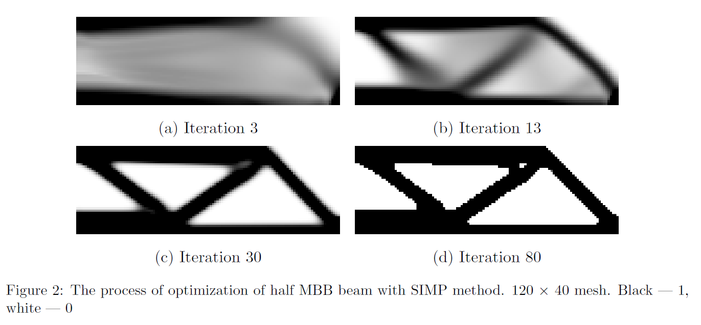
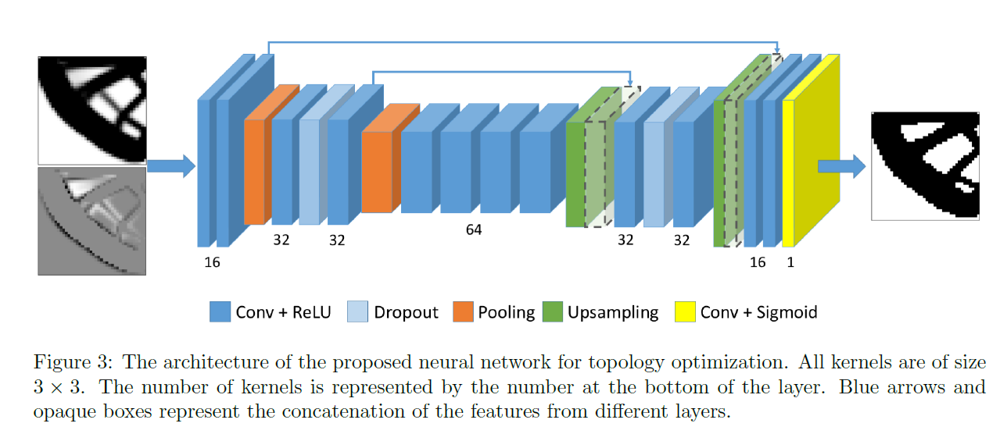

# 【Hackathon 5th No.57】Neural networks for topology optimization

|              |                    |
| ------------ | -----------------  |
| 提交作者      |       NKNaN        |
| 提交时间      |     2023-10-11     |
| RFC 版本号    | v1.0               |
| 依赖飞桨版本  | develop版本         |
| 文件名        | 20231011_paper_topology_optimization.md             |

## 1. 概述

### 1.1 相关背景

复现论文: Neural networks for topology optimization  
[论文链接](https://arxiv.org/abs/1709.09578)  
[源码链接](https://github.com/ISosnovik/nn4topopt) 

### 1.2 功能目标

原始数据集为使用 Topy 拓扑优化求解器基于 SIMP 算法生成的数据集(数据集形状: [N_sample, N_iters, height, width] = [10000, 100, 40, 40]), 基于 Unet 网络, 使用数据驱动方法实现简单2D结构的拓扑优化 

### 1.3 意义

增加使用 PaddleScience 现有 API 复现 AI4Science 论文的案例  

## 2. PaddleScience 现状

1. PaddleScience 在 Arch 中已实现 Unet - 论文核心模型
2. 现有框架可以对 Data 通过 `FunctionalTransform` 进行自定义的 transformation

## 3. 目标调研

### 3.1. 论文解决的问题:
   拓扑优化问题: 如何在设计域内分布材料，使获得的结构具有最优性能同时满足一定的约束条件(例如：必须是01解，1-域内有材料，0-域内没有材料)
   
   - 对于具有连续设计变量的拓扑优化问题，最常用的方法是所谓的 SIMP 迭代算法, 如上图所示  
   - 可以看到利用 SIMP 方法, 求解器只需要进行到第 13 ~ 30 次迭代就可以得到结构的基本视图  
   - 以 $N_{0}$ 表示SIMP算法的初始迭代次数, 论文的任务是将 SIMP 算法的第 $N_{0}$ 步输出 $X_{N_{0}}$ 和 $\delta X = X_{N_{0}} - X_{N_{0} - 1}$ 作为Unet的输入, 来预测 SIMP 算法的第 100 步输出结果
   
### 3.2. 提出的方法:
   采用SIMP方法进行初始迭代, 得到非01值密度分布; 利用Unet对得到的图像进行分割, 并将分布收敛到01解
   
### 3.3. 复现目标:
   利用泊松或均匀分布采样初始迭代次数从而生成输入数据, 从而训练Unet预测SIMP迭代算法的最终解
   
### 3.4. 可能存在的难点:
   需要完全利用现有PaddleScience API在准备数据集时对通道进行随机采样

## 4. 设计思路与实现方案

### 4.1. Unet:
   
  论文中的Unet为如图结构, 根据已有API需要对 `ppsci.arch.UNetEx` 的结构做调整例如加入 `Dropout` 层和 `Upsampling` 层

### 4.2. 初始迭代步数采样器:
   用 `numpy` 实现

### 4.3. 对图像数据做随机翻转和随机旋转操作:
   用 `FunctionalTransform` 实现

### 4.4. 原始代码构建 dataloader 时在每次生成一批 batch data 时对初始迭代步数进行采样:
   可以考虑将这一步放入 model 的 forward 方法中

## 5. 测试和验收的考量

验收标准:
- 定性标准: 需要基于 PaddleScience API 实现, 得到与参考代码中<https://github.com/ISosnovik/nn4topopt/blob/master/results.ipynb>中的Binary Accuracy相近的指标图像
- 定量标准: 基于 PaddleScience API 计算与论文table 1, table 2相对应的指标, 要求结果的相对误差不超过10%

## 6. 排期规划

- 前期调研: 10-01 ~ 10-05 日阅读论文及原始代码
- PaddleScience实现: 10-05 ~ 10-07 初步实现
- 产出修改整理: 10-23 ~ 10-25
- 撰写文档: 10-26 ~ 10-29

## 7. 影响面

对其他模块无影响
