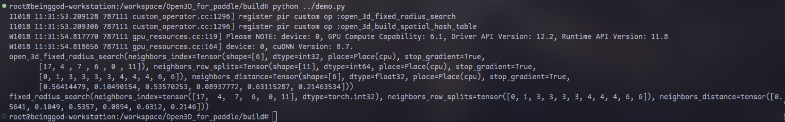

# 飞桨适配 Open3D

> RFC 文档相关记录信息

|              |                      |
| ------------ | -------------------- |
| 提交作者     | SecretXV             |
| 提交时间     | 2024-10-18           |
| RFC 版本号   | v1.0                 |
| 依赖飞桨版本 | develop              |
| 文件名       | 20241018_open3d_for_paddle.md |

## 1. 概述

### 1.1 相关背景

Open3D是一个开源库，专门用于处理三维数据的计算机视觉和图形学任务。它由英伟达（NVIDIA）资助，并且广泛应用于学术研究和工业界。 Open3D提供了丰富的工具集，用于 3D数据处理、可视化、机器学习、和 几何运算，使得用户可以高效地处理点云、网格、体素等三维数据。

### 1.2 功能目标

1. 完成 Open3D 和 Paddle 联合编译
2. 完成 PyTorch 算子向 Paddle 迁移，原则上所有算子都需要迁移
3. 完成 Paddle Layer 封装，结构与 PyTorch 保持一致
4. 完成相关代码合入 Open3D 仓库

### 1.3 意义

Open3D 集成了机器学习的功能，简化 3D 数据的机器学习任务，例如点云分类、分割和物体检测。它提供了易于使用的 API 和工具集，能够与主流深度学习框架（如 PyTorch 和 TensorFlow）无缝集成。通过为 Open3D 适配 paddle 后端，可以将 PyTorch 上的代码快速迁移至 Paddle，丰富 Paddle 在点云分类、分割和物体检测等场景的能力。

## 2. Open3D 现状

Open3D中实现了机器学习相关的模块，已经支持 PyTorch 和 Tensorflow 后端，具体包括：相关算子支持，dataset，loss，pipeline，visualize功能支持。其中，dataset，loss，pipeline，visualize功能具体在Open3D-ML中实现。

> NOTE：本次适配计划 Open3D-ML 非强制要求

## 3. 目标调研

### 3.1 后端集成方案调研
不用CppExtension/CudaExtension，在Open3D中采用CMake组织自定义算子编译
  1. 优点：与pytorch和tf的自定义算子编译方式保持统一
  2. 缺点：需要自行组织算子编译；需要将paddle的cpp_extension在Open3D中进行实现。

采用CppExtension/CudaExtension进行自定义算子编译
  1. 优点：实现便捷
  2. 缺点：采用CppExtension/CudaExtension编译的自定义算子会生成一个独立的模块，需要考虑如何自动化的打包到whl包中；算子存在第三方依赖，需要实现 CMake 和 setup.py 的参数透传
### 3.2 算子注册方案调研
Open3D中torch算子根据是否有反向算子，存在两种注册方式：
1. 对于存在反向的算子（e.g ContinuousConv），会创建一个继承自torch.autograd.Function的类，并实现forward和backward方法。本质是为了让autograd根据forward函数查找到对应的backward函数

```cpp
using namespace open3d::ml::impl;
using torch::autograd::AutogradContext;
using torch::autograd::Function;
using torch::autograd::Variable;
using torch::autograd::variable_list;

class ContinuousConvFunction : public Function<ContinuousConvFunction> {
public:
    static Variable forward(AutogradContext* ctx,
                            Variable filters,
                            Variable out_positions,
                            Variable extents,
                            Variable offset,
                            Variable inp_positions,
                            Variable inp_features,
                            Variable inp_importance,
                            Variable neighbors_index,
                            Variable neighbors_importance,
                            Variable neighbors_row_splits,
                            const bool align_corners,
                            const std::string& coordinate_mapping_str,
                            const bool normalize,
                            const std::string& interpolation_str,
                            const int64_t max_temp_mem_MB) {
        ...
    }

    static variable_list backward(AutogradContext* ctx,
                                  variable_list grad_output) {
        ...
};
torch::Tensor ContinuousConv(const torch::Tensor& filters,
                             const torch::Tensor& out_positions,
                             const torch::Tensor& extents,
                             const torch::Tensor& offset,
                             const torch::Tensor& inp_positions,
                             const torch::Tensor& inp_features,
                             const torch::Tensor& inp_importance,
                             const torch::Tensor& neighbors_index,
                             const torch::Tensor& neighbors_importance,
                             const torch::Tensor& neighbors_row_splits,
                             const bool align_corners,
                             const std::string& coordinate_mapping_str,
                             const bool normalize,
                             const std::string& interpolation_str,
                             const int64_t max_temp_mem_MB) {
    auto ans = ContinuousConvFunction::apply(
            filters, out_positions, extents, offset, inp_positions,
            inp_features, inp_importance, neighbors_index, neighbors_importance,
            neighbors_row_splits, align_corners, coordinate_mapping_str,
            normalize, interpolation_str, max_temp_mem_MB);
    return ans;
}

static auto registry = torch::RegisterOperators(
        "open3d::continuous_conv(Tensor filters, Tensor out_positions, Tensor "
        "extents, Tensor offset, Tensor inp_positions, Tensor inp_features, "
        "Tensor inp_importance, Tensor neighbors_index, Tensor "
        "neighbors_importance, Tensor neighbors_row_splits, bool "
        "align_corners=False, str coordinate_mapping=\"ball_to_cube_radial\", "
        "bool normalize=False, str interpolation=\"linear\", int "
        "max_temp_mem_MB=64) -> Tensor",
        &::ContinuousConv);
```

2. 对于只有前向的算子（e.g BuildSpatialHashTable），只注册前向算子
```cpp
#include <vector>

#include "open3d/ml/pytorch/TorchHelper.h"
#include "torch/script.h"

template <class T>
void BuildSpatialHashTableCPU(const torch::Tensor& points,
                              double radius,
                              const torch::Tensor& points_row_splits,
                              const std::vector<uint32_t>& hash_table_splits,
                              torch::Tensor& hash_table_index,
                              torch::Tensor& hash_table_cell_splits);
#ifdef BUILD_CUDA_MODULE
template <class T>
void BuildSpatialHashTableCUDA(const torch::Tensor& points,
                               double radius,
                               const torch::Tensor& points_row_splits,
                               const std::vector<uint32_t>& hash_table_splits,
                               torch::Tensor& hash_table_index,
                               torch::Tensor& hash_table_cell_splits);
#endif

std::tuple<torch::Tensor, torch::Tensor, torch::Tensor> BuildSpatialHashTable(
        torch::Tensor points,
        double radius,
        torch::Tensor points_row_splits,
        double hash_table_size_factor,
        int64_t max_hash_table_size) {
    ...
}

static auto registry = torch::RegisterOperators(
        "open3d::build_spatial_hash_table(Tensor points, float radius, Tensor "
        "points_row_splits, float hash_table_size_factor, int "
        "max_hash_table_size=33554432) -> (Tensor hash_table_index, Tensor "
        "hash_table_cell_splits, Tensor hash_table_splits)",
        &BuildSpatialHashTable);
```

Paddle自定义算子与torch存在一些差别，Paddle支持直接将func注册为对应op的前向和反向算子。
```cpp
// forward
std::vector<paddle::Tensor> Forward(
    const paddle::Tensor& x,
    bool bool_attr,
    int int_attr,
    float float_attr,
    int64_t int64_attr,
    const std::string& str_attr,
    const std::vector<int>& int_vec_attr,
    const std::vector<float>& float_vec_attr,
    const std::vector<int64_t>& int64_vec_attr,
    const std::vector<std::string>& str_vec_attr) {...}

// forward函数注册
PD_BUILD_OP(op_name)
    .Inputs({"X"})
    .Outputs({"Out"})
    .Attrs({"bool_attr: bool",
            "int_attr: int",
            "float_attr: float",
            "int64_attr: int64_t",
            "str_attr: std::string",
            "int_vec_attr: std::vector<int>",
            "float_vec_attr: std::vector<float>",
            "int64_vec_attr: std::vector<int64_t>",
            "str_vec_attr: std::vector<std::string>"})
    .SetKernelFn(PD_KERNEL(Forward));

// backward
std::vector<paddle::Tensor> Backward(
    const paddle::Tensor& grad_out,
    int int_attr,
    const std::vector<float>& float_vec_attr,
    const std::vector<std::string>& str_vec_attr) {...}

PD_BUILD_GRAD_OP(op_name)
    .Inputs({paddle::Grad("Out")})
    .Outputs({paddle::Grad("X")})
    .Attrs({"int_attr: int",
            "float_vec_attr: std::vector<float>",
            "str_vec_attr: std::vector<std::string>"})
    .SetKernelFn(PD_KERNEL(Backward));
```

## 4. 设计思路与实现方案

### 4.1 Paddle后端集成方案

1. 采用 Paddle 的自定义算子接口进行C++算子注册，参考CppExtension在Open3D中实现自定义算子python接口codegen对应逻辑。
2. 不用CppExtension/CudaExtension组织编译，在Open3D中采用cmake组织自定义算子编译。

### 4.2 算子及对应单测梳理

算子路径：
1. cpp/open3d/ml/pytorch/*

Pytorch Module路径：
1. python/open3d/ml/torch/classes/ragged_tensor.py
2. python/open3d/ml/torch/python/layers*

单测路径：
1. python/test/ml_ops，

| 算子名称                      | 需要反向 | 分类            | 对应 pytorch module                                                | 对应单测                                                                | 优先级                  |
| ----------------------------- | -------- | --------------- | ------------------------------------------------------------------ | ----------------------------------------------------------------------- | ----------------------- |
| continuous_conv               | Yes      | continuous_conv | ContinuousConv, SparseConv, SparseConvTranspose                    | test_cconv.py                                                           | P0                      |
| build_spatial_hash_table      | No       | misc            | FixedRadiusSearch                                                  | 无                                                                      | P0                      |
| continuous_conv_transpose     | Yes      | continuous_conv | SparseConvTranspose                                                | test_cconv.py                                                           | P0                      |
| fixed_radius_search           | No       | misc            | ContinuousConv, SparseConv, SparseConvTranspose, FixedRadiusSearch | test_fixed_radius_search.py                                             | P0                      |
| invert_neighbors_list         | No       | misc            | SparseConvTranspose                                                | test_general_sparseconv.py, test_cconv.py                               | P0                      |
| knn_search                    | No       | misc            | KNNSearch                                                          | test_knn_search.py                                                      | P0                      |
| radius_search                 | No       | misc            | RadiusSearch                                                       | test_radius_search.py                                                   | P0                      |
| voxel_pooling                 | Yes      | misc            | VoxelPooling                                                       | test_voxel_pooling.py                                                   | P0                      |
| ragged_to_dense               | No       | misc            |                                                                    | RaggedTensor                                                            | test_ragged_to_dense.py | P0 |
| nms                           | No       | misc            | 无                                                                 | test_nms.py                                                             | P1                      |
| reduce_subarrays_sum          | No       | misc            | 无                                                                 | test_cconv.py, test_general_sparseconv.py, test_reduce_subarrays_sum.py | P1                      |
| voxelize                      | No       | misc            | 无                                                                 | test_voxelize.py                                                        | P1                      |
| roi_pool                      | No       | misc            | 无                                                                 | test_roi_pool.py                                                        | P1                      |
| ball_query                    | No       | pointnet        | 无                                                                 | test_query_pts.py                                                       | P1                      |
| three_nn                      | No       | pointnet        | 无                                                                 | test_three_nn.py                                                        | P1                      |
| three_interpolate             | No       | pointnet        | 无                                                                 | test_three_interp.py                                                    | P1                      |
| furthest_point_sampling       | No       | pointnet        | 无                                                                 | test_sampling.py                                                        | P1                      |
| sparse_conv                   | Yes      | sparse_conv     | 无                                                                 | test_general_sparseconv.py, test_sparseconv.py                          | P1                      |
| sparse_conv_transpose         | Yes      | sparse_conv     | 无                                                                 | test_general_sparseconv.py,test_sparseconv.py                           | P1                      |
| three_interpolate_grad        | No       | pointnet        | 无                                                                 | 无                                                                      | P2                      |
| trilinear_devoxelize_forward  | No       | pvcnn           | 无                                                                 | 无                                                                      | P2                      |
| trilinear_devoxelize_backward | No       | pvcnn           | 无                                                                 | 无                                                                      | P2                      |

> NOTE: P0 和 P1 优先级算子必须实现，P2优先级算子的选择实现

### 4.3 方案验证

基于上述方案，已初步完成验证，测试代码及结果如下：

```python
import open3d.ml.paddle as p_ml3d
import paddle
import open3d.ml.torch as t_ml3d
import torch
import numpy as np

class p_Search(paddle.nn.Layer):
    def __init__(self, r: float):
        super().__init__()
        self.r = r
        self.search = p_ml3d.layers.FixedRadiusSearch(return_distances=True)

    def forward(self, x, y):
        nei = self.search(x, y, self.r)
        return nei

class t_Search(torch.nn.Module):
    def __init__(self, r: float):
        super().__init__()
        self.r = r
        self.search = t_ml3d.layers.FixedRadiusSearch(return_distances=True)

    def forward(self, x, y):
        nei = self.search(x, y, self.r)
        return nei

net_p = p_Search(r=0.8)
net_t = t_Search(r=0.8)

x= np.random.randn(20,3)
y=np.random.randn(10,3)

xp = paddle.to_tensor(x,dtype='float32').cpu()
yp = paddle.to_tensor(y,dtype='float32').cpu()


xt = torch.from_numpy(x).float().cpu()
yt = torch.from_numpy(y).float().cpu()

out_p = net_p(xp,yp)
out_t = net_t(xt,yt)

print(out_p)
print(out_t)
```

运行结果：



## 5. 测试和验收的考量

1. P0 和 P1 级别优先级的算子对应单测 100% 通过
2. Open3D 现有 CI 100%通过
3. [可选] 为 Open3D 新增 Paddle CI 100% 通过

## 6. 可行性分析和排期规划

整体来看，项目可行，具体排期规划如下：

| 里程碑                                                             | 人力（人日） | 时间点     |
| ------------------------------------------------------------------ | ------------ | ---------- |
| 编译 Open3D，跑通 pytorch example                                  | 1            |            |
| 参考 pytorch backend ，梳理需要改写的C++算子和对应 paddle module。 | 0.5          |            |
| 完成 Open3D + paddle 编译 + 1 * demo                               | 3            |            |
| 提交RFC                                                            | 1            | 2024/10/18 |
| 为 paddle 实现 C++ 算子和对应 module，编写并通过相关单测验证       | 20           |            |
| 调通 Open3D paddle CI                                              | 5            |            |
| 提交PR，完成合入                                                   | 5            | 2024/11/25 |
| [可选] Open3D-ML 适配                                              | 20           | long term  |

## 7. 影响面

### 7.1 PaddleScience
代码合入 Open3D 仓库，对 PaddleScience 无影响。
### 7.2 Open3D
本次适配为多后端支持，不影响 Open3D 现有功能，需要为Open3D增加对应paddle backend 的 CI。
